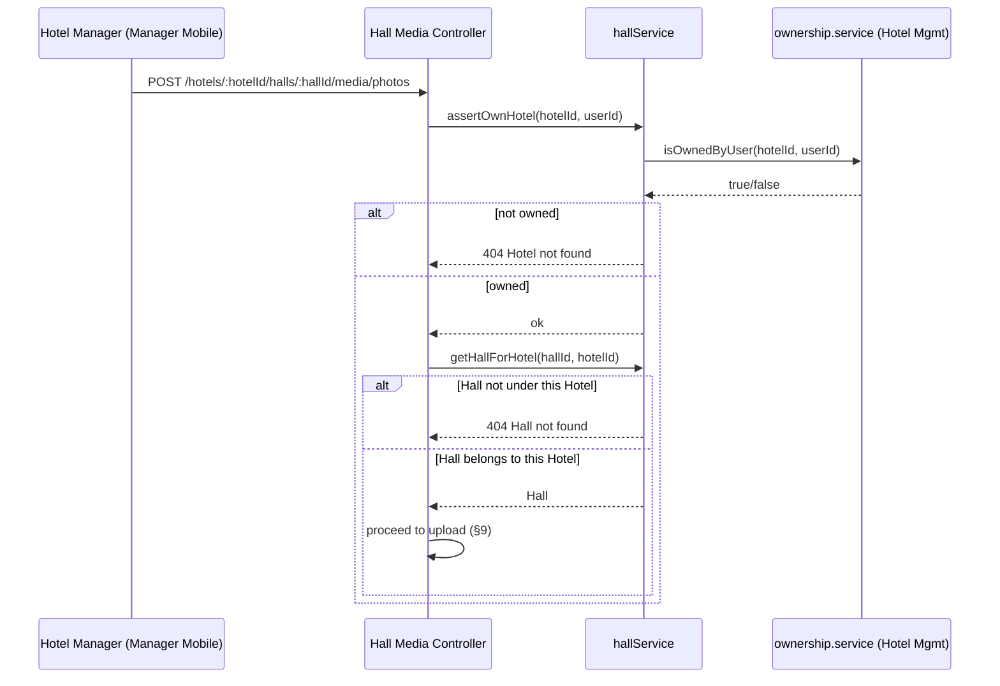
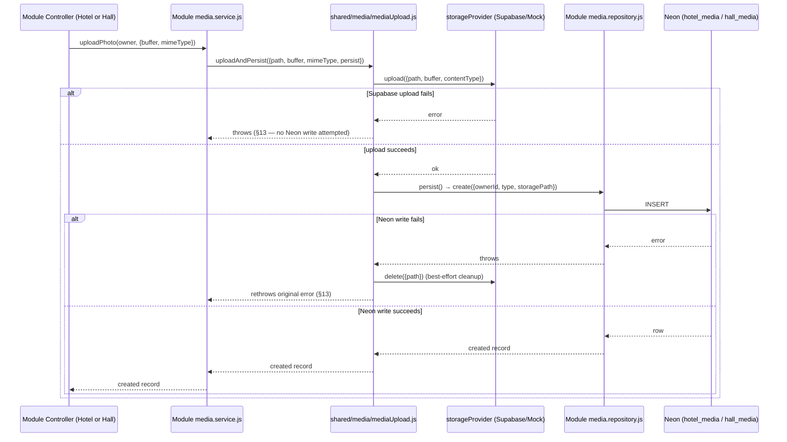

# Shared Media Infrastructure — Technical Design
## Hotel Hall Booking Management System

**Status:** Draft — In Review. Approved in principle by Ahmed's architectural review
(2026-08-28), with required corrections — applied in this revision (§6 bucket retained, not
renamed; §18/§19.2 Customer read access removed from scope; §13/§17 technical-default framing
reinforced). Not implementable until `ADR-0007` (Proposed) is Approved and this document itself
is Approved, per `documentation-architecture.md` §3's lifecycle model. No code, migration, or
bucket in this document has been created — this is design only.

**Consumers:** Hotel Management (Module 3), Hall Management (Module 4). A cross-cutting
document, not a 15th module — the project's module list is fixed at 14
(`documentation-architecture.md` §2). This document sits in `docs/02-architecture/` and plays
the same role for media that `mobile-application-architecture.md` already plays for UI/API
shape: a system-wide technical design every relevant module's own Technical Design references,
rather than re-deriving.

---

## 1. Purpose & Scope

Realizes `ADR-0007` (Proposed): one shared media-storage architecture for both Hotel media
(Logo, Photos — `BDR-015`) and Hall media (Photos — `BDR-016`), instead of two independently
designed, module-owned implementations. Supersedes the "future Hall Media Component, mirroring
Hotel Management's" direction Hall Management Technical Design §8 had left as its own
anticipated follow-up.

**In scope:** the shared storage/validation/upload/delete component; the `HallMedia` data
model; API endpoints for Hall media (new); how Hotel media's existing endpoints/model are
affected (moving only generic mechanics into the shared component — the request/response
contract itself is unchanged, §4); authorization; failure handling.

**Out of scope (explicitly deferred, not decided here):**
- Any change to Hotel media's existing request/response contract or business rules (its
  at-most-one-Logo rule, its endpoint paths, its response shape are unchanged).
- **Any bucket rename.** The existing `hotel-media` Supabase bucket is retained as-is (§6) —
  per Ahmed's review correction, renaming it is out of scope for this development phase unless
  the real environment actually requires it, which it does not.
- **Customer media read APIs.** Per Ahmed's review correction, no public/Customer-facing read
  endpoint is designed or implemented for either Hotel or Hall media in this phase — Hall Media
  `GET` uses the same own-Hotel(+own-Hall)-only authorization as every other endpoint here (§8,
  §19.2), with no special-casing (§18).
- Actual Supabase project creation, bucket creation, or credential configuration.
- The Prisma migration itself (specified here, not run).
- Flutter upload-flow changes for either app.
- Event Management's own future media needs (`ADR-0006`'s "Future Growth" note also mentions
  this) — not addressed; this design does not preclude a third consumer later, but does not
  design for one now (`architecture-principles.md` §2, Simplicity before complexity).

---

## 2. Architecture Context

Builds on already-Approved decisions, changing none of their own conclusions:

- **`ADR-0006`** (Approved) — Supabase is the storage provider. This document widens its
  scope to Hall media (via `ADR-0007`); the provider choice itself is unchanged.
- **`architecture-principles.md` §10** (Storage Principles) — "Business logic must never
  depend on Supabase... directly." Already satisfied by the existing
  `shared/providers/storageProvider.js` abstraction, which requires **no code change** to
  serve a second module — it already accepts an arbitrary `path` string and has no Hotel-
  specific assumption in its contract (`upload`/`delete`/`getPublicUrl`).
- **`database-standards.md` §5, §10** — every relationship is a real, database-enforced
  foreign key; no polymorphic/"soft" reference. This is the constraint that rules out the
  single polymorphic `Media(entityType, entityId)` table shape, and is why this design keeps
  two Prisma models (§5 below) sharing a metadata *shape* and enum, not a table.
- **`folder-structure.md` §5** — shared code lives in `shared/` only once it has two or more
  genuine consumers, and only the code genuinely needed by both. Hall media's arrival is
  exactly the second-consumer event that promotes the currently-Hotel-only validation/upload
  mechanics into `shared/`.
- **Existing, already-implemented precedent this design extends, not replaces:**
  `backend/src/modules/hotels/media.*` (Hotel Media Component, Hotel Management Technical
  Design §8a) — already built and migrated against the real development database. Every
  decision below is stated relative to what already exists there.

---

## 3. Module Boundary

Restates and finalizes the boundary Ahmed's instruction specified, cross-referenced against
what already exists in code:

| Owns | Shared Media Infrastructure (`backend/src/shared/media/`) | Hotel Management (`backend/src/modules/hotels/`) | Hall Management (`backend/src/modules/halls/`) |
|---|---|---|---|
| Storage operations (Supabase upload/delete/public-URL) | ✅ (`storageProvider.js` — already shared, no change needed) | ❌ | ❌ |
| File validation (magic-byte detection, size limit, allowed formats) | ✅ (new — promoted from `hotels/media.validation.js`) | ❌ | ❌ |
| Upload mechanics (build path, upload, persist, cleanup-on-failure) | ✅ (new — generic helper, parameterized by caller) | ❌ | ❌ |
| Deletion mechanics (delete storage object) | ✅ | ❌ | ❌ |
| Common media errors | ✅ (reuses existing `shared/errors/errorTypes.js` — no new error classes needed, §14) | ❌ | ❌ |
| Orphan cleanup (best-effort, on failure) | ✅ | ❌ | ❌ |
| Hotel↔Media relationship (`HotelMedia` model, repository) | ❌ | ✅ (unchanged) | ❌ |
| Hotel media business rules (at most one active Logo; unlimited Photos) | ❌ | ✅ (unchanged) | ❌ |
| Hotel ownership authorization | ❌ | ✅ (unchanged — `hotelService.getOwnHotelById`) | ❌ |
| Hall↔Media relationship (`HallMedia` model, repository — new) | ❌ | ❌ | ✅ |
| Hall media business rules (Photos only, no Logo) | ❌ | ❌ | ✅ |
| Hall ownership authorization (owns Hotel **and** Hall belongs to that Hotel) | ❌ | ❌ | ✅ |

Neither module ever imports the other's `media.*` files (`architecture-principles.md` §5) —
each imports only the shared component, the same discipline already governing how Hall
Management consumes Hotel Management's Ownership Query Interface
(`hotels/ownership.service.js`) rather than reaching into its tables.

---

## 4. Shared Component — Exact Files

What actually moves, what's new, what's untouched (a concrete answer to "determine the exact
model required," not a re-statement of the conceptual sketch):

```
backend/src/shared/media/
├── imageValidation.js     NEW — moved from hotels/media.validation.js almost verbatim:
│                          detectImageMimeType(), extensionForMimeType(),
│                          MAX_FILE_SIZE_BYTES, uploadMiddleware (multer factory),
│                          handleUploadError, validateUploadedFile. Generic — no
│                          "hotel" or "hall" concept anywhere in this file.
└── mediaUpload.js         NEW — generic uploadAndPersist({ path, buffer, mimeType,
                           persist, onFailureCleanup }) — the exact
                           upload-then-persist-with-cleanup-on-failure sequence
                           hotels/media.service.js#uploadAndPersist already
                           implements today, generalized to take the caller's own
                           `persist` function (its own repository's `create`) rather
                           than assuming HotelMedia.

backend/src/shared/providers/storageProvider.js   UNCHANGED. Already generic.
backend/src/shared/providers/supabaseStorageProvider.js   UNCHANGED.
backend/src/shared/providers/mockStorageProvider.js   UNCHANGED.
```

```
backend/src/modules/hotels/
├── media.repository.js    UNCHANGED (Prisma model reference only).
├── media.service.js       CHANGED — now calls the shared mediaUpload.uploadAndPersist()
│                          and imageValidation exports instead of its own private copies;
│                          keeps buildStoragePath({hotelId,...}), uploadLogo(),
│                          uploadPhoto(), deleteMedia(), getMedia() exactly as they
│                          behave today. No response-shape or endpoint change.
├── media.controller.js    UNCHANGED.
├── media.routes.js        UNCHANGED (paths, methods, middleware order all the same —
│                          now imports validation middleware from shared/media/).
├── media.mapper.js        UNCHANGED.
└── media.validation.js    REMOVED — superseded by shared/media/imageValidation.js.

backend/src/modules/halls/               NEW module additions, mirroring the above shape:
├── media.repository.js    NEW — Prisma model is hallMedia, not hotelMedia.
├── media.service.js       NEW — buildStoragePath({hallId,...}), uploadPhoto()
│                          (no uploadLogo() — Hall has no Logo, §7), deleteMedia(),
│                          getMedia(); calls the same shared mediaUpload/imageValidation.
├── media.controller.js    NEW — mirrors hotels/media.controller.js's shape, but
│                          resolves both the owning Hotel and the Hall within it
│                          (§8, two-step authorization) before calling the service.
├── media.routes.js        NEW — mounted nested one level deeper than Hotel's
│                          (§6), mergeParams: true.
└── media.mapper.js        NEW — toPublicHallMedia(), same shape as toPublicHotelMedia().
```

No new file is added to either module for "validation" — both now import the shared
`imageValidation.js` middleware directly in their `media.routes.js`, the same way both already
import `authenticate` from `shared/middleware/`.

---

## 5. Metadata Model

**Decision (§ADR-0007, Option 2):** two Prisma models, one shared enum, one shared conceptual
shape — not a single polymorphic table. See `ADR-0007`'s Options Considered for the full
`database-standards.md` §5/§10 reasoning; this section states the resulting schema.

### 5.1 Shared conceptual shape

Every media record — Hotel or Hall — carries the same fields, realized as two physically
distinct tables:

| Field | Type | Notes |
|---|---|---|
| `id` | UUID | Primary key (`database-standards.md` §4). |
| `<owner>Id` | UUID, FK | `hotelId` on `HotelMedia`, `hallId` on `HallMedia` — a real foreign key each time (§5 below), never a generic `entityId`. |
| `type` | `MediaType` enum | Shared enum (renamed from today's `HotelMediaType`, §5.3) — `LOGO \| PHOTO`. `HallMedia.type` is only ever written as `PHOTO` (§7) — a business-level constraint (Hall Component), not a narrower database enum, the same "business rule, not a `CHECK` constraint" pattern Hotel Management already uses for at-most-one-Logo. |
| `storagePath` | String | Bucket-relative Supabase Storage path (§6) — the permanent reference; never a binary, never a signed URL. |
| `displayOrder` | Int, nullable, default `null` | **New field, not present on today's `HotelMedia`.** Structural provision only — see §12 (Ordering) for what is and is not decided about its use. |
| `createdAt` / `updatedAt` | DateTime | Standard audit columns (`database-standards.md` §8). |

### 5.2 Prisma schema (proposed — not yet applied)

```prisma
enum MediaType {
  LOGO
  PHOTO

  @@map("media_type")
}

model HotelMedia {
  id      String @id @default(uuid()) @db.Uuid
  hotelId String @map("hotel_id") @db.Uuid
  hotel   Hotel  @relation(fields: [hotelId], references: [id], onDelete: Cascade)

  type MediaType

  storagePath  String @map("storage_path")
  displayOrder Int?   @map("display_order")

  createdAt DateTime @default(now()) @map("created_at")
  updatedAt DateTime @updatedAt @map("updated_at")

  @@index([hotelId], map: "idx_hotel_media_hotel_id")
  @@map("hotel_media")
}

model HallMedia {
  id     String @id @default(uuid()) @db.Uuid
  hallId String @map("hall_id") @db.Uuid
  hall   Hall   @relation(fields: [hallId], references: [id], onDelete: Cascade)

  /// Always `PHOTO` — Hall has no Logo (§7). Kept as the shared `MediaType` enum
  /// rather than a narrower Hall-only enum so the two tables share one real
  /// metadata *shape*, not just a superficially similar one.
  type MediaType

  storagePath  String @map("storage_path")
  displayOrder Int?   @map("display_order")

  createdAt DateTime @default(now()) @map("created_at")
  updatedAt DateTime @updatedAt @map("updated_at")

  @@index([hallId], map: "idx_hall_media_hall_id")
  @@map("hall_media")
}
```

`Hotel.media` and `Hall.media` back-relations are added to their respective models, mirroring
`Hotel.halls` today.

### 5.3 Migration plan (specified, not run this turn)

One migration, two logical changes bundled only because the enum rename is inseparable from
introducing the table that also uses it (`database-standards.md` §14 — "one logical schema
change" is interpreted here as "one shared-media introduction," not two artificially split
steps):

1. `ALTER TYPE "hotel_media_type" RENAME TO "media_type";` — pure rename, zero data change,
   zero application-visible effect (the enum's two values are unchanged). Safe against the real
   development database's existing `hotel_media` rows.
2. `ALTER TABLE "hotel_media" ADD COLUMN "display_order" INTEGER;` — nullable, no default
   required, no backfill needed (existing rows get `NULL`, which §12 treats as "no explicit
   order").
3. `CREATE TABLE "hall_media" (...)` — new table, standard shape, FK to `halls(id)`
   `ON DELETE CASCADE` (mirroring `hotel_media`'s own cascade — a Hall's media has no meaning
   without the Hall, the same reasoning Hotel Management's Technical Design §5 already applied
   to `HotelMedia`).

No `NOT NULL` column is added to a populated table (`database-standards.md` §14's specific
concern) — `display_order` is nullable everywhere.

---

## 6. Storage Structure

| Aspect | Decision |
|---|---|
| Bucket | **`hotel-media`** — **retained, not renamed.** Per Ahmed's review correction, a bucket rename is out of scope for this development phase unless the real environment actually requires it, and it does not (no real Supabase project is configured yet, §2). Both Hotel and Hall media live in this one bucket, distinguished by path prefix (below) — the bucket's own name stays a historical artifact of when it was Hotel-only, with no functional consequence, since nothing about bucket-level policy (public-read, service-role-write) differs between the two entities. `SUPABASE_STORAGE_BUCKET` env var default is unchanged. |
| Hotel Logo path | `hotels/{hotelId}/logo/{mediaId}.{ext}` — unchanged from today. |
| Hotel Photo path | `hotels/{hotelId}/photos/{mediaId}.{ext}` — unchanged from today. |
| Hall Photo path | `halls/{hallId}/photos/{mediaId}.{ext}` — new, mirroring Hotel's own convention exactly. Already platform-neutral (the prefix, not the bucket name, is what distinguishes the two entities). |
| `{hotelId}` / `{hallId}` | Always server-resolved from the authenticated Manager's own-Hotel (and, for Hall, own-Hall-within-that-Hotel) lookup — never a client-supplied value (§8). |
| `{mediaId}` | Server-generated UUID, matching the created row's own `id` — not a random/independent value (a small simplification over today's Hotel Media, which currently generates a separate `randomUUID()` for the path before the row exists; using the row's own `id` removes that redundancy once both are generated together, §11). |
| Extension | Derived from the *detected* MIME type (§9), never the client-supplied filename. |
| Visibility | **Public-read bucket**, both prefixes. Both Hotel Logo/Photos and Hall Photos are already **Public**-classified data (`data-architecture.md` §13, matching "Hall names, Hotel names, published Amenities" — a Hall/Hotel's photos are the same category of intended-for-anyone-to-see content once the owning Hotel is eligible). Writes (upload/delete) still require the service-role credential, held only by the backend (§10). Note: bucket-level public-read is a storage-layer setting only — it does **not** by itself expose any Customer-facing API; see §18 for why no such API is designed here regardless. |
| Public URL | Derived deterministically from `storagePath` at read time (`{SUPABASE_URL}/storage/v1/object/public/hotel-media/{storagePath}`) — never stored as the database reference itself, for either entity. |

---

## 7. Hotel vs. Hall Media Capabilities

Restates Ahmed's instruction as the enforced business rule, unchanged from what `BDR-015` and
`BDR-016` already separately approved — no new business rule is invented here:

| | Hotel | Hall |
|---|---|---|
| Logo | Exactly one **active** Logo at a time (uploading a new one replaces it) | **Not supported.** `BDR-016` never introduced a Hall Logo field; Hall Management's Media Component has no `uploadLogo()` and no route for it. |
| Photos | Any number | Any number |
| Enforcement point | Hotel Management's own `media.service.js` (business-level constraint, not a database constraint — unchanged from today) | Hall Management's own `media.service.js` — simply never exposes a Logo upload path; the shared `MediaType` enum still technically has a `LOGO` value (§5.1), but nothing in Hall Management's code path ever writes it. |

---

## 8. Authorization

Two distinct flows, exactly as specified, each reusing an interface that already exists —
**no new authorization mechanism is introduced for either.**

### 8.1 Hotel media

Unchanged from today's already-implemented, already-migrated behavior:

```
Authenticated Manager
  → hotelService.getOwnHotelById(hotelId, userId)   (existing, unchanged)
  → 404 if not found or not owned (never 403 — api-standards.md §13)
  → authorized
```

### 8.2 Hall media (new)

Composes two interfaces that **already exist** in the codebase today — this design adds no new
ownership-check code, only a new controller that calls both in sequence, mirroring exactly what
`hall.controller.js#updateHall` already does for Hall profile updates:

```
Authenticated Manager
  → hallService.assertOwnHotel(hotelId, userId)        (existing — Hotel Ownership
                                                          Query Interface, §3)
  → 404 if the Manager doesn't own hotelId
  → hallService.getHallForHotel(hallId, hotelId)        (existing — scoped lookup,
                                                          never returns a Hall
                                                          belonging to a different Hotel)
  → 404 if the Hall doesn't exist under that Hotel
  → authorized
```



Cross-tenant access is structurally impossible through this path: a Manager who owns Hotel A
cannot reach a Hall under Hotel B, because the second check is scoped to the *already-verified*
`hotelId`, not to the Hall's own `hotelId` taken from the Hall record in isolation. Both checks
fail closed to `404`, never `403` (`api-standards.md` §13 — never confirms existence to an
unauthorized caller).

---

## 9. Upload Sequence

One shared sequence, parameterized per caller — the exact
upload-then-persist-with-cleanup-on-failure ordering `hotels/media.service.js#uploadAndPersist`
already implements today, generalized:



Identical for Hotel Photo, Hotel Logo (first upload, no previous Logo), and Hall Photo — the
only difference per caller is the `path` builder (§6) and which repository's `create` is
passed as `persist`.

---

## 10. Replacement (Logo only)

Hotel-only — Hall has no Logo (§7), so this section doesn't apply to Hall media at all.
Unchanged from today's already-implemented behavior, restated for completeness since it's the
one asymmetry between the two callers of the shared upload sequence:

1. Hotel Management's `media.service.js` looks up the previous Logo (if any) **before** calling
   the shared upload sequence.
2. The shared upload sequence (§9) runs for the *new* Logo, exactly as any other upload.
3. Only **after** the new Logo is confirmed durable (Neon row exists) does Hotel Management's
   own service delete the previous Logo's storage object and database row — both best-effort
   (failures logged, not surfaced — the Hotel is left with two Logo rows in the rare case the
   cleanup call itself fails, a pre-existing, unchanged characteristic of today's
   implementation, not newly introduced here).

The shared component itself has no concept of "replace" — it only ever creates. Replacement is
entirely a Hotel Management business rule, correctly scoped there per §3's boundary table.

---

## 11. Deletion

One shared primitive (`storageProvider.delete`), called identically by both modules' own
`deleteMedia()`:

```
Module Controller → assertOwnership (§8) → Module Service.deleteMedia(owner, mediaId)
  → Module Repository.findByIdFor<Owner>(mediaId, ownerId)   (own-scoped lookup;
                                                                cross-tenant → 404)
  → shared storageProvider.delete({path})
  → Module Repository.remove(mediaId)
```

Order is deliberate (storage object deleted before the database row, matching Hotel Media's
existing behavior) — a delete that fails between the two steps leaves an orphaned *database
row* referencing an already-gone object, never an orphaned *storage object* the database no
longer knows about. This asymmetry is intentional: an orphaned row is harmless (it 404s on next
read attempt against a dead public URL, discoverable and cheap to reconcile manually); an
orphaned storage object is invisible and would silently consume storage forever (§13).

---

## 12. Ordering

**Structural provision only — the business rule is not decided here, recorded as Pending
(§17).** `displayOrder` (§5.1) is added to both tables' schema so that a future decision to
expose reordering doesn't require another migration. **Per Ahmed's review, this stays exactly
that — provisioned but unused — for this implementation: no photo-reordering UI in either
Flutter app, and no reordering API on the backend.** Until a future decision changes this:

- Every read (`GET .../media`) returns records ordered by `createdAt ascending` (unchanged from
  today's Hotel Photos behavior) — `displayOrder` is not yet consulted by any query.
- No endpoint in this design lets a client set or change `displayOrder`.
- Nothing in `BDR-015` or `BDR-016` mentions photo ordering as a Manager-facing capability —
  inventing reorder semantics now would violate "do not invent business rules where the
  existing specifications are silent."

---

## 13. Validation

Unchanged from Hotel Media's already-approved, already-implemented standard (`api-standards.md`
§15), now shared verbatim by both modules via `shared/media/imageValidation.js` (§4):

| Aspect | Standard |
|---|---|
| Transport | `multipart/form-data`, single `file` field. |
| Content-type detection | Magic bytes only — JPEG (`FF D8 FF`), PNG (`89 50 4E 47 0D 0A 1A 0A`), WebP (`RIFF...WEBP`). Client-supplied filename/`Content-Type` header never trusted. |
| Allowed formats | JPEG, PNG, WebP — identical for Hotel and Hall (nothing in either Business Specification distinguishes them, so no distinguishing rule is invented). |
| Maximum size | **5 MB**, same technical default Hotel Media already uses. **Explicitly documented as a technical default, not a permanent business rule** — restated as Pending (§17) per Ahmed's review, not newly re-flagged as if it were a fresh question. |
| Rejection | `400 VALIDATION_ERROR`, before any Supabase call, identical error shape for both entities (shared middleware, §4). |

Both the size limit and the allowed-format list (JPEG/PNG/WebP) are engineering defaults
carried forward unchanged from Hotel Media's existing implementation — reused for consistency,
not newly re-approved as business requirements. Either may change via a Business Decision
Record without touching this document's architecture.

---

## 14. Orphan Cleanup & Failure Handling

| Failure | Handling | Response |
|---|---|---|
| Unsupported format / missing file | Rejected before any Supabase call (§13) | `400 VALIDATION_ERROR` |
| Oversized file | Rejected by shared multer config before any Supabase call | `400 VALIDATION_ERROR` |
| Supabase upload fails | No Neon write attempted; nothing to clean up | `500 Internal Server Error` (same catch-all category a Twilio delivery failure already uses — no new status code) |
| Supabase upload succeeds, Neon write fails | Shared component deletes the just-uploaded object before returning (§9) | `500 Internal Server Error`; cleanup failure (if it also fails) is logged, never surfaced as a second error |
| Process crashes between the Supabase write and the cleanup call | **Not handled** — an orphaned object can remain. No reconciliation/garbage-collection job is designed here (identical, unchanged limitation Hotel Media's Technical Design §8a already accepted; extending it to Hall introduces no new exposure, just a second path that shares the same known, accepted gap) | N/A — recorded as a Technical Risk (§21), not silently resolved |
| Delete: storage delete fails | Database row is **not** removed (delete is aborted, `deleteMedia` rethrows) — never delete the reference to a still-existing object | `500 Internal Server Error` |
| Delete: storage delete succeeds, database delete fails | Database row remains (orphaned, harmless per §11) | `500 Internal Server Error` |

This table applies identically to both `hotels/media.service.js` and the new
`halls/media.service.js` — one behavior, two callers, per the shared-component design.

---

## 15. Hotel Lifecycle Interaction

**No change.** Hotel media upload/replace/delete has no Hotel-status precondition today (any
`HotelStatus`, including `REGISTERED`, may have media uploaded) — this design does not add one.
Consistent with Hotel Management's own existing Technical Design §8a, which was silent on a
lifecycle gate because none was ever specified in `BDR-015`/`BR-HOTEL-02`.

---

## 16. Hall Lifecycle Interaction

**No new rule invented.** Hall Management Technical Design already establishes (`BR-HALL-02`)
that Hall preparation is allowed regardless of the owning Hotel's own approval state, and that
principle is restated, not extended, for Hall media: uploading/deleting a Hall Photo has no
precondition on the Hall's own state (Hall has no status column, §4 of Hall Management's
Technical Design) or on the owning Hotel's lifecycle status. The two-step authorization (§8.2)
is the only gate.

---

## 17. Pending Business Decisions

Recorded, not invented, per this turn's explicit instruction:

1. **Maximum file size / supported formats as a settled limit.** Still a technical default
   (5 MB, JPEG/PNG/WebP) for both Hotel and Hall media — unchanged status from Hotel Media's
   own existing flag, now shared by both. Revisit via a Business Decision Record if the
   platform ever needs a different limit for either entity.
2. **Photo reordering.** `displayOrder` is structurally provisioned (§12) but no endpoint
   exposes it and no read path consults it. Whether Manager Mobile should ever let a Hotel
   Manager reorder Hotel Photos or Hall Photos is undecided — nothing in `BDR-015` or `BDR-016`
   addresses it.
3. **Orphan reconciliation.** No garbage-collection job exists for the rare crash-mid-request
   orphan case (§14). Whether this is ever worth building is an operational/cost decision, not
   a business rule — flagged here as a known, accepted gap rather than silently designed away.
4. **Customer-facing read access** is explicitly **out of scope** for this implementation, per
   Ahmed's review correction (§18) — not merely deferred-but-half-designed. Both Hotel and Hall
   Media `GET` endpoints use the identical own-Hotel(+own-Hall)-only authorization as their
   write counterparts; neither has a public or Customer-facing variant. The decision to ever
   expose one, and through which endpoint shape, belongs to a future Technical Design (Customer
   Management's, or Hotel/Hall Management's own) — not decided, and not partially designed,
   here.

None of these block Approval of the shared architecture itself — they are scoping boundaries on
what this design does and does not claim to settle.

---

## 18. Customer Read Access — Explicitly Out of Scope

Ahmed's original instruction was to design the architecture so Customer Mobile could later read
Hotel and Hall media without receiving write permissions. Ahmed's review of this design's first
draft corrected the scope of *how far that goes right now*: the first draft had gone one step
further than intended, by giving Hall Media's `GET` endpoint a public/visibility-gated
authorization (mirroring Hall's own profile `GET`) so it would already be Customer-readable.
**That is removed.** For this implementation:

- **Hall Media `GET` uses the same own-Hotel(+own-Hall)-only authorization as its write
  counterparts (§8.2, §19.2)** — identical in shape to Hotel Media's own `GET` (§19.1). No
  special-casing, no asymmetry between the two entities' read endpoints.
- **No public or Customer-facing media endpoint exists anywhere in this design** — not for
  Hotel, not for Hall. Nothing is half-built toward one.
- **This is a scope decision, not an architectural blocker.** Media is already served via
  stable, public, non-expiring Supabase URLs derived from `storagePath` (§6); a future Technical
  Design that *does* decide to expose Customer-facing reads can add a new endpoint (in Customer
  Management, or in Hotel/Hall Management's own future revision) without any change to the
  storage layer, the metadata model, or the shared component. That future decision is not made,
  designed, or partially implemented here.
- **Write access is, separately, already impossible for an unauthenticated or Customer
  caller** regardless of the above — every upload/delete endpoint (§8) requires `authenticate`
  and an ownership check only a Hotel Manager account can satisfy; a `CUSTOMER`-typed account
  fails it the same way a different Hotel Manager's account does (`404`, never `403`).

---

## 19. API Design

### 19.1 Hotel media (unchanged)

| Method | Path | Auth | Notes |
|---|---|---|---|
| `POST` | `/api/v1/hotels/:hotelId/media/logo` | Own-Hotel | Create or replace. |
| `POST` | `/api/v1/hotels/:hotelId/media/photos` | Own-Hotel | Always creates. |
| `DELETE` | `/api/v1/hotels/:hotelId/media/:mediaId` | Own-Hotel | |
| `GET` | `/api/v1/hotels/:hotelId/media` | Own-Hotel or Platform Administrator | Unchanged — no public/Customer variant (§18). |

### 19.2 Hall media (new)

Nested one level deeper than Hotel media, matching Hall Management's own existing nesting
convention for `/hotels/:hotelId/halls/:id` (`hall.routes.js`'s `hotelHallsRouter`):

| Method | Path | Auth | Notes |
|---|---|---|---|
| `POST` | `/api/v1/hotels/:hotelId/halls/:hallId/media/photos` | Own-Hotel + own-Hall (§8.2) | No `/media/logo` route exists — Hall has no Logo (§7). |
| `DELETE` | `/api/v1/hotels/:hotelId/halls/:hallId/media/:mediaId` | Own-Hotel + own-Hall | |
| `GET` | `/api/v1/hotels/:hotelId/halls/:hallId/media` | Own-Hotel + own-Hall (§8.2) | Same authorization as the write endpoints — no public/Customer-facing variant in this phase (§18). Symmetric with Hotel Media's own `GET` (§19.1). |

Response shape (both, matching today's `HotelMedia` response exactly):

```json
{
  "status": "success",
  "message": "Hall photo uploaded successfully.",
  "data": {
    "id": "uuid",
    "hallId": "uuid",
    "type": "PHOTO",
    "url": "https://.../storage/v1/object/public/hotel-media/halls/.../photos/....jpg",
    "createdAt": "...",
    "updatedAt": "..."
  }
}
```

`GET .../media` for Hall returns `{ photos: HallMedia[] }` (no `logo` key — unlike Hotel's `{
logo, photos }` shape, since a `logo: null` key would misleadingly imply Hall could ever have
one).

---

## 20. Security Design

Restates and extends Hotel Media's already-approved security posture (Hotel Management
Technical Design §12) to cover Hall media identically — no new mechanism, no weakening:

- **Service-role credential** (`SUPABASE_SERVICE_ROLE_KEY`) is read only by the backend
  process, only by `SupabaseStorageProvider` — never sent to Manager Mobile, Customer Mobile,
  or Admin Web, for either entity's media.
- **Backend-mediated upload only.** Neither Flutter app ever talks to Supabase directly;
  every upload is an authenticated request to this backend's own API (§8, §19).
- **Own-Hotel / own-Hotel-and-own-Hall scoping** is the sole authorization mechanism for
  writes (§8) — no second, parallel check is introduced.
- **Public-read bucket** (§6) is a deliberate, classification-driven choice (`data-architecture.md`
  §13), not an oversight — writes remain service-role-gated regardless.
- **Content-type validated by magic bytes**, never trusted client metadata (§13) — prevents a
  disguised non-image file from being accepted for either entity.
- **No secrets in the repository** — `SUPABASE_URL`/`SUPABASE_SERVICE_ROLE_KEY`/
  `SUPABASE_STORAGE_BUCKET` remain environment-only (`naming-conventions.md` §10), unchanged.

---

## 21. Technical Risks & Assumptions

| # | Risk / Assumption | Mitigation / Status |
|---|---|---|
| 1 | Crash-mid-request orphan (§14) can leave an unreferenced Supabase object | Accepted, unmitigated — same accepted risk Hotel Media already carries; no reconciliation job designed (§17 item 3). |
| 2 | 5 MB / format limits are technical defaults, not business-approved | Flagged transparently (§13, §17 item 1) rather than silently treated as settled. |
| 3 | Enum rename (`hotel_media_type` → `media_type`) touches an already-migrated, real-database table | Pure rename, no data change (§5.3) — low risk, but still a migration against the shared development database and subject to `database-standards.md` §14's migration-review requirement before it is ever run. |
| 4 | Two-table design (vs. one polymorphic table) means any future third media consumer (e.g. Event Management) requires its own third table, not a one-line addition to a shared table | Accepted trade-off — `database-standards.md` §5/§10 make the polymorphic alternative non-compliant regardless (`ADR-0007` Options Considered); the shared *component* (§4) still means only the table/repository is per-entity, not the validation/upload/delete mechanics. |
| 5 | *(Resolved by review, 2026-08-28)* An earlier draft gave Hall Media `GET` public/visibility-gated access while Hotel Media `GET` stayed own-Hotel-only | Removed per Ahmed's correction — both `GET` endpoints now use identical own-Hotel(+own-Hall)-only authorization (§18, §19). No asymmetry remains. |
| 6 | No real Supabase project is configured in this environment yet | `MockStorageProvider` remains active for both entities until real credentials are supplied — matches today's existing Hotel Media behavior exactly (§2). |

---

## 22. Dependencies

- **Depends on:** `ADR-0006` (Approved), `ADR-0007` (Proposed — this design's own authorization
  to exist), `BDR-015` (Approved), `BDR-016` (Approved), `database-standards.md`,
  `api-standards.md` §15, `architecture-principles.md` §10-11, `folder-structure.md` §5,
  Hotel Management Technical Design §8a (existing implementation this design extends), Hall
  Management Technical Design §11-§12 (existing ownership/authorization pattern this design
  reuses for Hall).
- **Blocks:** Hall Photos becoming functional in Manager Mobile (currently a disabled
  placeholder per the prior session's explicit instruction). A future, separately-designed
  Customer Mobile read path (§18) is not blocked by this document, but is also not enabled by
  it — that remains a future Technical Design's own decision.
- **Does not block:** any other module's own Technical Design — this document introduces no
  dependency Hotel Management or Hall Management didn't already have on `architecture-principles.md`
  §10 individually.

---

## 23. Traceability Matrix

| Source | Sections referenced | What it drove in this design |
|---|---|---|
| `ADR-0006` | Full | Provider choice (Supabase); the pattern this design widens rather than replaces. |
| `ADR-0007` (Proposed) | Full | The authorization for this document to exist; the two-table-not-polymorphic decision. |
| `BDR-015` | Full | Hotel Logo/Photos as approved business fields — unchanged by this design. |
| `BDR-016` | Full | Hall Photos as an approved business field, explicitly not yet a storage decision — this design is that decision. |
| `database-standards.md` | §4, §5, §8, §9, §10, §13, §14 | Two-table schema, FK/cascade design, migration plan, audit columns. |
| `api-standards.md` | §9, §13, §14, §15 | Error taxonomy reuse, own-tenant 404 pattern, file upload standard. |
| `architecture-principles.md` | §5, §10, §11 | Module boundary discipline; storage abstraction requiring no change; external-integration graceful-failure principle (Mock fallback). |
| `folder-structure.md` | §5 | Two-or-more-consumers threshold justifying promotion to `shared/`. |
| `data-architecture.md` | §9, §13 | Hall Domain's existing ownership of "Hall attributes"; Public classification. |
| Hotel Management Technical Design | §8a, §12 | The exact existing implementation this design extends without behavior change. |
| Hall Management Technical Design | §8, §11, §12 | Two-step ownership pattern (own-Hotel + own-Hall) reused verbatim for every Hall Media endpoint, including `GET` — Hall's own visibility-gate pattern (§6) exists but is deliberately *not* reused here, per §18. |

---

## Version History

| Version | Date | Author | Change |
|---|---|---|---|
| 0.1 | 2026-08-27 | Prepared by AI assistant, per Ahmed's explicit "design first" instruction | Initial Draft — not yet reviewed or Approved. Depends on `ADR-0007` (Proposed) being Approved first, per `Decision-Making-Principles.md` §7 ("the ADR comes first; the architecture document is then updated to match it"). |
| 0.2 | 2026-08-28 | Prepared by AI assistant, per Ahmed's architectural review ("Approved with required corrections") | (1) §6: removed the `hotel-media` → `media` bucket rename — bucket retained as-is. (2) §13/§17: reinforced 5 MB / JPEG-PNG-WebP as technical defaults, not permanent business rules. (3) §12: reinforced `displayOrder` as provisioned-but-unused, no reorder UI/API. (4) §17/§18/§19.2/§21/§23: removed Customer-facing read access from Hall Media `GET` — now identically own-Hotel(+own-Hall)-scoped as Hotel Media's `GET`, no public variant for either entity. (5) §1: clarified Hotel media's existing API contract is preserved unchanged, only internal mechanics move to `shared/media/`. Still `Draft`, re-presented for approval, not self-approved. |
