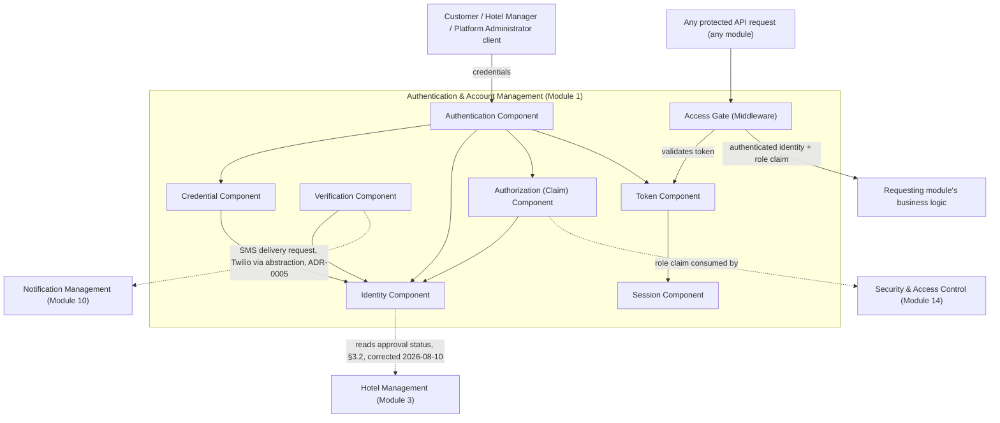
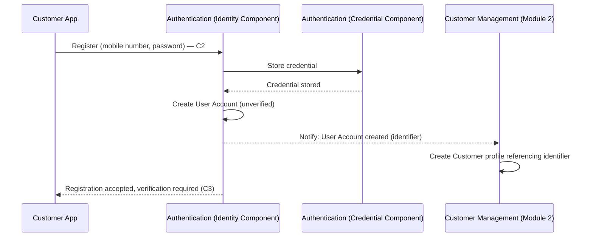
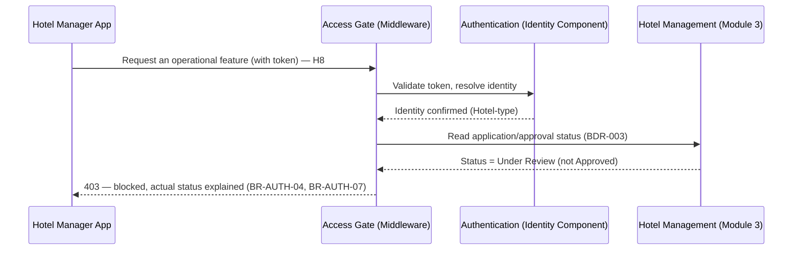
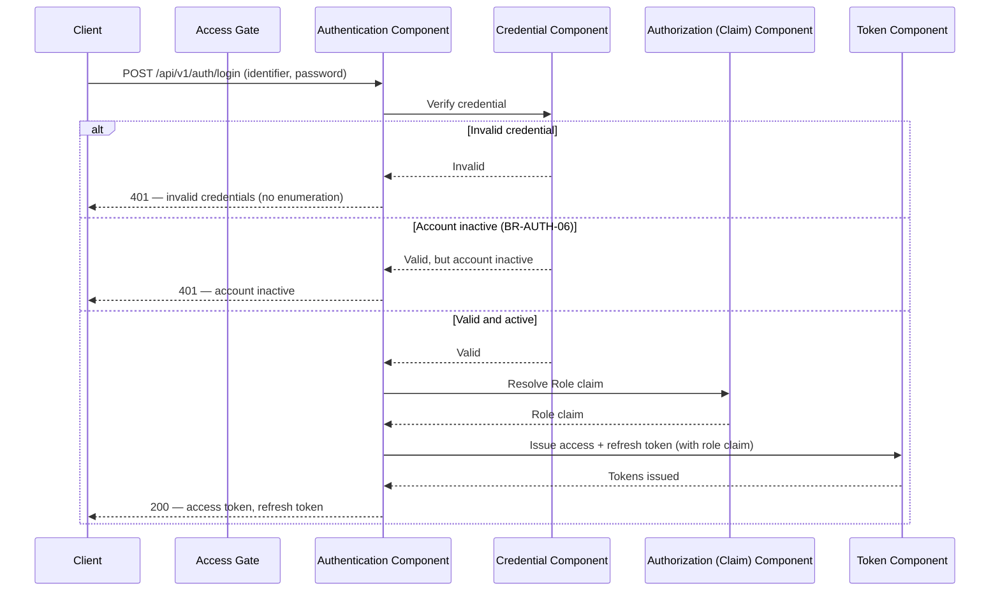
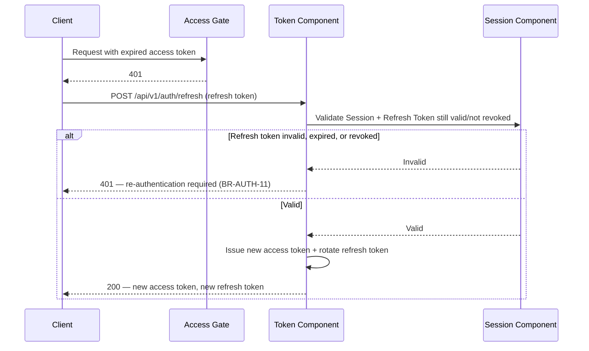
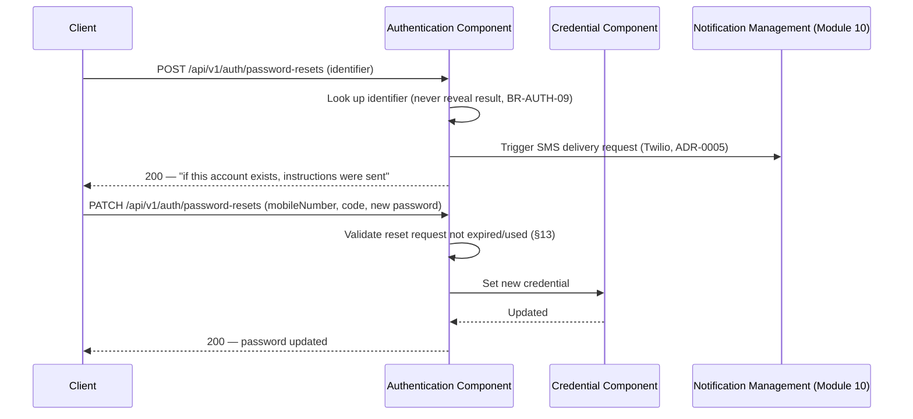
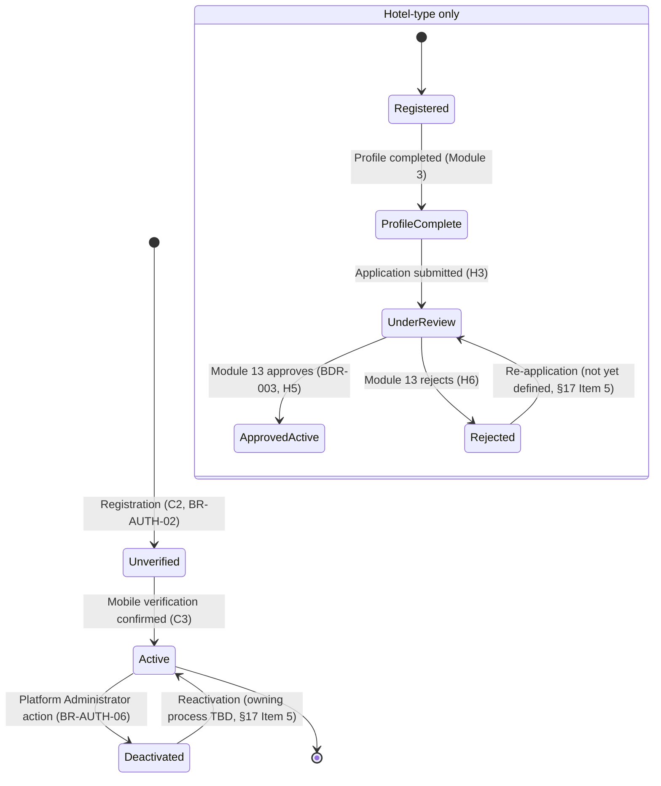
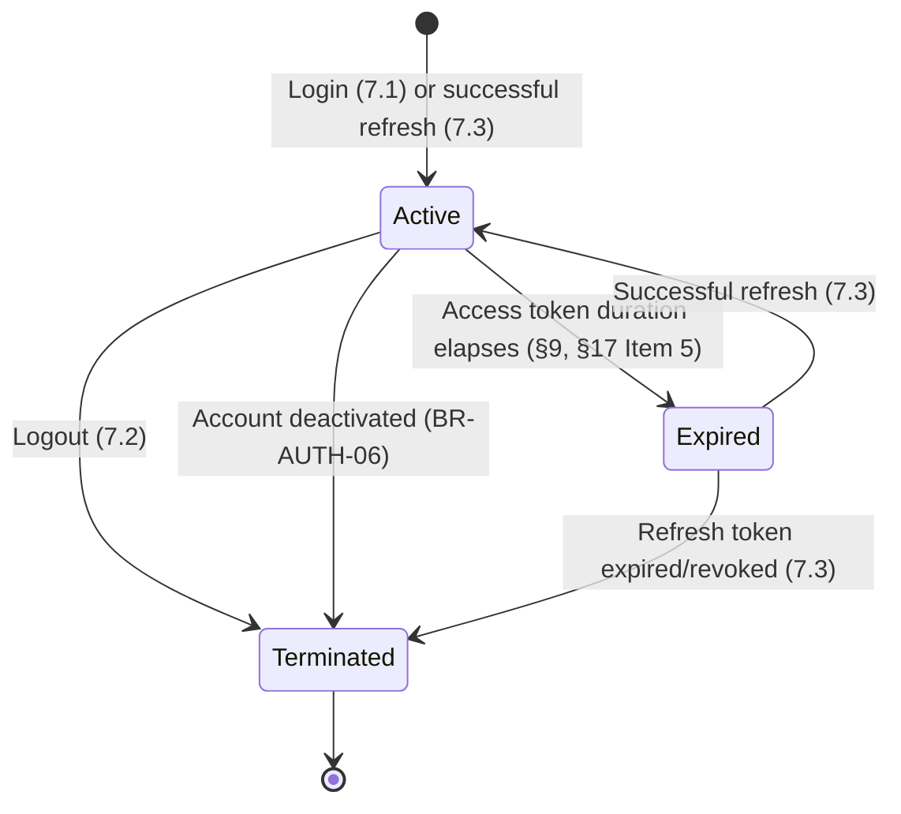
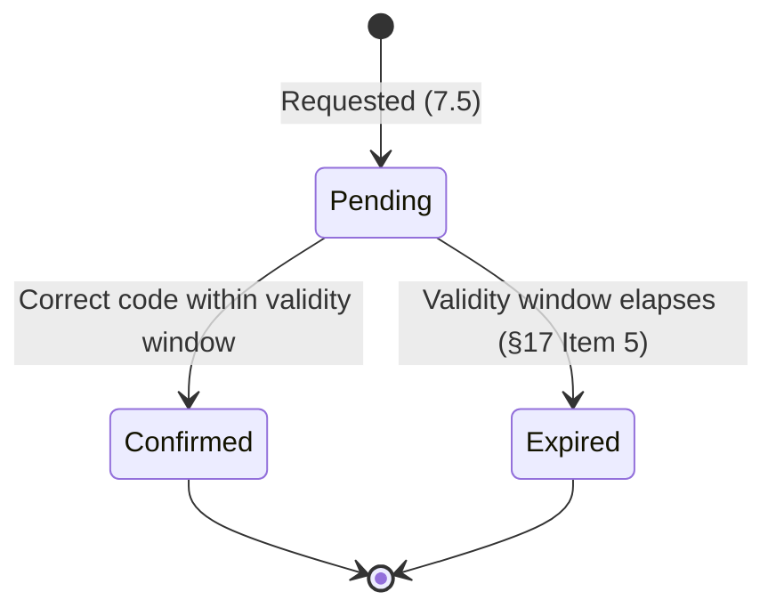

# Authentication & Account Management — Technical Design
## Hotel Hall Booking Management System

> **Relationship to other documents:** this document answers *how* Module 1 is built, never
> *what* it does or *why* — every business rule, account state, and journey referenced below
> is defined once, in `business-specification.md`, and cited here by ID (`BR-AUTH-##`, `C#`,
> `H#`, `A#`) rather than restated. Where this document and the Business Specification appear
> to disagree, the Business Specification governs (`documentation-standards.md` §2) and this
> document has a defect to correct. Where this document and an approved architecture or
> standards document appear to disagree, the more detailed/canonical document governs
> (`system-architecture-overview.md`'s own relationship rule) and this document is corrected,
> not the other way around.

---

## 1. Purpose

This Technical Design translates the `Approved` Authentication & Account Management
Business Specification into a concrete technical architecture: components, data design,
interactions, API contract, and technical behavior — conforming to
`architecture-principles.md`, `system-architecture-overview.md`, `data-architecture.md`, and
the Standards Layer (`api-standards.md`, `database-standards.md`, `coding-standards.md`,
`naming-conventions.md`).

It does not restate business rules, journeys, or acceptance criteria — every technical
decision below traces to one (§15, Traceability Matrix). It does not contain Prisma models,
SQL, controller implementations, or client (Flutter/React) code — those belong to
Implementation Planning and Development (`documentation-architecture.md` §11–§12), once this
document reaches `Approved`.

---

## 2. Module Overview

### 2.1 Responsibilities

Per the Business Specification's scope (§2) and `system-architecture-overview.md` §6
("Authentication | Identity, login, account lifecycle"):

- **Identity** — represents each authenticatable actor (Customer, Hotel, Platform
  Administrator, Staff Member) as a single login identity, independent of that actor's
  business profile (owned elsewhere, §3).
- **Authentication** — verifying a presented credential and issuing proof of identity.
- **Authorization (identity/role production only)** — producing the authenticated identity's
  role claim that Security & Access Control (Module 14) evaluates; this module does not
  define or enforce permission policy itself (`BR-AUTH-14`).
- **Session Management** — the technical mechanism behind a logged-in state, its validity,
  and its termination.
- **Credential Management** — password storage, verification, and change.
- **Identity Verification** — confirming a Customer's mobile number (`BR-AUTH-02`).
- **Access Control (primitive layer)** — the authentication/authorization middleware layer
  every other module's endpoints sit behind (`architecture-principles.md` §7).

### 2.2 Architectural Role

This module is the **dependency root of the entire platform** (`Project-Overview.md` §23):
no other module's protected functionality is reachable without it. It is also the concrete
implementation of two structural principles from `architecture-principles.md` §7:
"Authentication before authorization, structurally" and "Refresh tokens are a distinct
security boundary." Architecturally, it sits as a cross-cutting layer every request passes
through (`system-architecture-overview.md` §5, Middleware) rather than a module business
logic reaches into directly.

### 2.3 Design Objectives

- **Security by design** — credentials and tokens are never exposed, logged, or handled
  outside this module's Credential and Token Components (§4, §11).
- **Statelessness at the API layer** — authentication state travels with the request via JWT
  (`architecture-principles.md` §8), never server-side session memory.
- **Tenant-awareness** — a Hotel-type identity's token carries the scoping information
  Module 14's authorization policy needs to enforce tenant isolation
  (`architecture-principles.md` §6, `data-architecture.md` §11).
- **Deferred registration support** — the identity model accommodates unauthenticated
  browsing followed by registration at the point of booking (`BDR-009`, `C1`–`C2`), rather
  than assuming every Customer interaction is pre-authenticated.
- **Extensibility without redesign** — new credential or verification methods can be added
  later (§14) without changing this module's boundaries or its consumers' integration
  points.
- **Full compliance with the approved Business Specification** — every technical rule below
  exists because a `BR-AUTH-##` requires it (§15); none is introduced for technical
  convenience.

### 2.4 Dependencies

| Dependency | Relationship |
|---|---|
| PostgreSQL + Prisma (`technology-stack.md`) | This module's persistence layer, per `database-standards.md`. |
| Customer Management (Module 2) | Owns the Customer's business profile; references this module's identity (§3, §5). |
| Hotel Management (Module 3) | Owns the Hotel's business profile and its application/approval and lifecycle status (`BDR-003`, `data-architecture.md` §9, corrected 2026-08-10); references this module's identity (§3, §5). This module reads that status to gate access (`BR-AUTH-04`) but does not own or duplicate it. |
| Administration & Platform Management (Module 13) | Owns the Platform Administrator's review/approval/rejection/suspension **workflow and interface** (`BDR-003`) — not the underlying Hotel status data, which Hotel Management owns (corrected 2026-08-10, see above). Administration & Platform Management performs its review action against Hotel Management's data through Hotel Management's defined interface. |
| Staff Management (Module 9) | Creates Staff identities under a Hotel; this module authenticates them the same as any other identity (Business Specification §3). |
| Security & Access Control (Module 14) | Consumes this module's authenticated identity and role claim to enforce permission policy (`BR-AUTH-14`); this module does not depend on Module 14 to function, but Module 14 depends on this module. |
| SMS delivery (see §11, §17) | Identity Verification (`BR-AUTH-02`) and Password Recovery (`BR-AUTH-09`) require delivering a message outside the app; Twilio is the approved provider (`ADR-0005`), behind the Verification Component's abstraction (§4, §11). |

---

## 3. Module Boundaries

### 3.1 Owns

- **Identity** — the login identity record for every account type (§5).
- **Authentication** — credential verification, login, logout.
- **Authorization (production only)** — issuing the role claim; not the permission policy
  itself (`BR-AUTH-14`; owned by Module 14).
- **Session Management** — session/token issuance, validity, expiration, termination (§9).
- **Credential Management** — password storage, change, reset (§7, §11).
- **Identity Verification** — mobile number verification (§7).
- **Access Control (primitive enforcement layer)** — the authentication middleware every
  protected endpoint, across every module, sits behind.

### 3.2 Does Not Own

| Not Owned | Owning Module | This Module's Relationship to It |
|---|---|---|
| Customer onboarding (profile, preferences) | Customer Management (Module 2) | Creates the Identity a Customer profile references; never stores profile fields. |
| Hotel onboarding (profile, application review/approval) | Hotel Management (Module 3) | Creates the Identity a Hotel account references; reads (never writes) the application/approval status Hotel Management owns (`BDR-003`, corrected 2026-08-10 — previously misattributed to Administration & Platform Management), to gate access (`BR-AUTH-04`, `BR-AUTH-07`). Administration & Platform Management (Module 13) owns only the review workflow/interface through which that status changes, not the status data itself. |
| Booking | Booking Management (Module 5) | No direct relationship; a Booking references a Customer's Identity only indirectly, through Customer Management. |
| Payments | Payment Management (Module 7) | No relationship. |
| Hotel Management (Hall inventory, operations) | Hotel Management (Module 3) | No relationship beyond the Identity reference above. |
| Customer Management (profile/history) | Customer Management (Module 2) | See above. |
| Notification Management | Notification Management (Module 10) | This module *triggers* identity-related notifications (verification codes, password-reset messages, account-status changes) through Notification Management's interface; it does not compose, template, or deliver messages itself. |
| Permission / authorization policy (what a role may do) | Security & Access Control (Module 14) | This module produces the identity and role claim Module 14's policy evaluates (`BR-AUTH-14`). |
| Audit Record ownership | *(Not currently assigned to any domain — §17, Item 4)* | This module produces Audit Records for security-significant events (§11) without claiming ownership of the Audit Record entity itself. |

---

## 4. Component Architecture

| Component | Responsibility |
|---|---|
| **Identity Component** | Creates and retrieves the login identity for an account (§5); the single point every other component resolves "which account is this" through. |
| **Credential Component** | Stores and verifies password credentials; handles password change and the password-reset lifecycle (`BR-AUTH-08`, `BR-AUTH-09`). Never exposes a stored credential in any form. |
| **Authentication Component** | Verifies a presented credential against the Credential Component and, on success, requests token issuance from the Token Component (`C4`, `H7`, `A1`). |
| **Verification Component** | Manages the Identity Verification lifecycle (`BR-AUTH-02`, `C3`) — issuing, tracking, and confirming a verification request, through the abstraction described in §11/§17. |
| **Token Component** | Issues, validates, and revokes access and refresh tokens (`architecture-principles.md` §7); the only component that constructs or parses a JWT. |
| **Session Component** | Represents the logical session a Token Component's tokens belong to; tracks session validity and termination (§9), independent of the token format itself. |
| **Authorization (Claim) Component** | Resolves an Identity's Role(s) (`data-architecture.md` §5) into the claim the Token Component embeds — production only, not policy evaluation (`BR-AUTH-14`). |
| **Access Gate (Middleware)** | The shared middleware every protected endpoint (in every module) passes through; validates the token via the Token Component before a request reaches any module's business logic (`architecture-principles.md` §7, `api-standards.md` §12). |



---

## 5. Data Design (Logical)

Business purpose only, per `data-architecture.md` §4's convention — no Prisma models, no
SQL, no physical shape.

| Logical Entity | Business Purpose |
|---|---|
| **User Account** | The login identity for one actor (Customer, Hotel, Staff Member, or Platform Administrator) — holds the credential reference, account type, account status (`BR-AUTH-06`), and verification status. The entity every other domain's profile record references (`data-architecture.md` §9, Single Source of Truth). |
| **Role** | A named set of permissions a User Account holds (`data-architecture.md` §4) — Customer, Hotel Manager, Staff, Platform Administrator. Master data; this module references it, Module 14 defines what each Role means. |
| **Session** | Represents one authenticated session's lifecycle (§9) — logically distinct from the Token Component's tokens, so a session can be reasoned about (and terminated) independent of token format. |
| **Refresh Token** | Represents one issued refresh token's lineage for a Session — enables the revocation and rotation `architecture-principles.md` §7 requires, treating it as a distinct security boundary from the access token. |
| **Verification Request** | A pending or resolved attempt to verify a User Account's mobile number (`BR-AUTH-02`) — has a lifecycle (§13) and an expiry. |
| **Password Reset Request** | A pending or resolved attempt to reset a User Account's password (`BR-AUTH-09`) — has a lifecycle (§13) and an expiry, and never reveals whether the originating identifier exists (`BR-AUTH-09`'s anti-enumeration rule). |

### 5.1 Relationships (conceptual only)

- A **User Account** is referenced by exactly one profile record in its owning domain — a
  Customer profile (Module 2), a Hotel profile (Module 3), a Staff Member record (Module 9),
  or a Platform Administrator record (Module 13). This module never stores that profile data
  itself (§3.2).
- A **User Account** holds one or more **Roles** (`data-architecture.md` §5).
- A **User Account** has zero or more **Sessions** over its lifetime; at most the number of
  concurrently valid Sessions permitted by policy (§9, §17 Item 5 — not yet defined).
- A **Session** has one current **Refresh Token** at any time; a refresh rotates it to a new
  one rather than reusing it (§7, §11).
- A **User Account** has zero or more **Verification Requests**, historically, but at most
  one *active* (unexpired, unconfirmed) Verification Request at a time.
- A **User Account** has zero or more **Password Reset Requests**, historically, but at most
  one *active* Password Reset Request at a time.
- A **Hotel**-type User Account's ability to reach operational features additionally depends
  on the Hotel's application/approval status (`BR-AUTH-04`), which this module reads from
  the Hotel domain (`BDR-003`, `data-architecture.md` §9, corrected 2026-08-10) rather than
  owning.

---

## 6. Module Interactions

- **Customer Management (Module 2)** — Authentication creates the User Account at
  registration (`C2`); Customer Management creates the Customer profile referencing that
  User Account's identifier. Authentication never reads or writes Customer profile fields.
- **Hotel Management (Module 3)** — Same pattern as Customer Management, for the Hotel
  profile (`H1`–`H2`). Authentication also reads the Hotel's application/approval status
  (owned by Hotel Management per `BDR-003`, corrected 2026-08-10) to evaluate `BR-AUTH-04`
  when a Hotel account attempts to reach operational features (`H8`).
- **Administration & Platform Management (Module 13)** — Owns the review/approve/reject
  workflow and interface (`BDR-003`), which acts on Hotel Management's data through Hotel
  Management's defined interface (Hotel Management Technical Design §7). Authentication has
  no direct relationship with Module 13 — it never performs, and never reads the result of,
  the review/approve/reject action itself (§3.2); it reads the resulting status from Hotel
  Management, above.
- **Notification Management (Module 10)** — Authentication triggers a notification request
  (a verification code, a password-reset message, an account-deactivation notice) through
  Module 10's interface; Module 10 owns composition and delivery. The verification-code and
  password-reset messages specifically are delivered via SMS through Twilio (`ADR-0005`);
  other account-status notices (e.g. deactivation) are not scoped by that ADR and remain
  Module 10's own channel choice.
- **Security & Access Control (Module 14)** — Authentication produces the authenticated
  identity and role claim; Module 14's policy evaluates it against the requested resource
  and action (`BR-AUTH-14`). This module has no dependency on Module 14 to authenticate a
  user; Module 14 depends on this module's output to authorize one.
- **Audit** — there is no approved "Audit Module" among the fourteen approved modules
  (`Project-Overview.md` §6); Audit Records are a cross-cutting data concern
  (`data-architecture.md` §4, §14) with no domain currently assigned ownership in
  `data-architecture.md` §9 (§17, Item 4). This module produces Audit Records for
  security-significant events (§11) as a cross-cutting capability, not as an interaction
  with a dedicated module.

### 6.1 Sequence — Customer Registration Touching Customer Management



### 6.2 Sequence — Hotel Access Attempt Before Approval (Reading Hotel Management's Status)

**Corrected 2026-08-10:** this diagram previously showed the Access Gate reading approval
status from Administration & Platform Management (Module 13); that status is owned by Hotel
Management (Module 3), not Module 13 (§2.4, §3.2) — corrected below.



---

## 7. Authentication Design

### 7.1 Login Flow (`C4`, `H7`, `A1`)



### 7.2 Logout Flow (`C5`, `A2`, `BR-AUTH-13`)

```mermaid
sequenceDiagram
    participant Client
    participant Auth as Authentication Component
    participant Tok as Token Component
    participant Sess as Session Component

    Client->>Auth: POST /api/v1/auth/logout (access token)
    Auth->>Tok: Revoke current refresh token
    Tok->>Sess: Terminate Session
    Sess-->>Tok: Session terminated
    Tok-->>Auth: Revoked
    Auth-->>Client: 204 — logged out; no further action succeeds without re-login (BR-AUTH-13)
```

### 7.3 Token Issuance and Refresh (`api-standards.md` §12, `architecture-principles.md` §7)



### 7.4 Password Recovery (`C6`, `BR-AUTH-09`)



### 7.5 Identity Verification (`C3`, `BR-AUTH-02`)

```mermaid
sequenceDiagram
    participant Client
    participant Auth as Verification Component
    participant Notif as Notification Management (Module 10)

    Client->>Auth: POST /api/v1/auth/verifications (after registration)
    Auth->>Auth: Create Verification Request (§13)
    Auth->>Notif: Trigger SMS delivery request (Twilio, ADR-0005)
    Auth-->>Client: 200 — verification pending
    Client->>Auth: POST /api/v1/auth/verifications/confirm (code)
    alt Correct, unexpired code
        Auth->>Auth: Mark Verification Request confirmed; activate User Account
        Auth-->>Client: 200 — account active
    else Incorrect or expired code
        Auth-->>Client: 422 — invalid or expired verification request
    end
```

---

## 8. Authorization Design

Per `BR-AUTH-14`, this module produces the inputs Module 14's policy consumes; it does not
define permission rules itself.

- **Role evaluation** — the Authorization (Claim) Component resolves the authenticated User
  Account's Role(s) (`data-architecture.md` §5) at token-issuance time (§7.1) and embeds
  them as a claim in the access token (`architecture-principles.md` §7, RBAC as a
  first-class layer).
- **Permission evaluation** — performed by Module 14's policy, outside this module's
  boundary, using the role claim this module produced (`api-standards.md` §13).
- **Access control flow** — every protected request passes through the Access Gate (§4),
  which validates the token (authentication) before Module 14's authorization policy is
  consulted (authentication-before-authorization, `architecture-principles.md` §7) —
  authentication failure short-circuits with `401` before authorization is ever evaluated.
- **Protected resource access** — a request reaching a module's business logic has already
  passed both gates; a module's own business logic never re-implements authentication, and
  performs only its own business-rule checks, not identity or role checks.
- **Tenant scoping** — for a Hotel-type identity, the role claim carries the scoping
  information (`architecture-principles.md` §6) Module 14 needs to enforce that a Hotel
  Manager's token authorizes actions only within their own Hotel (`api-standards.md` §13);
  this module produces that scoping data, it does not enforce the tenant check itself.

---

## 9. Session Management

- **Session creation** — a Session is created at successful login (§7.1) or successful
  token refresh (§7.3, which extends rather than replaces the logical Session), and holds
  the current Refresh Token reference (§5).
- **Session validation** — every protected request's access token is validated by the
  Access Gate against the Token Component (§4); the underlying Session's state (active vs.
  terminated) governs whether a refresh against it will succeed (§7.3).
- **Session expiration** — an access token expires after a duration this Technical Design
  does not fix (§17, Item 5 — tracked in the Business Specification as Pending Business
  Decision #3, Session Validity Duration); expiration is handled per `BR-AUTH-10`/`BR-AUTH-11`
  — treated as unauthenticated, not as an error state (`mobile-application-architecture.md`
  §13).
- **Session termination** — explicit, via logout (§7.2), or implicit, via refresh-token
  expiry/revocation (§7.3) or account deactivation (`BR-AUTH-06`), which must terminate any
  Session belonging to the deactivated User Account.
- **Concurrent session behavior** — **not currently defined.** The approved Business
  Specification does not state whether multiple simultaneous Sessions per User Account
  (e.g. the same Customer logged in on two devices) are permitted, limited, or mutually
  exclusive. Consistent with the same governance discipline the Business Specification
  applies in its own §10, this is flagged as a candidate for a future Pending Business
  Decision ("Concurrent Session Policy") rather than assumed here (§17, Item 5). The Session
  Component's design (§5, one Session per login/refresh cycle) accommodates either outcome
  without restructuring.

---

## 10. API Design

Every endpoint follows `api-standards.md` in full: `/api/v1/...` versioning (§3), the
success/error envelopes (§7–§8), the status codes in §9, and `naming-conventions.md` §9's
field casing. Endpoints are illustrative of this module's contract; exact request/response
field lists are an Implementation Planning concern once numeric parameters (§17, Item 5) are
resolved.

#### `POST /api/v1/auth/register`
- **Purpose** — create a new User Account (Customer or Hotel) — `C2`, `H1`.
- **Request** — `accountType` (`CUSTOMER` \| `HOTEL`), primary identifier (mobile number),
  password.
- **Response** — `201 Created`; the created identity's identifier and account status. Never
  the password or any credential material (`data-architecture.md` §13).
- **Authentication** — Public (`api-standards.md` §12, secure-by-default exception
  explicitly documented here).
- **Authorization** — N/A.
- **Validation** — `400` for malformed identifier/missing fields; `422` if the identifier is
  already registered (`BR-AUTH-02`) or the password fails the strength policy (§17, Item 5,
  Pending Business Decision #1).

#### `POST /api/v1/auth/verifications`
- **Purpose** — request a mobile-verification code for the authenticated-but-unverified
  User Account — `C3`.
- **Request** — none beyond the caller's identity (from a limited-scope token issued at
  registration, or the identifier).
- **Response** — `200 OK`; confirmation that a verification request was created.
- **Authentication** — Requires the limited, unverified-account context established at
  registration.
- **Authorization** — N/A beyond identity match (a User Account may only request
  verification for itself).
- **Validation** — `409` if an active Verification Request already exists (§13); `422` if
  the account is already verified.

#### `POST /api/v1/auth/verifications/confirm`
- **Purpose** — confirm a verification code, activating the User Account — `C3`,
  `BR-AUTH-02`.
- **Request** — the verification code.
- **Response** — `200 OK`; updated account status (`Active`).
- **Authentication** — Same as above.
- **Authorization** — N/A beyond identity match.
- **Validation** — `422` for an incorrect or expired code (§13); this module does not invent
  a new status code for "expired" per `api-standards.md` §9.

#### `POST /api/v1/auth/login`
- **Purpose** — authenticate and issue tokens — `C4`, `H7`, `A1`.
- **Request** — identifier, password.
- **Response** — `200 OK`; access token, refresh token.
- **Authentication** — Public.
- **Authorization** — N/A.
- **Validation** — `401` for invalid credentials or an inactive account (`BR-AUTH-06`),
  worded per §7.1 to avoid enumeration and to distinguish inactive-account from
  invalid-credential where the Business Specification requires it.

#### `POST /api/v1/auth/logout`
- **Purpose** — terminate the current session — `C5`, `A2`, `BR-AUTH-13`.
- **Request** — none beyond the current access token.
- **Response** — `204 No Content`.
- **Authentication** — Required (valid access token).
- **Authorization** — N/A beyond identity match.
- **Validation** — `401` if the token is already invalid/expired.

#### `POST /api/v1/auth/refresh`
- **Purpose** — exchange a valid refresh token for a new access token — §7.3.
- **Request** — refresh token only, per `api-standards.md` §12 ("never accepted anywhere a
  regular access token is expected").
- **Response** — `200 OK`; new access token, rotated refresh token.
- **Authentication** — The refresh token itself is the credential; no access token required.
- **Authorization** — N/A.
- **Validation** — `401` for an invalid, expired, or revoked refresh token (`BR-AUTH-11`).

#### `POST /api/v1/auth/password-resets`
- **Purpose** — request a password reset — `C6`, `BR-AUTH-09`.
- **Request** — the account's identifier.
- **Response** — `200 OK`, with a message that does not confirm or deny the identifier's
  existence (`BR-AUTH-09`).
- **Authentication** — Public.
- **Authorization** — N/A.
- **Validation** — `400` only for a malformed identifier; never `404` (would leak
  existence).

#### `PATCH /api/v1/auth/password-resets`
- **Purpose** — confirm a password reset with the reset code and a new password — `C6`.
- **Request** — `mobileNumber`, `code`, `newPassword`. **Corrected in v1.5**: originally
  specified as `PATCH /password-resets/:id`, but the `POST` above (§10, "never confirm or
  deny the identifier's existence") cannot return a request id to the client without itself
  revealing whether the account exists — an id in the response is exactly the kind of signal
  `BR-AUTH-09` forbids. `mobileNumber` + `code` identify the request instead, the same
  pattern `POST /verifications/confirm` already uses.
- **Response** — `200 OK`.
- **Authentication** — Public — the code itself, tied to the mobile number, is the
  credential; no access token (the caller cannot log in, which is the whole reason this
  endpoint exists).
- **Authorization** — N/A.
- **Validation** — `422` for an incorrect, expired, or superseded reset code (Technical
  Design §5.1 — at most one active request per account, so an earlier code stops working
  once a newer one is requested) or a new password failing policy (§17, Item 5).

#### `PATCH /api/v1/auth/password`
- **Purpose** — change password while authenticated — `C7`, `A3`, `BR-AUTH-08`.
- **Request** — current password, new password.
- **Response** — `200 OK`.
- **Authentication** — Required.
- **Authorization** — N/A beyond identity match (a User Account may only change its own
  password).
- **Validation** — `422` if the current password is incorrect, or the new password fails
  policy (§17, Item 5).

#### `GET /api/v1/auth/me`
- **Purpose** — retrieve the authenticated identity's own account summary — `C8`.
- **Request** — none.
- **Response** — `200 OK`; account type, role, verification status, account status. Never
  credential material.
- **Authentication** — Required.
- **Authorization** — N/A beyond identity match.
- **Validation** — `401` if the token is invalid/expired (`BR-AUTH-11`).

---

## 11. Security Design

`security-architecture.md` is currently `Not Started` (§17, Item 1) — this section is
grounded instead in what is already `Approved`: `architecture-principles.md` §7,
`system-architecture-overview.md` §10, `api-standards.md` §12/§19,
`mobile-application-architecture.md` §10/§12, `database-standards.md` §16, and
`coding-standards.md` §12. Once `security-architecture.md` and
`security-coding-standards.md` are authored, this section must be reconciled against them.

- **Password handling** — a password is never stored, logged, or transmitted in recoverable
  form; it is hashed before persistence (`coding-standards.md` §12) using **Argon2id**,
  decided by Ahmed 2026-08-03 (see box below). The specific strength/complexity *policy* for
  what a user may choose as a password remains Pending Business Decision #1 (§17, Item 5) —
  distinct from the hashing algorithm, which is settled.

  > **Hashing algorithm decision — Argon2id.** Considered against bcrypt (the credible
  > alternative — simpler, no native-binary dependency, still acceptable per OWASP) and
  > scrypt/PBKDF2 (OWASP's third and last-resort choices, not competitive on Security).
  > Argon2id is OWASP's current first-choice recommendation for password storage: memory-hard
  > and resistant to GPU/ASIC cracking in a way bcrypt is not, which matters directly for a
  > platform that also handles payments (`BDR-002`, `BDR-004`) and therefore has a higher
  > incentive-to-attack profile than a low-value target. Its one real cost — a native module
  > dependency (`argon2` npm package) that must build correctly in the Docker image
  > (`technology-stack.md`) — is a one-time Development-phase (WBS-03) concern, not an
  > ongoing one, and does not outweigh the Security criterion
  > (`Decision-Making-Principles.md` §6) for a security-critical, dependency-root module.
  > Exact cost parameters (memory, iterations, parallelism) are tuned during WBS-03 against
  > OWASP's published baseline guidance once the hosting environment's hardware is known
  > (`Project-Overview.md` §13 — hosting remains `TBD`); fixing precise numeric parameters
  > now, ahead of that, would be guessing. This is a Technical Decision within already
  > approved architecture and standards (`Decision-Making-Principles.md` §3 — not an
  > architecture change, so no ADR is required), recorded here per `coding-standards.md`
  > §12's own instruction that this Technical Design is where the algorithm is named. Once
  > `security-coding-standards.md` is authored (§17, Item 1), it should adopt this same
  > algorithm as the project-wide default rather than leave it Module-1-specific.
- **Token lifecycle** — an access token is short-lived and stateless; a refresh token is a
  distinct, longer-lived security boundary (`architecture-principles.md` §7) with its own
  revocation path (§7.3, §9) — the two are never interchangeable, and a refresh token is
  never accepted where an access token is expected (`api-standards.md` §12).
- **Credential protection** — password hashes and tokens are classified **Restricted**
  (`data-architecture.md` §13) — never present in any API response body, regardless of
  requester role (`api-standards.md` §19).
- **Audit events** — login success/failure, password change, password reset, verification
  outcome, and account activation/deactivation are recorded as Audit Records for
  security-significant, state-changing actions (`api-standards.md` §19,
  `Project-Constitution.md` §8) — subject to the ownership gap noted in §17, Item 4.
- **Identity verification** — the Verification Component (§4) delivers via Twilio SMS
  (`ADR-0005`), behind the same abstraction (`architecture-principles.md` §10–§11 pattern)
  used for storage and push notifications, so the concrete provider can be replaced later
  via a new ADR without changing this module's design.
- **Session security** — refresh token rotation on every use (§7.3), explicit revocation on
  logout (§7.2) and deactivation (`BR-AUTH-06`), and client-side secure storage
  (`mobile-application-architecture.md` §10) — this module is responsible for the
  server-side half of that guarantee; secure client storage is the consuming app's
  responsibility, not re-specified here.

---

## 12. Error Handling

All error categories use `api-standards.md` §8's error envelope and §9's status codes — no
new status code is introduced (§9's rule: "No other status code is used without an explicit,
documented reason").

| Category | Status Code | Handling Strategy |
|---|---|---|
| Authentication failures (invalid credentials, invalid/missing token) | `401` | Generic, non-enumerating message (`BR-AUTH-09`); routes the client to login/re-authentication (`mobile-application-architecture.md` §13). |
| Authorization failures | `403` | Not produced by this module directly (§8) — surfaced by Module 14's policy using this module's identity/role output; included here for contract completeness on shared middleware. |
| Validation failures (request shape) | `400` | Malformed input rejected before any business logic runs (`api-standards.md` §14). |
| Validation failures (business rule) | `422` | E.g. duplicate registration, incorrect current password, expired verification/reset request — well-formed request, business rule not satisfied. |
| Expired or invalid sessions | `401` | Treated identically to an authentication failure — never a distinct error type a client must special-case (`BR-AUTH-11`). |
| Invalid verification/reset requests | `422` | An expired or already-used request is a business-rule failure, not a "not found" (`404` would incorrectly imply the resource concept doesn't exist) nor a new status code. |
| Deactivated account login attempt | `401` | Distinguished only in the human-readable `message` field (`BR-AUTH-06`), never a different status code, so clients handle one code path. |
| Rate-limited authentication endpoints | `429` | Per `api-standards.md` §19 — login and refresh held to stricter limits than general traffic; exact thresholds are an Implementation Planning parameter. |

---

## 13. State Models

### 13.1 User Account



*Note: the Hotel-type application states (Registered → Rejected) are owned by Hotel
Management (Module 3) (§3.2, corrected 2026-08-10); they are shown here only because
this module's access-gating logic (`BR-AUTH-04`) reads them.*

### 13.2 Session



### 13.3 Verification Request



---

## 14. Extension Points

This module's boundaries (§3) and abstraction points (§4, §11) support the following
without redesigning the module — consistent with `architecture-principles.md` §11
(Integration Principles: external services sit behind abstraction layers, replaceable
integrations):

- **OAuth providers / social login** — introduced as an additional credential-verification
  path into the Authentication Component (§4), alongside the existing password-based path,
  without changing the Identity, Session, or Token Components. Requires a new ADR
  (`Decision-Making-Principles.md` §7) before adoption, per `technology-stack.md`'s
  "changing this stack" rule.
- **Multi-factor authentication** — an additional verification step inserted between
  successful credential verification (§7.1) and token issuance; the Verification Component's
  existing lifecycle (§13.3) generalizes to this without structural change.
- **Biometric authentication** — `mobile-application-architecture.md` §12 already flags this
  as a future, not-required-for-MVP client-side unlock factor sitting in front of the
  existing token/session model — no server-side redesign implied.
- **Additional identity providers** (e.g. a future federated identity source) — would
  integrate at the Authentication Component as an additional credential-verification
  strategy, the same seam OAuth uses above.

None of these are approved or scheduled — they are documented here only to show the design
does not foreclose them, per the request's own framing.

---

## 15. Traceability Matrix

| Technical Element | Business Specification Reference |
|---|---|
| Identity Component, User Account entity | `BR-AUTH-02`, `BR-AUTH-03`, §5 (Account Types & Lifecycle) |
| Credential Component | `BR-AUTH-08`, `BR-AUTH-09` |
| Authentication Component, Login flow (§7.1) | `C4`, `H7`, `A1`, `BR-AUTH-06` |
| Logout flow (§7.2) | `C5`, `A2`, `BR-AUTH-13` |
| Token Component, refresh flow (§7.3) | `BR-AUTH-10`, `BR-AUTH-11`, Acceptance Criterion 8 |
| Verification Component (§7.5) | `C3`, `BR-AUTH-02` |
| Password recovery flow (§7.4) | `C6`, `BR-AUTH-09`, Acceptance Criterion 9 |
| Password change endpoint (§10) | `C7`, `A3`, `BR-AUTH-08`, Acceptance Criterion 10 |
| Access Gate, Authorization (Claim) Component (§8) | `BR-AUTH-14` |
| Hotel approval gating (§6.2, §13.1) | `BR-AUTH-04`, `BR-AUTH-07`, `H4`, `H6`, `H8`, `BDR-003` |
| Deactivated-account handling (§12) | `BR-AUTH-06`, `C9`, `A4` |
| Deferred registration (browsing without an account) | `BDR-009`, `C1`, `C2` |
| Session Component, concurrent-session note (§9) | Not yet covered by an approved rule — §17, Item 5 |
| Extension points (§14) | Business Specification does not currently require any of these — documented as non-foreclosure only, introducing no new business requirement |

Every row traces to an approved source; no technical element in this document lacks one.

---

## 16. Technical Review Checklist

- [ ] **Alignment with Business Specification** — every `BR-AUTH-##`, journey, and
      acceptance criterion is reflected somewhere in §5–§13 (§15).
- [ ] **Module boundary compliance** — §3's Owns/Does Not Own matches
      `architecture-principles.md` §3 and `data-architecture.md` §9's ownership rules.
- [ ] **Security compliance** — §11 conforms to everything currently `Approved`; gaps
      pending `security-architecture.md`/`security-coding-standards.md` are explicitly
      flagged, not silently assumed (§17).
- [ ] **Architecture compliance** — layering (`architecture-principles.md` §4), feature-based
      structure (`folder-structure.md` §4), and the technology stack
      (`technology-stack.md`) are followed with no undocumented component (§4).
- [ ] **API consistency** — §10 follows `api-standards.md` versioning, envelopes, status
      codes, and `naming-conventions.md` §9 naming exactly.
- [ ] **Maintainability** — component boundaries (§4) keep this module independently
      understandable, per `architecture-principles.md` §3.
- [ ] **Extensibility** — §14 confirms future credential/verification methods don't require
      redesign.
- [ ] **Testability** — components (§4) are defined with clear inputs/outputs, enabling unit
      testing per `testing-standards.md` without a live HTTP server (`coding-standards.md`
      §5's service-layer testability pattern).
- [ ] **Documentation consistency** — terminology matches `Project-Glossary.md`; every
      cross-reference in this document resolves to a real document/section.

---

## 17. Self-Review — Architectural Gaps & Blockers

Per this project's own rule that a Technical Design must never silently encode an
unrecorded answer (`business-decision-register.md` §1) and must never bypass an
architectural principle rather than flag it (`architecture-principles.md` §14), the
following genuine gaps were identified while authoring this document. None require
redesigning an approved business decision, and none contradict an approved document — they
are honest gaps in the surrounding documentation set that this Technical Design has worked
around (via explicit deferral or abstraction) but not silently resolved.

1. **`security-architecture.md` and `security-coding-standards.md` are both `Not Started`.**
   Both are named as mandatory design inputs for this work. This document grounds §11
   instead in everything already `Approved` that touches security
   (`architecture-principles.md` §7, `system-architecture-overview.md` §10, `api-standards.md`
   §12/§19, `database-standards.md` §16, `mobile-application-architecture.md` §10/§12), and
   defers what only those two documents can properly settle project-wide (exact
   token/session durations, rate-limit thresholds). The password hashing algorithm no longer
   waits on them — **resolved 2026-08-03: Argon2id**, decided by Ahmed and recorded directly
   in §11, per `coding-standards.md` §12's own instruction that this Technical Design is
   where it's named; `security-coding-standards.md` should adopt it as the project-wide
   default once authored. **Recommendation (unchanged for the rest):** author both documents
   (Ahmed, per `documentation-architecture.md` §8) before or during Implementation Planning —
   not a new BDR, since these are architecture documents, not business decisions.
2. ~~No approved external communication integration exists for verification/password-reset
   delivery.~~ **Resolved 2026-08-03 — `ADR-0005` (`Approved`,
   `docs/02-architecture/adr/0005-sms-delivery-provider.md`) selected Twilio as the approved
   SMS delivery provider for `BR-AUTH-02` (mobile verification) and `BR-AUTH-09` (password
   reset), scoped specifically to this module.** `system-architecture-overview.md` §8 and
   `technology-stack.md` have been updated accordingly. §7.4 and §7.5 are no longer blocked
   at the architecture level — implementation still depends on Business Specification
   Pending Decision #2 (verification code format/window, Item 5 below) for its exact
   parameters, same as every other component.
3. **`domain-model-and-bounded-contexts.md` does not exist** (referenced as "once authored"
   by both `data-architecture.md` and `system-architecture-overview.md`). This document's
   §5 and §15 are grounded directly in `data-architecture.md` §3–§5 and the Business
   Specification instead. Not a blocker for this document's own validity; recommend
   reconciling this Technical Design against `domain-model-and-bounded-contexts.md` once it
   is authored.
4. **Audit Record has no assigned owning domain.** `data-architecture.md` §4 lists "Audit
   Record" as a core entity, but §9's Data Ownership table does not assign it to any domain.
   This document (§6, §11) treats audit logging as a cross-cutting capability this module
   participates in without claiming ownership — consistent with not inventing a domain that
   doesn't exist — but the underlying gap in `data-architecture.md` is independent of this
   module and worth Ahmed's attention when that document is next revised.
5. **Several parameters remain genuinely undecided**, all already tracked in the Business
   Specification's §10 (Pending Business Decisions) except the last, which this Technical
   Design newly surfaces: password strength policy (#1), verification method/window (#2),
   session validity duration (#3), failed-login handling (#4), Customer self-deactivation
   (#5), Hotel re-application after rejection (#6), Platform Administrator credential
   recovery (#7), and **Concurrent Session Policy** (new — §9) — whether multiple
   simultaneous Sessions per User Account are permitted. None block this document's
   architecture, which is deliberately parameterized to accommodate any resolution; they
   block only the specific numeric/behavioral values Implementation Planning would need.

**Conclusion (updated 2026-08-03):** This Technical Design is internally consistent and
fully traceable to the `Approved` Business Specification, and does not contradict any
currently `Approved` architecture or standards document. Item 2's blocker is **resolved**
(`ADR-0005`, `Approved` — Twilio) and the password hashing algorithm, previously the most
consequential item Item 1 deferred, is also **resolved** (Argon2id, decided directly in
§11) — the Identity Verification, Password Recovery, and Credential Component designs
(§7.4, §7.5, §4) are all unblocked at the architecture level. Item 1's remaining scope is
narrower than originally flagged: `security-architecture.md` and
`security-coding-standards.md` are still `Not Started`, and this Technical Design's exact
token/session-duration and rate-limiting values still wait on them (or on Pending Business
Decisions #3/#4, Item 5) — but no component in this document is blocked from being
implemented by their absence any longer. Every component described here (Identity,
Authentication, Session, Token, Credential, Verification, and Authorization-claim design;
the API contract in §10; module boundaries in §3) is ready to proceed to Implementation
Planning and Development now. Item 5's pending parameters should still be resolved through
the Business Specification's existing governance path before those specific values are
finalized, but do not block starting the work itself.

**Implementation update (2026-08-04):** every component described in this document has now
been built (backend, `feature/authentication-identity-foundation`), including Identity
Verification and Password Reset (§7.4, §7.5), through the SmsProvider abstraction this
document specified (§4, §11) — `MockSmsProvider` for any environment without Twilio
credentials configured, `TwilioSmsProvider` when they're present, selected without the
application failing to start either way. Implementation surfaced one real defect in §10's
originally-specified `PATCH /password-resets/:id`, corrected below (v1.5) rather than
silently implemented around.

---

## 18. Frontend Integration Scope (`Approved` — not yet built)

**Status: scoping only — no Flutter or React code is written in this section**, consistent
with this document's own constraints (Deliverable). This section maps this module's
already-built API (§10) to the three approved client applications, using
`Hotel Hall Design System/` (repo root) as the visual source. **Reviewed and approved by
Mohamed, 2026-08-04** (`documentation-architecture.md` §4, no self-review), the same as
`implementation-plan.md` §3.1's `FE-##` tasks this section feeds. Being `Approved` makes it a
valid basis to build from — it is still scope and design, not code; Development
(`Development-Lifecycle.md` Phase 8) on any `FE-##` task is a separate step, per
`git-workflow-and-branching.md` §4 (a feature branch is created only once its documentation
is `Approved` and the feature reaches `Ready for Development`).

### 18.1 Design System Source

`Hotel Hall Design System/` is a React/JSX component library plus CSS custom-property design
tokens (`tokens/*.css`), currently **untracked in git** (added 2026-08-04, not yet
committed). No authentication screen exists in it today — `ui_kits/guest-app/Screens.jsx`
covers only the post-login guest experience (Stay/Key/Services), and `ui_kits/website/`
covers marketing/booking, not account flows. Every screen in §18.3 is newly composed from
the kit's primitive components (`components/core/`, `components/forms/`,
`components/feedback/`), not adapted from an existing mock.

**Recommendation, not a decision made here:** this kit is the closest thing this project has
to `docs/03-standards/ui-ux-and-accessibility-standards.md` (`documentation-architecture.md`
§9), which is still entirely unauthored. Ahmed should decide whether to commit this folder
into the repo and formally adopt it as that document's source, per the normal documentation
process — not decided unilaterally here.

### 18.2 Platform / Format Mismatch — the one real architectural gap

- **Admin Web** (React + Vite, `BDR-007`) can consume the kit's `.jsx` components and CSS
  tokens directly — same stack, no translation needed.
- **Customer Mobile** and **Hotel Manager Mobile** are Flutter/Dart
  (`technology-stack.md`) — the kit's `.jsx` components do not run there. What *does*
  transfer is the token **values** (hex colors, type scale, spacing scale, radii, motion
  durations — `tokens/*.css`) and the written brand/voice rules (`readme.md`) — these need a
  one-time port into a Flutter `ThemeData`/design-tokens package, a prerequisite task (§18.4,
  FE-00), not a per-screen one.
- **Fonts** (Cinzel, Cormorant Garamond, Jost) and **icons** (Lucide, loaded from a CDN in
  the web kit) are explicitly flagged in the kit's own `readme.md` as substitutions needing
  real binaries/a Dart-side equivalent for Flutter — an implementation-time technology
  choice (e.g. a `google_fonts`-style package), not decided here.

### 18.3 Screens Needed, by App and Journey

Every screen traces to a journey already defined in `business-specification.md` §7 and an
endpoint already built in §10 — nothing here introduces new business behavior.

| App | Screen | Journey / Rule | Endpoint(s) | Key components (design system) |
|---|---|---|---|---|
| Customer Mobile | Browse (no account) | `C1`, `BDR-009` | — | *(no auth screen at all — noted for boundary clarity)* |
| Customer Mobile | Register | `C2`, `BR-AUTH-02` | `POST /register` | `Input` ×2, `Button` (primary) |
| Customer Mobile | Verify mobile | `C3` | `POST /verifications`, `POST /verifications/confirm` | `Input` (code), `Button`, `Toast` (resend) |
| Customer Mobile | Login | `C4`, `BR-AUTH-06` | `POST /login` | `Input` ×2, `Button`, text link to Forgot Password |
| Customer Mobile | Logout | `C5`, `BR-AUTH-13` | `POST /logout` | Triggered from account/settings — not a dedicated screen |
| Customer Mobile | Forgot password (request) | `C6` | `POST /password-resets` | `Input` (mobile number), `Button` |
| Customer Mobile | Forgot password (confirm) | `C6` | `PATCH /password-resets` | `Input` (code), `Input` (new password), `Button` |
| Customer Mobile | Change password | `C7`, `BR-AUTH-08` | `PATCH /password` | `Input` ×2, `Button` — from account settings |
| Customer Mobile | Deactivated-account state | `C9`, `BR-AUTH-06` | `POST /login` (401) | `Toast` (tone `danger`) |
| Hotel Manager Mobile | Create account | `H1`, `BR-AUTH-03` | `POST /register` (`accountType=HOTEL_MANAGER`) | Same as Customer Register |
| Hotel Manager Mobile | Login | `H7`, `A1`-equivalent | `POST /login` | Same as Customer Login |
| Hotel Manager Mobile | Access blocked before approval | `H8`, `BR-AUTH-04`/`07` | `POST /login` + `GET /me` | Persistent blocked-state screen, **not** a toast — see §18.5 gap |
| Admin Web | Login | `A1` | `POST /login` | `Input` ×2, `Button` — direct reuse |
| Admin Web | Change password | `A3`, `BR-AUTH-08` | `PATCH /password` | `Input` ×2, `Button` — direct reuse |
| Admin Web | Logout | `A2` | `POST /logout` | Direct reuse |

Platform Administrator accounts are not self-registered (§3.2) — Admin Web has no
registration screen.

### 18.4 Proposed Frontend Task Breakdown

Illustrative WBS-style numbering (`FE-##`), **not yet added to
`implementation-plan.md`** — that requires its own review, the same gate every other WBS
addition to this feature has gone through.

| ID | Task | Depends on | Blocked? |
|---|---|---|---|
| FE-00 | Port design tokens (`tokens/*.css`) to a Flutter `ThemeData`/tokens package, shared by both mobile apps (`folder-structure.md` §5) | — | Prerequisite for FE-03–FE-07 |
| FE-01 | Admin Web — Login screen | Backend (done) | No |
| FE-02 | Admin Web — Change Password screen | Backend (done) | No |
| FE-03 | Customer Mobile — Register + Verify flow | FE-00 | Yes, on FE-00 |
| FE-04 | Customer Mobile — Login/Logout | FE-00 | Yes, on FE-00 |
| FE-05 | Customer Mobile — Forgot/Change Password | FE-00 | Yes, on FE-00 |
| FE-06 | Hotel Manager Mobile — Register/Login (shares FE-03/FE-04's components via Flutter `shared/`) | FE-00, FE-03, FE-04 | Yes |
| FE-07 | Hotel Manager Mobile — Access-before-approval state | FE-00, Module 3 & 13 Business Specs | Yes — §18.5 |

### 18.5 Genuine Gaps

1. **Design system location/adoption** — untracked folder; needs a repo-location decision and
   a decision on formally adopting it as `ui-ux-and-accessibility-standards.md`'s source
   (§18.1). Ahmed's call, not made here.
2. **Flutter token translation doesn't exist yet** (FE-00) — blocks every mobile screen; does
   not block Admin Web.
3. **Font binaries and an icon package are undecided** for Flutter (§18.2) — an
   implementation-time technology choice when FE-00 is actually built.
4. **FE-07's exact blocked-state copy can't be fully scoped yet** — it needs to show the
   Hotel's real application status (Registered / Profile Complete / Under Review /
   Rejected), and those states are owned by Hotel Management (Module 3) and Administration &
   Platform Management (Module 13), neither of which has an authored Business Specification
   yet. This table names the screen; it cannot name its exact content until those modules
   exist.
5. ~~This whole section is a proposal.~~ **Resolved 2026-08-04** — reviewed and approved by
   Mohamed; the `FE-##` tasks are formally in `implementation-plan.md` §3.1. Gaps 1–4 above
   remain genuinely open (they're facts about the world, not review status) and still block
   the specific `FE-##` tasks named in each.

---

## Version History

| Version | Date | Author | Change |
|---|---|---|---|
| 1.8 | 2026-08-10 | Ahmed | Corrected a data-ownership conflict discovered during Hotel Management's Technical Design review: every reference to "Hotel approval status" previously attributed to Administration & Platform Management (Module 13) is corrected to Hotel Management (Module 3), matching `data-architecture.md` §9 (corrected in the same pass) and the `Approved` Hotel Management Business Specification §3. §2.4, §3.2, §4 (component diagram), §5.1, §6 (sequence diagram §6.2), and §13.1 updated. Module 13's role is narrowed to owning the review workflow/interface only, acting on Hotel Management's data through Hotel Management's defined interface — no business decision changed; `BDR-003` never assigned data ownership, this corrects an architecture-layer inference that had gone beyond it. |
| 1.7 | 2026-08-04 | Ahmed | §18 (Frontend Integration Scope) reviewed and approved by Mohamed — status changed from "proposed, pending review" to `Approved`, matching `implementation-plan.md` §3.1's `FE-##` tasks it feeds. Scope only; still no Flutter/React code. |
| 1.6 | 2026-08-04 | Ahmed | Added §18, Frontend Integration Scope — maps §10's API to Customer Mobile, Hotel Manager Mobile, and Admin Web using `Hotel Hall Design System/` (repo root, untracked). Scoping only, no Flutter/React code. Flags the React-vs-Flutter format mismatch, a Flutter token-translation prerequisite (FE-00), and that Hotel Manager's access-blocked screen can't be fully scoped until Modules 3/13 have Business Specifications. **This section is new scope pending its own review** — not covered by Mohamed's earlier approval through v1.5. |
| 1.5 | 2026-08-04 | Ahmed | Milestone M3 implemented (Identity Verification, Password Reset) via the SmsProvider abstraction, `MockSmsProvider`/`TwilioSmsProvider`. §10's `PATCH /password-resets/:id` **corrected** to `PATCH /password-resets` (body: `mobileNumber`, `code`) — the original `:id` shape was discovered, during implementation, to be incompatible with this same endpoint's own anti-enumeration requirement (an id in the `POST` response would reveal account existence). §7.4 sequence diagram updated to match. |
| 1.4 | 2026-08-03 | Ahmed | Password hashing algorithm decided: **Argon2id**, recorded in §11 with rationale (bcrypt considered and rejected as the weaker alternative). §17 Item 1 narrowed accordingly (hashing no longer among what's deferred to `security-coding-standards.md`) and the Conclusion updated — every component in this document is now unblocked at the architecture level. |
| 1.3 | 2026-08-03 | Ahmed | `ADR-0005` reached `Approved` (Twilio selected). §2.4, §6, §7.4, §7.5, §11, and §17 (Item 2) updated from "blocked, awaiting ADR" to resolved — Identity Verification and Password Recovery are now unblocked at the architecture level. §17's Conclusion updated accordingly; Item 1 (missing security architecture documents) remains the sole open blocker. |
| 1.2 | 2026-08-03 | Ahmed | §17, Item 2 and the Conclusion now cite `ADR-0005` (`Proposed`, `docs/02-architecture/adr/0005-sms-delivery-provider.md`) by ID instead of referring generically to "a new ADR" — minor, clarifying cross-reference only; no rule changed. |
| 1.1 | 2026-08-03 | Ahmed | Status changed `Draft` → `Approved`: independent review by Mohamed or Abukar is complete, per `documentation-architecture.md` §4's no-self-review rule. §17's two flagged blockers (missing security architecture documents; no approved verification/notification delivery integration) remain open and are carried forward into Implementation Planning as dependencies/risks — approval of this design does not resolve them. |
| 1.0 | 2026-08-03 | Ahmed | Initial draft Technical Design for Authentication & Account Management, authored against the `Approved` Business Specification (v1.2). Self-review identified two genuine blockers (missing security architecture documents; no approved verification/notification delivery integration) — see §17. Not yet reviewed — see status. |
