# Hotel Management — Technical Design
## Hotel Hall Booking Management System

> **Relationship to other documents:** this document answers *how* Hotel Management is
> built, never *what* it does or *why* — every business rule and journey referenced below is
> defined once, in `business-specification.md` (`Approved`, v1.1), and cited here by ID
> (`BR-HOTEL-##`, `HM#`) rather than restated. Where this document and the Business
> Specification appear to disagree, the Business Specification governs
> (`documentation-standards.md` §2) and this document has a defect to correct. Where this
> document and an approved architecture or standards document appear to disagree, the more
> detailed/canonical document governs (`system-architecture-overview.md`'s own relationship
> rule) — except where §18 identifies a genuine, unresolved conflict *between* two already-
> approved documents, which is flagged rather than silently arbitrated.

---

## 1. Technical Overview

This Technical Design translates the `Approved` Hotel Management Business Specification
(v1.1) into a concrete technical architecture: components, domain model, data design, state
model, API contract, and module interactions — conforming to `architecture-principles.md`,
`system-architecture-overview.md`, `data-architecture.md`, and the Standards Layer
(`api-standards.md`, `database-standards.md`, `coding-standards.md`, `naming-conventions.md`).

It does not restate business rules, journeys, or acceptance criteria — every technical
decision below traces to one (§19, Traceability Matrix). It contains no Prisma schema, SQL,
Express controller implementation, or client (Flutter/React) code — those belong to
Implementation Planning and Development (`documentation-architecture.md` §12), once this
document reaches `Approved`.

Hotel Management is the technical realization of the Hotel as a **business entity and
tenant** (`data-architecture.md` §3–§4): its registration, profile, application lifecycle,
and operational-eligibility state. It is the second module in `Development-Roadmap.md`
Wave 1 ("Identity & Tenant Foundation"), depending only on Authentication & Account
Management (Module 1, `Approved` and implemented) and unblocked by any other module.

---

## 2. Architecture Context

### 2.1 Module Position

Per `system-architecture-overview.md` §6, this module is **"Hotel — Hotel (tenant) profile
and management,"** the backend module folder `hotels/` (`folder-structure.md` §4,
`naming-conventions.md` §4). It is one of the fourteen approved feature-based modules
(`architecture-principles.md` §3) and introduces no component outside that approved list.

### 2.2 Responsibilities

Directly realizing Business Specification §5 (Business Capabilities):

- **Hotel Registration** — establishing the Hotel business entity.
- **Profile Management** — Hotel profile completion and maintenance.
- **Application Submission & Review Tracking** — the application lifecycle and its status.
- **Application Outcome Handling** — approval, rejection (with edit/resubmit), withdrawal.
- **Operational Eligibility Control** — activation, suspension, deactivation.
- **Information Validity Enforcement** — restriction and review.
- **Change Impact Management** — ordinary vs. critical profile change handling.

### 2.3 Dependencies

| Dependency | Relationship |
|---|---|
| PostgreSQL + Prisma (`technology-stack.md`) | This module's persistence layer, per `database-standards.md`. |
| Authentication & Account Management (Module 1, `Approved`, implemented) | Provides the authenticated Hotel Manager identity and role claim (via the Access Gate) this module operates under; this module never re-implements identity, credentials, or session logic (§10). |
| Hall Management (Module 4, `Implementation`) | Consumes this module's operational-eligibility signal to decide whether a Hotel's Halls may be listed/visible (`BR-HOTEL-04`, `BR-HOTEL-05`); this module never owns Hall data (§10). |
| Administration & Platform Management (Module 13, `Not Started`) | Owns the Platform Administrator's review/approval/rejection/suspension **interface and workflow**; consumes this module's Hotel-lifecycle write interface to record its decisions (`BR-HOTEL-14`, §7, §10). |

### 2.4 Architectural Boundaries

Per Business Specification §3, restated technically:

- This module **owns** the Hotel entity, its profile, its application lifecycle, and its
  operational-eligibility state (§4–§6).
- This module **does not own** Hotel Manager identity/credentials/authentication (Module 1),
  Hall data (Module 4), or the Platform Administrator's review interface/workflow
  (Module 13) — §10 defines each interaction precisely.
- **§18 Item 1 (resolved 2026-08-10)** — `data-architecture.md` §9 and Module 1's Technical
  Design §2.4/§3.2 previously attributed "Hotel approval status" ownership to Module 13,
  conflicting with this boundary. Both documents have been corrected to match this Business
  Specification's approved boundary; see §18 for the resolution record.

---

## 3. Module Architecture

Internal components of the `hotels/` module (`folder-structure.md` §4), each with a single
responsibility (`architecture-principles.md` §4). No implementation code — conceptual
responsibility only.

| Component | Responsibility |
|---|---|
| **Hotel Component** | Creates and retrieves the Hotel entity (§4) — the aggregate root every other component operates on. The single point every other module resolves "which Hotel is this" through. |
| **Profile Component** | Manages Hotel profile data and profile-completion state (`BR-HOTEL-02`); classifies an incoming profile change as ordinary or critical and routes it accordingly (`BR-HOTEL-11`, `BR-HOTEL-12`, §8). |
| **Application Component** | Manages the application lifecycle: submission, editing after rejection, resubmission, withdrawal (`BR-HOTEL-03`, `BR-HOTEL-06`–`BR-HOTEL-08`, §7). |
| **Lifecycle (State) Component** | The single point that enforces valid Hotel state transitions (§6) — every other component requests a transition through this component; no other code path mutates Hotel status directly (`architecture-principles.md` §4). |
| **Eligibility Query Interface** | A narrow, read-only interface other modules (Module 1, Module 4) query to determine a Hotel's current operational eligibility, without exposing this module's internals (`architecture-principles.md` §5). |
| **Hotel Ownership Query Interface** | **Added in v1.4.** A second, narrow, read-only interface — distinct from the Eligibility Query Interface above — that Hall Management (Module 4) queries to determine whether a given Hotel Manager owns a given Hotel: `isOwnedByUser(hotelId, userId)`, returning a boolean only. It answers "who owns this Hotel," never "is this Hotel operationally eligible" — the two questions are deliberately not conflated into one interface (§10, §18 Item 6). Introduced specifically to satisfy Hall Management's `BR-HALL-10` own-Hotel authorization without exposing this module's `Hotel` table, its `registeredByUserId` field, or any other Hotel data across the module boundary (`architecture-principles.md` §5) — the caller receives a boolean, never a Hotel record. |
| **Suspension / Restriction Component** | Handles suspension, deactivation (Platform-Administrator-triggered, `BR-HOTEL-09`), and restriction triggered by invalid required information (`BR-HOTEL-10`, §9). |
| **Media Component** | **Added in v1.8.** Manages Hotel Logo/Photo upload, replacement, deletion, and retrieval (`BDR-015`, `ADR-0006`, §8a). The only component that talks to the Storage Provider abstraction (`architecture-principles.md` §10, Supabase per `ADR-0006`) — every other component remains storage-agnostic. Reuses the Hotel Component's own-Hotel resolution (`getOwnHotelById`) for authorization — introduces no second authorization mechanism. |

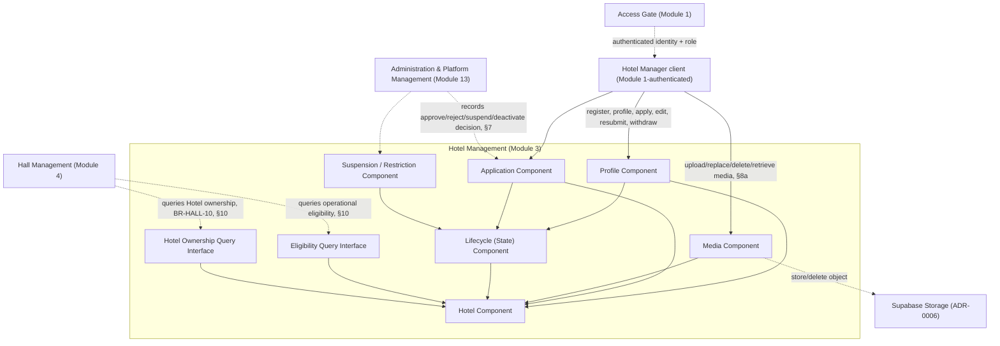

---

## 4. Domain Model

Logical entities only, per `data-architecture.md` §4's convention — no Prisma models, no
columns.

| Entity | Business Purpose | Owning Component |
|---|---|---|
| **Hotel** | The persistent tenant entity — one record per Hotel, existing from registration onward. Holds profile data (content deliberately unspecified, §18 Item 7) and a current lifecycle status (§6). The aggregate root. | Hotel Component |
| **Hotel Application** | One record per review cycle — the initial submission, and a new record for each resubmission after rejection (`BR-HOTEL-07`). Captures the submission and its eventual decision. Historical, append-only — never overwritten. | Application Component |
| **Critical Information Change Request** | One record per critical-information change awaiting Platform Administrator review (`BR-HOTEL-12`) — the proposed change, its submission, and its eventual decision, independent of the Hotel's own status (§6, §18 Item 6). | Profile Component |
| **Hotel Media** | **Added in v1.8.** One record per uploaded Hotel Logo or Photo (`BDR-015`) — a reference to the actual file in Supabase Storage (`ADR-0006`), never the binary itself (`database-standards.md`). At most one `LOGO` record per Hotel at a time (enforced by the Media Component, the same "business-level constraint, not a `CHECK` constraint" pattern already used for at-most-one-open-Application, §5); any number of `PHOTO` records. | Media Component |

**Entities investigated but not modeled separately**, with rationale:

- **Hotel Profile** — still not modeled as a separate entity, now that `BDR-015` (Required
  Hotel Business-Profile Content, resolving former Pending Business Decision #7) is
  `Approved`. `BDR-015` settles the required/optional/custom-field *content* of a Hotel's
  profile at the business level; it does not require a dedicated schema-level entity to
  enforce it — the required/optional standard field names (Hotel Name, Description, Location,
  Contact Phone; Email, Hotel Logo, Hotel Photos) are validated at the Profile Component
  (§8), the same way `api-standards.md` §14 already separates request-shape validation from
  persistence shape. Profile data remains a single attribute set on **Hotel** (the existing
  `profileData` column, §5) — now with a defined minimum key set rather than an unconstrained
  one, but still no per-field database columns, migration, or sub-entity. Choosing schema-level
  columns instead is a legitimate future option (§18) if per-field query/indexing needs ever
  emerge, not a requirement `BDR-015` itself imposes. **One exception, added in v1.8:** Hotel
  Logo and Hotel Photos are *not* stored as `profileData` keys, unlike every other standard
  field — a storage-path reference (and, for Photos, an unbounded multiplicity) doesn't fit
  the flat-attribute-set shape the way text fields do, so they are the one part of the Hotel
  Profile modeled as their own entity (**Hotel Media**, below) instead.
- **Restriction Record** — not modeled as a dedicated entity. `BDR-013`'s "applicable
  business process" is undefined (Pending Business Decision #4); restriction is represented
  as a Hotel status value (§6) plus a generic Audit Record (§13), not a bespoke tracking
  entity whose shape would have to anticipate an undefined process.
- **Suspension Record** — not modeled as a dedicated entity, for the same reason. Suspension
  and deactivation are Hotel status values (§6); accountability (who, when, why) is captured
  through Audit Records (§13), consistent with how Module 1's Technical Design treats
  security-significant actions it doesn't own a dedicated entity for.

### 4.1 Relationships

- A **Hotel** is referenced by one or more Hotel Manager **User Accounts** (Module 1) — the
  Business Specification does not address whether more than one Hotel Manager account may
  represent one Hotel, but `Project-Glossary.md`'s approved definition of Hotel ("represented
  by *at least one* Hotel Manager account") supports a one-to-many relationship. This module
  never stores Module 1's identity/credential data — only a reference (§10).
- A **Hotel** has zero or more **Hotel Applications** over its lifetime, historically, but at
  most one *open* (Under Review) Application at a time (§5) — mirroring the same "at most one
  active request" pattern Module 1 already applies to its own Verification and Password
  Reset Requests.
- A **Hotel** has zero or more **Critical Information Change Requests** over its lifetime,
  but at most one *open* (pending decision) request at a time (§5).
- A **Hotel Application** and a **Critical Information Change Request** are each decided by
  exactly one Platform Administrator **User Account** (Module 1, referenced, never owned).
- **Added in v1.8:** A **Hotel** has zero or more **Hotel Media** records — at most one
  `LOGO` at a time, any number of `PHOTO`. Deleting a Hotel cascades to its Hotel Media
  records (same `onDelete: Cascade` pattern as Hotel Application and Critical Information
  Change Request, §5) — but see §5's note on why this stays theoretical for the
  `deleted_at` case, and §16 for the Supabase-object cleanup this cascade does *not* itself
  handle.

---

## 5. Data Architecture (Logical)

Business-purpose persistence design only, per `data-architecture.md`'s convention — no
Prisma schema, no SQL (`database-standards.md` governs the physical shape, not written here).

- **Ownership** — Hotel, Hotel Application, Critical Information Change Request, and
  (**added in v1.8**) Hotel Media are owned exclusively by this module
  (`architecture-principles.md` §5); no other module reads or writes these tables directly —
  only through this module's defined interfaces (§3, §10). Hotel Media additionally never
  stores the media binary itself (`database-standards.md`) — only a Supabase Storage
  `storagePath` reference (§8a); the binary lives exclusively in Supabase, per `ADR-0006`'s
  own division of responsibility.
- **Constraints** (business-level, not `CHECK`-constraint detail) —
  - A Hotel has exactly one current status (§6) at all times; the status is never null.
  - At most one *open* Hotel Application per Hotel (§4.1) — a new submission or resubmission
    is only valid when no other Application for that Hotel is currently Under Review.
  - At most one *open* Critical Information Change Request per Hotel (§4.1).
  - **Added in v1.8:** At most one `LOGO`-type Hotel Media record per Hotel at a time — a
    second logo upload replaces the first (§8a), it does not create a second row.
- **Added in v1.8 — Hotel Media and soft delete:** a Hotel's `onDelete: Cascade` to Hotel
  Media (§4.1) only ever fires for a genuinely disposable/erroneous Hotel record (never for
  Suspended/Deactivated, per the `deleted_at` rule directly above) — a case with no approved
  trigger anywhere in this module today, so it stays theoretical. It does not, by itself,
  delete the underlying Supabase object; the Media Component deletes the Supabase object
  first, then the database row, on every deletion/replacement path it owns (§8a, §16) — the
  cascade is a data-integrity backstop, not the primary deletion mechanism.
- **Audit requirements** — every state-changing action (§13) is recorded as an Audit Record
  with actor, action, and timestamp, per `api-standards.md` §19 and
  `Project-Constitution.md` §8 (Auditability) — the same cross-cutting pattern Module 1
  already uses (§18 Item 4 notes the same ownership gap for the Audit Record entity itself).
- **Historical information** — a Hotel Application is never overwritten; a resubmission
  creates a new Application record (§4), preserving the full review history without relying
  on soft delete. `database-standards.md` §9 explicitly distinguishes soft delete from
  suspension/deactivation, using a Hotel as its own illustrative example ("A Hotel being
  temporarily deactivated by a Platform Administrator is a different business concept from a
  Hotel being deleted") — this design follows that rule precisely: `deleted_at` is reserved
  for a genuinely disposable/erroneous Hotel record, never for Suspended, Deactivated, or any
  other lifecycle status (§6).
- **Classification** (`data-architecture.md` §13) — per `BDR-015`'s now-settled field content,
  Hotel Name, Description, Location, Hotel Logo, and Hotel Photos are **Public** (a Hotel
  listing is, by design, publicly visible once `APPROVED_ACTIVE`); Contact Phone and Email are
  **Internal**. No field reaches **Restricted** classification (no payment credentials or
  authentication material are stored here — that remains Module 1's and Payment Management's
  domain).

---

## 6. State Machine

The Hotel's lifecycle status (Business Specification §6) is modeled as a single status field
on the **Hotel** entity. Two states from the Business Specification's lifecycle table are
deliberately **not** separate persisted status values, for reasons explained below —
transparently, not silently:

- **"Rejected — Editing"** is a client-side/workflow distinction, not a persisted status. A
  Rejected Hotel remains `REJECTED` at the data layer while its Hotel Manager drafts edits;
  the status changes only on actual resubmission (`BR-HOTEL-07`).
- **"Pending Critical Change Review"** is **not** modeled as a Hotel status change. This is a
  direct consequence of Pending Business Decision #6 (Hotel Operational Status During
  Critical-Change Review) being genuinely undefined: whether a Hotel remains fully
  operational during this window, or is restricted, is not decided. Modeling it as a Hotel
  status would silently pick an answer (restricted). Instead, the pending change is tracked
  entirely on the **Critical Information Change Request** entity (§4), independent of Hotel
  status — the technical design is deliberately parameterized to accommodate either
  resolution without a schema change, the same technique Module 1's Technical Design uses
  for its own undecided parameters.

### 6.1 Hotel Status

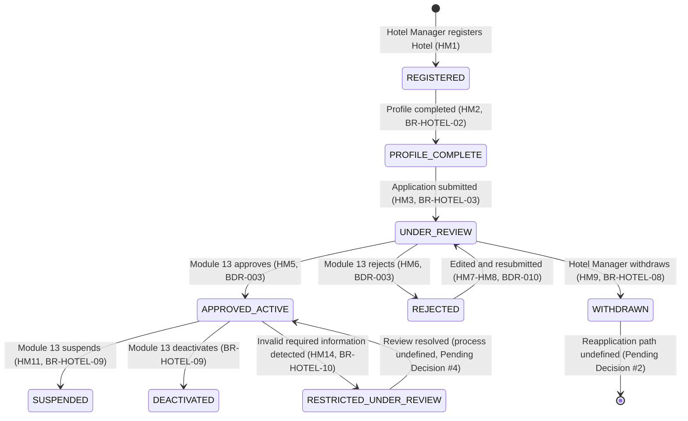

### 6.2 Transition Table

| From | To | Trigger | Precondition | Result |
|---|---|---|---|---|
| — | `REGISTERED` | Hotel Manager registers a Hotel (HM1) | Hotel Manager has an authenticated account (Module 1) | Hotel entity created |
| `REGISTERED` | `PROFILE_COMPLETE` | Profile completion (HM2) | Required profile fields supplied (content TBD, §18 Item 7) | Hotel eligible to submit |
| `PROFILE_COMPLETE` | `UNDER_REVIEW` | Application submission (HM3) | Profile complete; no other open Application | Hotel Application created |
| `UNDER_REVIEW` | `APPROVED_ACTIVE` | Platform Administrator approves (HM5) | Module 13 authorization confirmed | Hotel operationally eligible (`BR-HOTEL-05`) |
| `UNDER_REVIEW` | `REJECTED` | Platform Administrator rejects (HM6) | Module 13 authorization confirmed | Application marked rejected |
| `UNDER_REVIEW` | `WITHDRAWN` | Hotel Manager withdraws (HM9) | Application still open | Application marked withdrawn |
| `REJECTED` | `UNDER_REVIEW` | Edit + resubmit (HM7–HM8) | New Application record created | Re-enters review (`BDR-010`) |
| `APPROVED_ACTIVE` | `SUSPENDED` | Platform Administrator suspends (HM11) | Module 13 authorization confirmed | Operational eligibility ends |
| `APPROVED_ACTIVE` | `DEACTIVATED` | Platform Administrator deactivates | Module 13 authorization confirmed | Operational eligibility ends |
| `APPROVED_ACTIVE` | `RESTRICTED_UNDER_REVIEW` | Invalid required information detected (HM14) | Detection mechanism undefined (§18 Item 4) | Operational eligibility suspended pending review |
| `RESTRICTED_UNDER_REVIEW` | `APPROVED_ACTIVE` | Review resolved favorably | Resolution process undefined (§18 Item 4) | Operational eligibility restored |

No transition exists out of `WITHDRAWN` (Pending Decision #2), a defined negative exit from
`RESTRICTED_UNDER_REVIEW` (Pending Decision #4), or reactivation out of `SUSPENDED`/
`DEACTIVATED` back to `APPROVED_ACTIVE` — all three absences are deliberate, not omissions.
**Added during technical review:** the original draft flagged the first two explicitly but
left reactivation silently absent; `BR-HOTEL-09` approves that a Hotel may be suspended or
deactivated but does not address whether either is reversible, so no reactivation transition
is shown, consistent with how `WITHDRAWN` and `RESTRICTED_UNDER_REVIEW`'s own open questions
are handled.

---

## 7. Application Review Workflow

Technical orchestration only; business policy is defined in the Business Specification and
never re-decided here.

1. **Submission** (HM3) — the Application Component creates a Hotel Application, requests a
   `PROFILE_COMPLETE → UNDER_REVIEW` transition from the Lifecycle Component (§6), and the
   Application becomes visible to Module 13's review workflow.
2. **Administrator review** — owned entirely by Module 13's own interface and workflow
   (`BR-HOTEL-14`); this module exposes no review UI.
3. **Approval / Rejection** — Module 13, after its own authorization check confirms the
   caller is a Platform Administrator, calls this module's Application Component through a
   defined service interface (`architecture-principles.md` §5 — an in-process call within the
   single Express backend, `system-architecture-overview.md` §5, not a second HTTP
   round-trip) to record the decision. The Lifecycle Component then executes the
   corresponding transition (§6).
4. **Resubmission** (HM7–HM8) — the Application Component creates a **new** Hotel Application
   record (§4) rather than mutating the rejected one, requests `REJECTED → UNDER_REVIEW`.
5. **Withdrawal** (HM9) — the Application Component marks the open Application withdrawn and
   requests `UNDER_REVIEW → WITHDRAWN`.

**Reconciliation for §2.4/§18's ownership conflict (resolved 2026-08-10):** this
service-interface pattern — Hotel Management owns and persists the Hotel/Application data
and exposes a narrow write interface; Module 13 owns the review action and calls it — is
consistent with *both* the Business Specification's boundary (Hotel Management owns the
data) and `architecture-principles.md` §5 (modules communicate through defined interfaces,
never direct table access). `data-architecture.md` §9 and Module 1's Technical Design
§2.4/§3.2 have been corrected to match (§18 Item 1); this pattern is now the agreed
architecture, not merely a proposal.

---

## 8. Profile Management

- **Profile creation** — occurs at `REGISTERED` (§6); fields are supplied incrementally until
  complete (`BR-HOTEL-02`).
- **Profile updates** — every update request is classified by the Profile Component as
  **ordinary** or **critical** before being applied.
- **Ordinary changes** (`BR-HOTEL-11`) — applied immediately to the Hotel entity; no Lifecycle
  Component transition, no Module 13 involvement.
- **Critical changes** (`BR-HOTEL-12`) — routed to a new Critical Information Change Request
  (§4) instead of being applied directly; the change takes effect only once Module 13
  approves it, through the same service-interface pattern as §7.
- **Field classification** (ordinary vs. critical) — **not decided here.** Pending Business
  Decision #5 leaves the exact field list undefined. The Profile Component's routing
  mechanism is fully specified (a classification lookup that decides immediate-apply vs.
  review-required); the classification data itself is treated as an injectable ruleset the
  component consults, not a hardcoded list — so the mechanism can be implemented and tested
  today, and the actual field classification supplied once Pending Business Decision #5 is
  resolved, without redesigning this component.
- **Validation** — request-shape validation (correct types) happens before this component
  runs, per `coding-standards.md` §11 / `api-standards.md` §14. The completeness criteria for
  `PROFILE_COMPLETE` (§6) are now settled by `BDR-015` (Required Hotel Business-Profile
  Content, resolving former Pending Business Decision #7): the Profile Component's completion
  check verifies the standard *required* keys are present and non-empty within `profileData`
  — Hotel Name, Description, Location, Contact Phone. Email, Hotel Logo, and Hotel Photos are
  standard but optional; any other key supplied is an unconstrained custom field. Per
  `BDR-015`, a custom field can never satisfy a required key's presence — the completeness
  check only ever inspects the four named required keys, never any other key in the object, so
  no combination of custom fields can substitute for a missing required one.
- **Review interaction** — a Critical Information Change Request's approval/rejection follows
  the identical Module-13-calls-in pattern as §7's Application decisions.

---

## 8a. Media Management

**Added in v1.8.** Realizes `BDR-015`'s Hotel Logo/Photo fields and `ADR-0006`'s Supabase
provider choice. Owned entirely by the Media Component (§3); no other component touches
Supabase or the Hotel Media table.

- **Architecture (fixed by this session's instruction, not re-derived here):**

  ```
  Manager Mobile → Hotel Management Backend → Supabase Storage
                                             ↘ Neon (Hotel Media metadata)
  ```

  Flutter **never** talks to Supabase directly, and never holds a Supabase credential of any
  kind (§12). Every upload, replacement, deletion, and retrieval is a request to this
  module's own API (§11), authenticated and own-Hotel-scoped exactly like every other
  endpoint here (§12) — no second authorization mechanism.

- **Storage path convention** — `hotels/{hotelId}/logo/{fileId}` and
  `hotels/{hotelId}/photos/{fileId}`, in the `hotel-media` bucket. `{hotelId}` is always the
  Hotel resolved from the authenticated Manager's own-Hotel lookup (`hotelService.getOwnHotelById`,
  §3) — never a client-supplied value, so a Manager cannot choose another Hotel's path.
  `{fileId}` is a server-generated UUID plus an extension derived from the *detected* MIME
  type (§8a Validation below), never the client-supplied filename or extension.
- **Bucket visibility** — `hotel-media` is a **public-read** bucket. This follows directly
  from §5's existing Classification note: Hotel Logo and Hotel Photos are already **Public**
  data (a Hotel listing is publicly visible once `APPROVED_ACTIVE`) — there is no
  confidentiality reason to gate reads behind a signed URL. The Hotel Media table stores only
  `storagePath` (§4, §5) — a stable, non-expiring public URL is derived from it at read time
  (`{SUPABASE_URL}/storage/v1/object/public/hotel-media/{storagePath}`), never stored as the
  database reference itself, satisfying the constraint against persisting a temporary signed
  URL as permanent state. Writes (upload/delete) still require the service-role credential,
  held only by the backend (§12) — public-read does not mean public-write.
- **Validation** (request-shape, before the Media Component runs, `api-standards.md` §14/§15):
  - Content type is detected from the file's own magic bytes, never the client-supplied
    extension or `Content-Type` header (`api-standards.md` §15). Allowed: JPEG, PNG, WebP.
  - **Technical default, not a settled business decision — flagged for review:** maximum file
    size **5 MB** per upload. Nothing in the Business Specification or any approved BDR sets
    this number; it is a reasonable engineering default for profile-image-scale assets,
    documented transparently per this session's own instruction rather than left unstated.
    Revisit via a Pending Business Decision if a different limit is ever actually needed.
  - An unsupported format or oversized file is rejected before any Supabase call is made —
    `400 VALIDATION_ERROR` (§16), the same category `api-standards.md` §15 already documents
    for file-upload standards generally.
- **Upload / replace semantics** —
  - `POST .../media/logo` — if the Hotel already has a `LOGO` record, the Media Component
    deletes the old Supabase object and its database row *after* the new upload succeeds and
    is persisted (never before — §16's failure-cleanup ordering applies symmetrically here:
    the old logo is never removed until the new one is confirmed durable), then returns the
    new record. This is "replace," realized as one endpoint, not two.
  - `POST .../media/photos` — always creates an additional `PHOTO` record; no replacement
    semantics (BDR-015 defines Photos as plural).
  - `DELETE .../media/:mediaId` — deletes one Hotel Media record (logo or photo) by id, own-
    Hotel-scoped the same as every other endpoint here.
  - `GET .../media` — returns the Hotel's current Logo (or `null`) and full Photos list.
- **Failure handling (§16 detail, summarized here):** if the Supabase upload succeeds but the
  Neon metadata write then fails, the Media Component deletes the just-uploaded Supabase
  object before returning the error — no orphaned file is left behind. This is the one place
  in this module where a single logical operation spans two systems (`architecture-principles.md`
  §10's storage abstraction is otherwise fully transactional-looking from a caller's
  perspective); the ordering (storage write, then Neon write, then cleanup-on-failure) is
  deliberate and is not a two-phase-commit — a crash between the Supabase write and the
  cleanup call could still leave an orphan in the rare case the process dies mid-request. No
  reconciliation/garbage-collection job is designed here — not required by anything approved,
  and out of scope for this change.

---

## 9. Suspension / Restriction Architecture

**Technically known (approved, not reopened):**

- An `APPROVED_ACTIVE` Hotel may transition to `SUSPENDED` or `DEACTIVATED` (§6), each ending
  operational eligibility identically as far as this design is concerned.
- Only a Platform Administrator may trigger either transition (`BR-HOTEL-09`) — enforced by
  Module 13's own authorization check before it calls this module's interface (§7's pattern),
  never by this module re-implementing role checks Module 1/Module 13 already own.
- An `APPROVED_ACTIVE` Hotel may transition to `RESTRICTED_UNDER_REVIEW` when required
  information becomes invalid (`BR-HOTEL-10`).

**Genuinely dependent on Pending Business Decisions — not invented here:**

- **Suspension vs. Deactivation distinction** (Pending Decision #3) — both are modeled as
  sibling status values with identical technical effect (operational eligibility ends). If a
  future decision differentiates their behavior (e.g., different reactivation paths), it is
  an additive change to the Lifecycle Component (§3), not a redesign.
- **Restriction detection mechanism** (Pending Decision #4) — what makes information
  "invalid," and what automatically or manually triggers the `APPROVED_ACTIVE →
  RESTRICTED_UNDER_REVIEW` transition, is undefined. This design provides the status value
  and the transition itself (§6); it does not invent a detection process.
- **Restriction resolution process** (Pending Decision #4) — the exit path from
  `RESTRICTED_UNDER_REVIEW` back to `APPROVED_ACTIVE` (or elsewhere) is shown in §6 as a
  single resolved-favorably transition; no negative/alternate outcome is invented.

---

## 10. Module Interactions

- **Authentication & Account Management (Module 1, `Approved`, implemented)** — this module
  trusts the Access Gate's authenticated identity and role claim exactly as every other
  module does (`architecture-principles.md` §7); it never re-implements authentication,
  credentials, or session logic. Conversely, Module 1's own Access Gate reads this module's
  operational-eligibility status (via the Eligibility Query Interface, §3) to evaluate
  `BR-AUTH-04`/`BR-AUTH-07` when a Hotel account attempts an operational feature. **Resolved
  2026-08-10:** Module 1's Technical Design §6.2 sequence diagram, §2.4, §3.2, §4, §5.1, and
  §13.1 previously showed this read directed at Administration & Platform Management
  (Module 13); all have been corrected to target Hotel Management (Module 3), matching this
  Business Specification's boundary (§18 Item 1).
- **Hall Management (Module 4, `Implementation`)** — queries this module's Eligibility Query
  Interface to determine whether a Hotel's Halls may be listed/visible (`BR-HOTEL-04`,
  `BR-HOTEL-05`). **Added in v1.4:** Hall Management also queries this module's new Hotel
  Ownership Query Interface (§3, `isOwnedByUser(hotelId, userId)`) to enforce `BR-HALL-10`
  (a Hotel Manager may only create, view, or manage Halls belonging to their own Hotel) —
  Hall Management's own Technical Design §6/§11–§12 gates its `POST`/`PATCH` endpoints and the
  owning-Hotel-Manager branch of its two conditional-public `GET` endpoints on this call. This
  module never reaches into Hall Management's data, and never defines hall visibility
  mechanics or Hall-side authorization logic itself (Business Specification §3) — it only
  answers the two narrow questions ("is this Hotel eligible," "does this user own this Hotel")
  through its own two interfaces.
- **Administration & Platform Management (Module 13, `Not Started`)** — consumes this
  module's Application/Lifecycle write interface (§7, §8, §9) for its review, approval,
  rejection, suspension, and deactivation workflow, and its read/query interface
  (`GET /hotels`, §11) to populate its Hotel approval queue. This module never implements a
  review UI or duplicates Module 13's authorization logic.
- **Audit** — cross-cutting, same gap Module 1's Technical Design already flags (§18 Item 4):
  no approved module owns the Audit Record entity. This module produces Audit Records for
  security-significant, state-changing actions (§13) without claiming ownership, consistent
  with Module 1's own precedent.
- **Notification** — the Business Specification does not require notifying a Hotel Manager of
  a decision or state change; no such requirement is invented here. A future integration with
  Notification Management (Module 10) is plausible but not designed, since nothing approved
  currently requires it.

---

## 11. API Design

Every endpoint follows `api-standards.md` in full: `/api/v1/...` versioning (§3), the
success/error envelopes (§7–§8), the status codes in §9, and `naming-conventions.md` §9's
field casing (`/api/v1/hotels`, per `naming-conventions.md` §4/§9). Endpoints are conceptual;
exact request/response field lists are an Implementation Planning concern once Pending
Business Decisions #5 and #7 resolve.

**Note:** the Platform-Administrator-facing approve/reject/suspend/deactivate REST endpoints
are Administration & Platform Management's own API surface (Module 13, not yet designed,
`BR-HOTEL-14`). This module exposes only the internal service interface those endpoints
would call (§7) — no `POST /hotels/:id/approve`-style endpoint is designed here, since that
action does not belong to this module's own API surface.

#### `POST /api/v1/hotels`
- **Purpose** — register a new Hotel — `HM1`.
- **Actor** — Hotel Manager.
- **Authentication** — Required (Module 1 access token).
- **Authorization** — Any authenticated Hotel Manager identity may register a Hotel (no
  additional role check beyond authentication).
- **Request concept** — initial profile fields (shape TBD, §18 Item 7).
- **Response concept** — `201 Created`; the created Hotel's identifier and status
  (`REGISTERED`).
- **Validation** — `400` for malformed request shape.
- **State transition** — `— → REGISTERED` (§6).

#### `GET /api/v1/hotels/:id`
- **Purpose** — retrieve a Hotel's own profile and current status — supports `HM2`–`HM15`.
- **Actor** — Hotel Manager (own Hotel only) or Platform Administrator.
- **Authentication** — Required.
- **Authorization** — Hotel Manager restricted to their own Hotel (`api-standards.md` §13);
  cross-tenant access returns `404`, not `403` (tenant-isolation rule).
- **Response concept** — Hotel profile fields, current status, and (if open) the pending
  Application or Critical Information Change Request summary.
- **Validation** — `404` if not found or not owned by the caller.

#### `PATCH /api/v1/hotels/:id`
- **Purpose** — update Hotel profile fields — `HM2`, `HM12`, `HM13`.
- **Actor** — Hotel Manager (own Hotel only).
- **Authentication** — Required.
- **Authorization** — Own-Hotel only (`404` cross-tenant, as above).
- **Request concept** — one or more profile fields to change.
- **Response concept** — `200 OK`; indicates whether each change applied immediately
  (ordinary, `BR-HOTEL-11`) or is now pending Platform Administrator review (critical,
  `BR-HOTEL-12`).
- **Validation** — `400` for malformed fields; `422` if the Hotel's current status does not
  permit profile changes (e.g. `RESTRICTED_UNDER_REVIEW` — exact rule pending §18 Item 4).
- **State transition** — none for ordinary changes; creates a Critical Information Change
  Request for critical changes (§8), independent of Hotel status (§6).

#### `POST /api/v1/hotels/:id/applications`
- **Purpose** — submit an application for review (`HM3`), or resubmit after editing a
  rejected application (`HM7`–`HM8`) — modeled as a non-idempotent sub-resource action, per
  `api-standards.md` §5's pattern (`POST /bookings/:id/cancellations` is the precedent
  example).
- **Actor** — Hotel Manager (own Hotel only).
- **Authentication** — Required.
- **Authorization** — Own-Hotel only.
- **Response concept** — `201 Created`; the new Hotel Application record and updated Hotel
  status (`UNDER_REVIEW`).
- **Validation** — `422` if the Hotel's profile is not complete (`BR-HOTEL-02`,
  `BR-HOTEL-03`), or an open Application already exists (`409 Conflict`).
- **State transition** — `PROFILE_COMPLETE → UNDER_REVIEW` or `REJECTED → UNDER_REVIEW`.

#### `POST /api/v1/hotels/:id/applications/:applicationId/withdrawal`
- **Purpose** — withdraw a pending application — `HM9`, `BR-HOTEL-08`.
- **Actor** — Hotel Manager (own Hotel only).
- **Authentication** — Required.
- **Authorization** — Own-Hotel only.
- **Response concept** — `200 OK`; Application marked withdrawn, updated Hotel status
  (`WITHDRAWN`).
- **Validation** — `409` if the Application is no longer open (already decided).
- **State transition** — `UNDER_REVIEW → WITHDRAWN`.

#### `GET /api/v1/hotels`
- **Purpose** — list Hotels, filterable by status — the query interface Module 13's Hotel
  approval queue (`system-architecture-overview.md` §4) reads from to discover Applications
  awaiting review. **Added during technical review** — the original draft specified the
  write-side interfaces Module 13 calls (§7) but omitted the corresponding read-side query
  interface, without which the approval-queue feature has no way to discover pending work.
- **Actor** — Platform Administrator only.
- **Authentication** — Required.
- **Authorization** — Platform Administrator role only — a Hotel Manager may not list Hotels
  other than their own (already served by `GET /hotels/:id`).
- **Request concept** — `?status=UNDER_REVIEW` (or any other status value, §6) as a query
  filter, per `api-standards.md` §11; paginated per `api-standards.md` §10 (offset
  pagination — a bounded, page-numbered administrative list view).
- **Response concept** — `200 OK`; a page of Hotel summaries matching the filter.
- **Validation** — `400` for an unrecognized `status` filter value.

**Added in v1.8 — Hotel Media (§8a, `BDR-015`, `ADR-0006`):**

#### `POST /api/v1/hotels/:hotelId/media/logo`
- **Purpose** — upload the Hotel Logo, creating or replacing it (§8a).
- **Actor** — Hotel Manager (own Hotel only).
- **Authentication** — Required.
- **Authorization** — Own-Hotel only (`404` cross-tenant, `api-standards.md` §13).
- **Request concept** — `multipart/form-data`, one file field (`api-standards.md` §15).
- **Response concept** — `201 Created`; the created/replacing Hotel Media record.
- **Validation** — `400` for an unsupported format, an oversized file, or a missing file.
- **State transition** — none; independent of Hotel status (like an ordinary profile field,
  no Lifecycle Component involvement).

#### `POST /api/v1/hotels/:hotelId/media/photos`
- **Purpose** — add a Hotel Photo (§8a). No replacement semantics — Photos are plural.
- **Actor** — Hotel Manager (own Hotel only).
- **Authentication** — Required.
- **Authorization** — Own-Hotel only.
- **Request concept** — `multipart/form-data`, one file field.
- **Response concept** — `201 Created`; the created Hotel Media record.
- **Validation** — `400` for an unsupported format, an oversized file, or a missing file.
- **State transition** — none.

#### `DELETE /api/v1/hotels/:hotelId/media/:mediaId`
- **Purpose** — delete one Hotel Media record (Logo or Photo), and its underlying Supabase
  object.
- **Actor** — Hotel Manager (own Hotel only).
- **Authentication** — Required.
- **Authorization** — Own-Hotel only; a `mediaId` belonging to a different Hotel (or a
  different Hotel Manager's own Hotel) is `404`, the same tenant-isolation rule as every
  other endpoint here — never `403` (`api-standards.md` §9).
- **Response concept** — `204 No Content` (`api-standards.md` §9 — "a successful `DELETE`, or any request with nothing meaningful to return"), no body.
- **Validation** — `404` if `mediaId` does not exist or does not belong to this Hotel.
- **State transition** — none.

#### `GET /api/v1/hotels/:hotelId/media`
- **Purpose** — retrieve the Hotel's current media — supports the Hotel Profile screen
  displaying what's already uploaded.
- **Actor** — Hotel Manager (own Hotel only) or Platform Administrator.
- **Authentication** — Required.
- **Authorization** — Same as `GET /hotels/:id` (§11 above): own-Hotel for a Hotel Manager,
  any Hotel for a Platform Administrator; `404` cross-tenant.
- **Response concept** — `200 OK`; `{ logo: HotelMedia | null, photos: HotelMedia[] }`.
- **Validation** — `404` if the Hotel itself does not exist or is not owned by the caller.

---

## 12. Security Design

- **Authentication dependency on Module 1** — this module never issues, validates, or stores
  any token or credential; every request passes through Module 1's Access Gate first
  (`architecture-principles.md` §7). No duplication of Module 1's implementation.
- **Authorization** — Hotel Manager actions are scoped to their own Hotel only, enforced as
  part of authorization per `api-standards.md` §13 (cross-tenant access returns `404`, never
  `403`, so tenant existence is never leaked). Platform-Administrator-only actions
  (approve/reject/suspend/deactivate/critical-change review, `BR-HOTEL-09`, `BR-HOTEL-14`)
  are authorized by Module 13's own layer before it calls into this module (§7) — this module
  does not re-implement that role check.
- **Hotel data protection** — profile data classified per `data-architecture.md` §13 (§5);
  no Restricted-classification data is expected in this module's scope.
- **Administrative actions** — every Platform-Administrator-triggered transition (§6) is
  attributable to a specific administrator identity via the audit trail (§13).
- **Sensitive profile information** — `BDR-015`'s field list (Hotel Name, Description,
  Location, Contact Phone, Email, Hotel Logo, Hotel Photos, plus Hotel Manager-defined custom
  fields) contains nothing beyond what a public Hotel listing already implies — no field
  reaches **Restricted** classification (`data-architecture.md` §13); Contact Phone and Email
  remain at most **Internal**, consistent with §5's existing Public-to-Internal framing.
- **Auditability** — every state-changing action is logged (§13), per `api-standards.md` §19.
- **Added in v1.8 — Media credential handling (this session's own explicit requirement):**
  the Supabase **service-role key** (which bypasses Row Level Security and can write/delete
  anything in the bucket) is held only by the backend process, read from environment
  configuration the same way every other provider credential in this project is handled
  (`naming-conventions.md` §10) — **never** sent to, embedded in, or reachable from the
  Flutter apps. Flutter never receives a Supabase URL, API key, or credential of any kind; it
  only ever calls this module's own authenticated API (§8a, §11). This is a stricter posture
  than Supabase's own anon-key-plus-RLS pattern would technically require (`ADR-0006`'s own
  Context notes that pattern is safe by Supabase's design) — deliberately, per this session's
  explicit "never expose service-role credentials to Flutter" instruction, satisfied here by
  not exposing *any* Supabase credential to Flutter, not only the service-role one.
- **Added in v1.8 — Media authorization** reuses the exact own-Hotel resolution every other
  endpoint here already uses (`hotelService.getOwnHotelById`, §3) — no second authorization
  mechanism, no new role check. A Hotel Manager can never upload to, delete, or retrieve
  another Hotel's media: the Hotel is resolved from the authenticated identity's ownership
  relationship, never from a client-supplied Hotel id being trusted at face value (the id is
  present in the URL for routing/tenant-isolation-error purposes only, exactly like
  `PATCH /hotels/:id` today).
- **State-transition protection** — only the Lifecycle Component (§3) may mutate Hotel status;
  no other component, including the Profile and Application Components, writes it directly.

**`security-architecture.md` and `security-coding-standards.md` are both currently `Not
Started`** (§18 Item 2) — this section is grounded instead in `architecture-principles.md`
§6–§7, `api-standards.md` §12–§13/§19, and `database-standards.md` §16, the same gap Module
1's Technical Design already flags and works around.

---

## 13. Audit & Traceability

Hotel actions requiring an Audit Record, each derived directly from an approved rule —
nothing invented beyond the Business Specification's own scope:

| Action | Rule / Journey |
|---|---|
| Hotel registered | `HM1` |
| Profile completed | `HM2`, `BR-HOTEL-02` |
| Application submitted | `HM3`, `BR-HOTEL-03` |
| Application edited after rejection | `HM7`, `BR-HOTEL-06` |
| Application resubmitted | `HM8`, `BR-HOTEL-07` |
| Application withdrawn | `HM9`, `BR-HOTEL-08` |
| Application approved (Platform Administrator) | `HM5`, `BDR-003` |
| Application rejected (Platform Administrator) | `HM6`, `BDR-003` |
| Hotel suspended (Platform Administrator) | `HM11`, `BR-HOTEL-09` |
| Hotel deactivated (Platform Administrator) | `BR-HOTEL-09` |
| Hotel restricted (invalid required information) | `HM14`, `BR-HOTEL-10` |
| Restriction resolved | `BR-HOTEL-10` (resolution process itself pending, §18 Item 4) |
| Ordinary profile change applied | `HM13`, `BR-HOTEL-11` |
| Critical profile change submitted | `HM12`, `BR-HOTEL-12` |
| Critical profile change approved/rejected (Platform Administrator) | `BR-HOTEL-12` |
| Hotel Media uploaded (Logo or Photo) | **Added v1.8**, `BDR-015`, `ADR-0006`, §8a |
| Hotel Media replaced (Logo) | **Added v1.8**, §8a |
| Hotel Media deleted | **Added v1.8**, §8a |

Each record captures actor, action, timestamp, and the affected Hotel — the same shape
Module 1 already uses for its own Audit Records, subject to the same unresolved ownership
gap (§18 Item 4, inherited from Module 1's Technical Design §17 Item 4).

---

## 14. Sequence Diagrams

Only flows supported by approved business rules.

### 14.1 Hotel Registration / Onboarding (`HM1`–`HM3`)

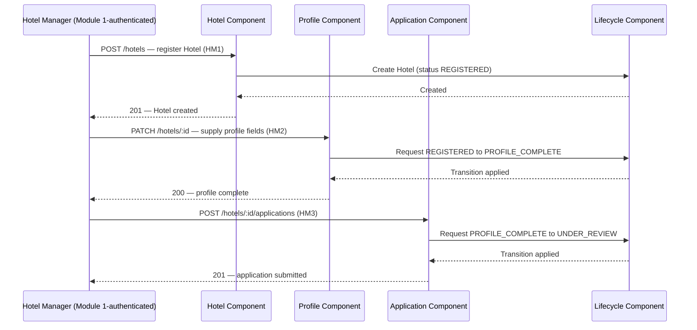

### 14.2 Administrator Approval (`HM5`)

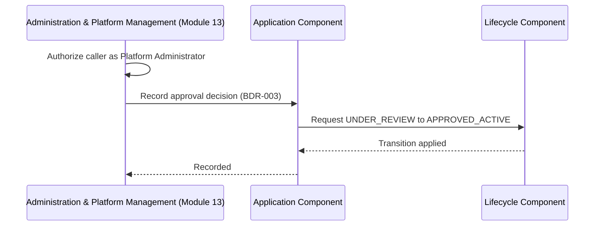

### 14.3 Administrator Rejection (`HM6`)

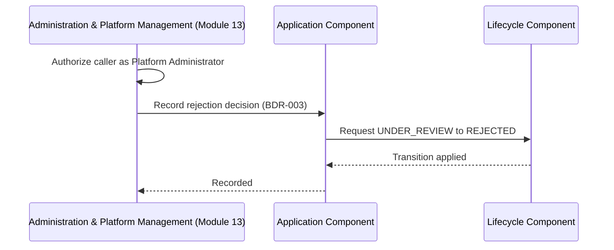

### 14.4 Rejected Hotel Resubmission (`HM7`–`HM8`)

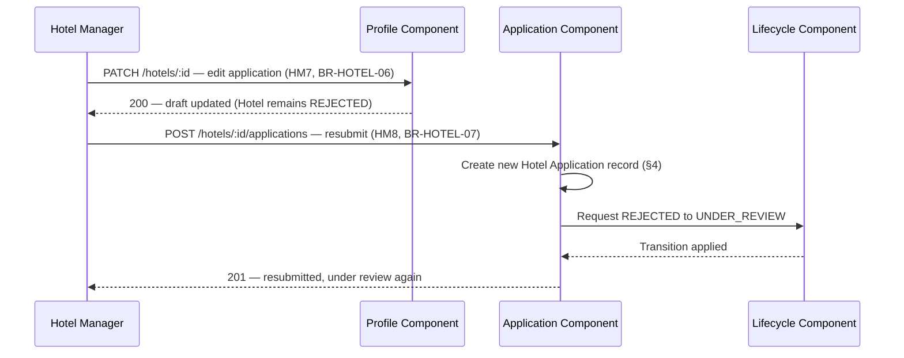

### 14.5 Pending Application Withdrawal (`HM9`)

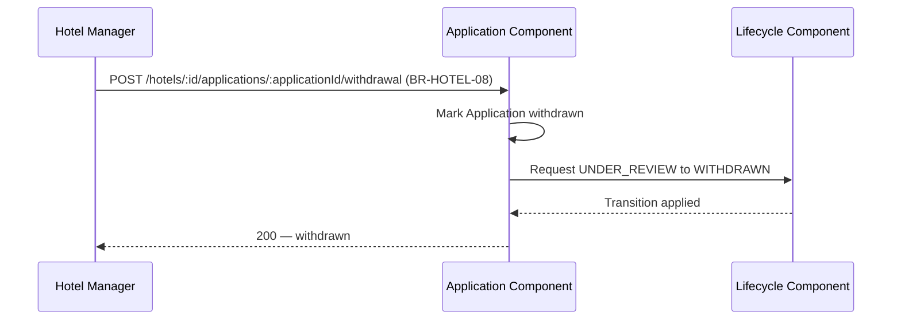

### 14.6 Approved Hotel Suspension (`HM11`)

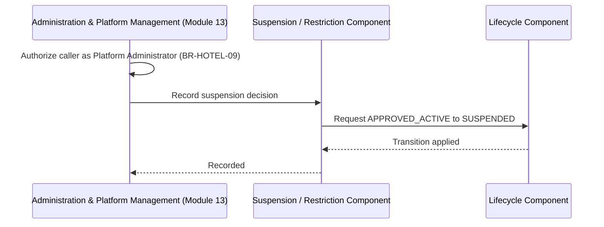

### 14.7 Critical Profile Change / Review (`HM12`)

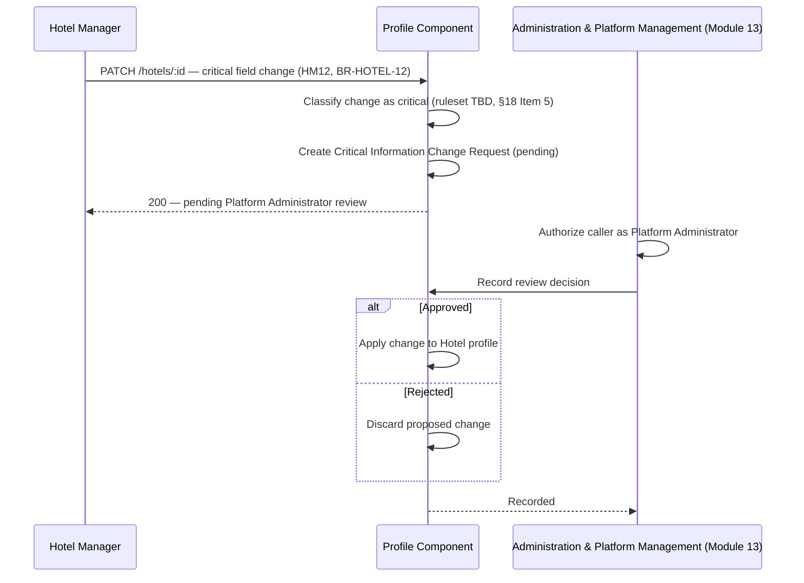

---

## 15. Data / State Diagrams

### 15.1 Hotel Lifecycle

See §6.1 (`stateDiagram-v2`) — the authoritative Hotel status model.

### 15.2 Hotel Application Lifecycle

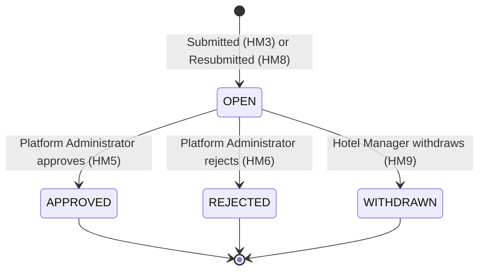

Each Hotel Application record is immutable once it leaves `OPEN` (§4) — history is
preserved by creating a new record on resubmission, never by reopening a decided one.

### 15.3 Critical Information Change Request Lifecycle

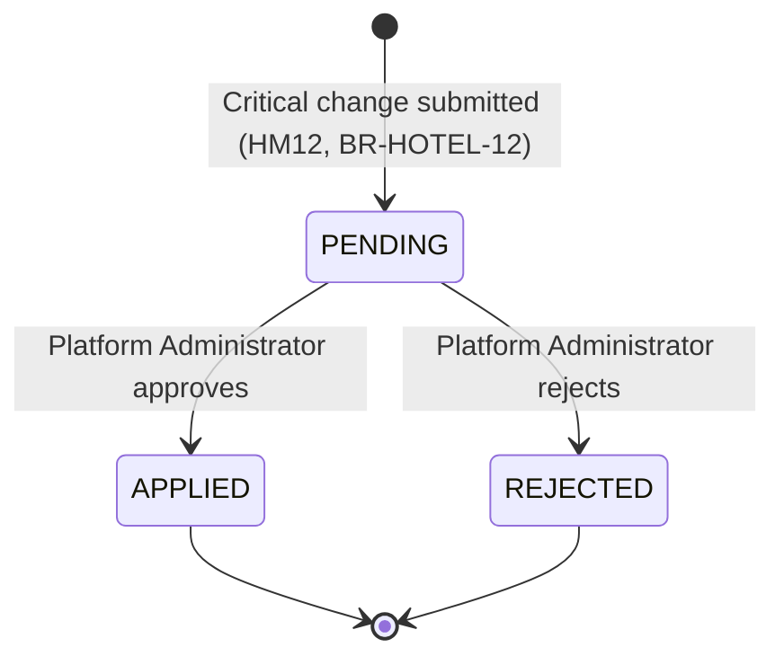

Independent of Hotel status throughout (§6) — the deliberate design response to Pending
Business Decision #6.

---

## 16. Error & Failure Handling

All categories use `api-standards.md` §8's error envelope and §9's status codes — no new
status code is introduced.

| Category | Status Code | Handling |
|---|---|---|
| Invalid state transition (e.g. submitting while already `UNDER_REVIEW`) | `409 Conflict` | Rejected before any Lifecycle Component transition is attempted (§6). |
| Unauthorized administrative operation (non-Platform-Administrator attempts approve/reject/suspend) | `403 Forbidden` | Refused by Module 13's own authorization layer before this module's interface is ever called (§7, §12). |
| Invalid Hotel data (malformed request) | `400 Bad Request` | Request-shape validation, before business logic runs (`api-standards.md` §14). |
| Invalid Hotel data (business rule, e.g. incomplete profile) | `422 Unprocessable Entity` | Well-formed request, business rule not satisfied (`BR-HOTEL-02`, `BR-HOTEL-03`). |
| Application submission failure (profile incomplete) | `422 Unprocessable Entity` | Same as above. |
| Review conflict (e.g. Module 13 attempts to decide an already-withdrawn Application) | `409 Conflict` | The Application is no longer `OPEN` (§15.2). |
| Suspended/restricted Hotel attempting an operational action | `422 Unprocessable Entity` | A well-formed, authenticated, authorized request that fails because the Hotel's current status does not permit the action — a business-rule failure, not an authentication (`401`) or authorization (`403`) failure. |
| Cross-tenant access attempt | `404 Not Found` | Never `403` — consistent with `api-standards.md` §9's tenant-isolation rule. |
| **Added v1.8** — Unsupported file type or missing file (media upload) | `400 Bad Request` | Detected from magic bytes (§8a), before any Supabase call. |
| **Added v1.8** — Oversized file (media upload) | `400 Bad Request` | Exceeds the 5 MB technical default (§8a) — flagged for business-decision review, not a settled limit. |
| **Added v1.8** — Supabase upload failure (network/provider error) | `500 Internal Server Error` | `api-standards.md` §9 defines no dedicated upstream-provider-failure status — this falls under its own `500` catch-all ("anything not anticipated by the above"), the same category a Twilio delivery failure already falls into (`shared/providers/twilioSmsProvider.js`). No new status code is introduced. Neon is never written; no partial state (§8a). |
| **Added v1.8** — Neon metadata write fails after a successful Supabase upload | `500 Internal Server Error` (after best-effort cleanup) | The Media Component deletes the just-uploaded Supabase object before returning the error (§8a) — cleanup failure is logged, not surfaced to the client as a second error; the client sees the original write failure. |

---

## 17. Dependencies

- **Internal** — Authentication & Account Management (Module 1, satisfied); Hall Management
  (Module 4, `Implementation` — not a blocking dependency for this module's own architecture,
  since Hall Management is the *consumer* of this module's Eligibility Query Interface and, as
  of v1.4, its Hotel Ownership Query Interface, not the reverse); Administration & Platform
  Management (Module 13, `Not Started` — same relationship, this module is the interface
  provider).
- **External services** — `BDR-015` (Approved) confirms Hotel Logo and Hotel Photos as
  optional profile fields; `ADR-0006` (Approved, 2026-08-26) settles the provider realizing
  that dependency: **Supabase Storage**, behind the same provider-agnostic abstraction
  (`architecture-principles.md` §10, `technology-stack.md`). **Added in v1.8:** the upload
  mechanism `ADR-0006` left open is now designed here — §8a (storage path, bucket
  visibility, validation defaults, replace/delete semantics, failure handling). The backend
  is the only party that ever holds a Supabase credential (§12); a `SupabaseStorageProvider`
  / `MockStorageProvider` pair is selected the same credential-presence-based way
  `shared/providers/smsProvider.js` already selects between `TwilioSmsProvider` and
  `MockSmsProvider` (§10-11 abstraction pattern) — absent `SUPABASE_URL`/
  `SUPABASE_SERVICE_ROLE_KEY`, the mock is used automatically, the same "absence selects the
  mock, never a startup failure" rule already established for SMS.
- **Infrastructure** — PostgreSQL + Prisma, Express (shared, no module-specific addition).
  **Added in v1.8:** `multer` (multipart/form-data parsing, `api-standards.md` §15) and
  `@supabase/supabase-js` (the Supabase client SDK) — both ordinary library dependencies, not
  architecture decisions in their own right (the architecture decision, provider selection,
  is `ADR-0006`).
- **Pending BDR dependencies** — see §18 for the full classification of whether each of the
  seven Pending Business Decisions blocks architecture, blocks only specific future
  Development-phase work, or blocks neither.

---

## 18. Technical Risks & Assumptions

Per this project's own rule that a Technical Design must never silently encode an unrecorded
answer (`business-decision-register.md` §1) and must never bypass an architectural principle
rather than flag it (`architecture-principles.md` §14), the following were identified while
authoring this document.

1. **Architecture conflict — Hotel approval status ownership. RESOLVED 2026-08-10.**
   `data-architecture.md` §9 ("Administration Domain owns... Hotel approval status") and
   Module 1's `Approved` Technical Design (§2.4, §3.2, §4, §5.1, §6.2, §13.1) previously
   attributed ownership of Hotel approval status to Module 13, conflicting with the
   `Approved` Hotel Management Business Specification §3, which makes Hotel Management "the
   upstream source of truth for the Hotel-entity decisions (approval, rejection, suspension,
   restriction)," with Module 13 owning only the review interface/workflow. **Resolution:**
   Ahmed confirmed the Business Specification's boundary as authoritative. `data-architecture.md`
   §9 was corrected (v1.1) to attribute Hotel approval status to the Hotel Domain, narrowing
   the Administration Domain to cross-tenant administrative data only. Module 1's Technical
   Design was corrected (v1.8) at every reference — the component diagram (§4), Dependencies
   (§2.4), Does Not Own (§3.2), Data Design relationships (§5.1), the §6.2 sequence diagram,
   and the §13.1 state-diagram note — to read Hotel approval status from Hotel Management
   (Module 3) rather than Module 13. No business decision changed; `BDR-003` never assigned
   data ownership, so this was an architecture-layer correction, not a reopened decision. The
   service-interface reconciliation pattern this document proposed in §7 (Hotel Management
   owns and persists the data; Module 13 owns the review action and calls in through a
   defined interface) is now the agreed architecture.
2. **`security-architecture.md` and `security-coding-standards.md` are both `Not Started`.**
   The same gap Module 1's Technical Design already flags (its own §17 Item 1) — inherited
   here, not newly introduced. §12 is grounded in everything already `Approved` that touches
   security.
3. **`domain-model-and-bounded-contexts.md` does not exist.** Referenced as "once authored" by
   both `data-architecture.md` and `system-architecture-overview.md`. This document's §4 and
   §5 are grounded directly in `data-architecture.md` §3–§5 instead. Not a blocker; recommend
   reconciling once that document exists (same recommendation Module 1's Technical Design
   already makes).
4. **Audit Record has no assigned owning domain** — the same gap Module 1's Technical Design
   flags in its own §17 Item 4. This module participates in audit logging (§13) without
   claiming ownership, for the same reason.
5. **A secondary, smaller Data Architecture staleness:** `data-architecture.md` §9 attributes
   "Hall inventory data" to the "Hotel Domain," but the approved module list
   (`system-architecture-overview.md` §6, `folder-structure.md` §4) treats Hall Management as
   its own separate module — consistent with this Business Specification's own boundary (§3,
   Hall Management is a separate feature). Worth Ahmed's attention alongside Item 1's
   correction, same document. **Resolved** — corrected in `data-architecture.md` v1.2 ahead of
   Hall Management's own Technical Design (that document's §2.4).
6. **Genuine gap found and resolved during Hall Management's own implementation (v1.4):**
   Hall Management's `Approved` Technical Design (§6, §11–§12) requires own-Hotel
   authorization (`BR-HALL-10`) — "does Hotel Manager X own Hotel Y" — but this module's only
   approved cross-module interface at the time (the Eligibility Query Interface) exposed no
   ownership information, and Hall Management has no approved seam to query this module's
   `Hotel` table directly (`architecture-principles.md` §5). Two resolution options were
   evaluated: (A) extend the Eligibility Query Interface with an ownership field, bundling two
   distinct questions into one interface; (B) add a second, dedicated, narrow interface
   answering only the ownership question. **Option B was selected** — it keeps the Eligibility
   Query Interface's meaning unchanged (per explicit instruction: this module's existing
   interface is not to be reinterpreted), keeps each interface single-purpose
   (`architecture-principles.md`'s low-coupling principle), and returns the minimum
   information a caller needs (a boolean, never a Hotel record). Realized as the Hotel
   Ownership Query Interface (§3, §10) — `isOwnedByUser(hotelId, userId)`, implemented in
   `backend/src/modules/hotels/ownership.service.js`, wrapping the same internal
   `hotelRepository.findByIdForOwner` helper this module's own controller already uses for
   identical own-Hotel scoping (§11's `GET`/`PATCH /hotels/:id` handlers) — no new query, no
   new database access pattern, only a new narrow export of an existing, already-tested
   lookup.

**Pending Business Decisions — classified against this document's architecture:**

| # | Pending Decision | Blocks this Technical Design's architecture? | Blocks specific future work? |
|---|---|---|---|
| 1 | Rejection/Resubmission Cycle Limit | No — unlimited cycles supported by default via historical Application records (§4); a future cap is an additive validation rule. | No |
| 2 | Post-Withdrawal Reapplication | No — `WITHDRAWN`'s outgoing transition is simply absent (§6); adding one later is additive. | No |
| 3 | Suspension vs. Deactivation Distinction | No — both modeled as sibling status values with identical current effect (§9); differentiating them later is additive. | No |
| 4 | Restriction Scope & Applicable Business Process | No, for the status value and transition itself (§6). | **Yes** — the detection mechanism and resolution process for `RESTRICTED_UNDER_REVIEW` cannot be implemented until this resolves; flag before scheduling that Development-phase work. |
| 5 | Ordinary vs. Critical Field Classification | No — the routing *mechanism* is fully specified (§8) as an injectable ruleset. | **Yes** — the Profile Component cannot be fully implemented/tested without the actual field list; flag before scheduling that work. |
| 6 | Hotel Operational Status During Critical-Change Review | No — deliberately parameterized; Hotel status is unaffected by design (§6, §15.3). | No, until the eligibility business rule itself needs the answer. |
| 7 | ~~Required Business-Profile Content~~ | **RESOLVED 2026-08-26** — `BDR-015` approved. No architecture change required: profile remains a single `profileData` attribute set on Hotel (§4), now with a defined required/optional/custom key structure enforced by the Profile Component (§8) rather than a schema/migration change. | Resolved — no longer blocks Development-phase work. |

**Conclusion:** of the seven Pending Business Decisions originally identified, six remain
open; none block this Technical Design's own architecture — it is deliberately parameterized
to accommodate any resolution, the same technique Module 1's Technical Design uses. Two of
the six (#4, #5) block specific future Development-phase tasks and should be resolved before
those particular tasks are scheduled, not before this document proceeds. Item #7 has been
resolved (`BDR-015`, 2026-08-26) without requiring any architecture change — see row above.
Item 1 (the ownership conflict) was the one genuine
architecture-level risk requiring resolution above the level of a single Pending Business
Decision — **resolved 2026-08-10** (see above); no remaining blocker at the architecture
level.

---

## 19. Traceability Matrix

| Business Rule / Journey | Technical Component / Design Element | API / Flow / Data Element |
|---|---|---|
| `BR-HOTEL-01` (account precondition) | §2.3 (Dependencies), §10 | — (boundary statement, no dedicated flow) |
| `BR-HOTEL-02` (profile completion) | Profile Component (§3), Hotel entity (§4) | `PATCH /hotels/:id` (§11), §14.1 |
| `BR-HOTEL-03` (submission precondition) | Application Component (§3) | `POST /hotels/:id/applications` (§11), §14.1 |
| `BR-HOTEL-04` (halls hidden pre-approval) | Eligibility Query Interface (§3) | §10 (Module 4 interaction) |
| `BR-HOTEL-05` (operational eligibility) | Lifecycle Component (§3), §6 | Hotel status `APPROVED_ACTIVE` |
| `BR-HOTEL-06` (edit after rejection) | Profile Component (§3) | §14.4 |
| `BR-HOTEL-07` (resubmission) | Application Component (§3) | `POST /hotels/:id/applications` (§11), §14.4 |
| `BR-HOTEL-08` (withdrawal) | Application Component (§3) | `POST .../withdrawal` (§11), §14.5 |
| `BR-HOTEL-09` (suspension authority) | Suspension / Restriction Component (§3) | §14.6 |
| `BR-HOTEL-10` (restriction) | Suspension / Restriction Component (§3), §6 | Hotel status `RESTRICTED_UNDER_REVIEW` |
| `BR-HOTEL-11` (ordinary changes) | Profile Component (§3) | `PATCH /hotels/:id` (§11) |
| `BR-HOTEL-12` (critical changes) | Profile Component (§3), Critical Information Change Request (§4) | §14.7, §15.3 |
| `BR-HOTEL-13` (single location) | §4 (no Branch entity, `BDR-008`) | — |
| `BR-HOTEL-14` (Module 13 interface boundary) | §7, §10, §12 | Service-interface pattern (§7), `GET /hotels` query interface (§11) |
| `HM1`–`HM15` | §14 (Sequence Diagrams) | Each journey maps to a named sequence diagram or transition table row (§6.2) |
| Pending Business Decisions #1–#7 | §18 | Classified individually, none invented; #7 resolved via `BDR-015` |
| `BDR-001`, `BDR-003`, `BDR-008` | §1, §6, §4.1 | Foundational architecture grounding |
| `BDR-010`–`BDR-014` | §6, §7, §8, §9 | Direct realization of each decision |
| `BDR-015` | §4, §8, §18 | Required/optional/custom Hotel profile field structure |
| `ADR-0006` | §3, §4, §4.1, §5, §8a, §11, §12, §13, §16, §17 | Hotel media (Logo/Photos) storage provider (Supabase) and its full upload/replace/delete/retrieve design |

Every row traces to an approved source; no technical element in this document lacks one.

---

## Version History

| Version | Date | Author | Change |
|---|---|---|---|
| 1.8 | 2026-08-26 | Ahmed | Designs the Hotel Media upload/replace/delete/retrieve architecture `ADR-0006` left open: new §8a (Media Management); Media Component added to §3; Hotel Media entity added to §4/§4.1; ownership/constraint/cascade notes added to §5; four new endpoints added to §11; credential-handling and authorization notes added to §12; three new Audit actions added to §13; four new error rows added to §16 (no new status code — `500` covers upstream/persistence failures, matching the existing Twilio-failure precedent); dependencies (`multer`, `@supabase/supabase-js`) and §19 traceability updated. Directed explicitly by the requester (mandated architecture: Manager Mobile → Hotel Management Backend → Supabase Storage / Neon metadata, no direct Flutter-to-Supabase access, no service-role credential in Flutter). Ahmed directed and reviewed this change directly; no separate Mohamed/Abukar review round occurred for this specific update (the same transparently-flagged deviation v1.3 already used). |
| 1.7 | 2026-08-26 | Ahmed | §17: the Cloudinary-vs-Supabase conflict v1.6 flagged as open is resolved — `ADR-0006` (Approved) selects Supabase as the Hotel media storage provider. The specific upload mechanism remains a follow-up Technical Design addendum, not designed here. |
| 1.6 | 2026-08-26 | Ahmed | Reflects `BDR-015` (Required Hotel Business-Profile Content), `Approved` 2026-08-26, resolving former Pending Business Decision #7 (§18). §4 (Domain Model) and §8 (Profile Management) updated to state the actual required (Hotel Name, Description, Location, Contact Phone), optional (Email, Hotel Logo, Hotel Photos), and custom-field structure — no architecture change: profile remains the existing `profileData` attribute set on Hotel, enforced by the Profile Component, not a new entity or schema/migration. §18's Pending Decision table and conclusion, and §19's Traceability Matrix, updated accordingly. No other design element changed. Ahmed directed and reviewed this change directly in the same session `BDR-015` was approved; no separate Mohamed/Abukar review round occurred for this specific update (the same transparently-flagged deviation v1.3 already used). |
| 1.5 | 2026-08-25 | Ahmed | Fixed the two Minor findings from an independent-style review pass of v1.4's Hotel Ownership Query Interface, ahead of sending it for actual review: (1) §2.3 and §17 previously still read Hall Management as `(Module 4, Not Started)` after §10 had already been updated to `Implementation` — all three now agree, matching `Team-Management.md`'s register; (2) added a test for a soft-deleted Hotel's genuine owner, making the interface's existing fail-closed behavior (`false`, not an error) explicit and verified rather than incidental. No design or contract change — `isOwnedByUser(hotelId, userId)`'s signature, return shape, and implementation are unchanged. **Still pending independent review by Mohamed or Abukar before Hall Management's WBS-05 may consume it.** |
| 1.4 | 2026-08-25 | Ahmed | **Status: `Approved`, pending independent review of this specific change.** Added the Hotel Ownership Query Interface (§3, §10, §18 Item 6) — `isOwnedByUser(hotelId, userId)` — a second, narrow, read-only cross-module interface alongside the existing Eligibility Query Interface, resolving a genuine architectural blocker discovered during Hall Management's implementation (Hall Management had no approved way to verify `BR-HALL-10` own-Hotel authorization). Option B (a dedicated interface) was selected over Option A (extending the existing interface) specifically to leave the Eligibility Query Interface's meaning unchanged, per explicit direction. Implemented in `backend/src/modules/hotels/ownership.service.js`, tested in `hotels.integration.test.js`. **This addition must be independently reviewed and approved by Mohamed or Abukar (`documentation-architecture.md` §4, no self-review) before Hall Management's WBS-05 (own-Hotel-scoped endpoints) may consume it** — implemented and tested, not yet treated as consumable by another module pending that review. |
| 1.3 | 2026-08-10 | Ahmed | Status changed `Draft` → `Approved`. Ahmed directed and personally reviewed the reconciliation of Major Finding #1 in the preceding session turns (proposal reviewed and confirmed "it's right" before any edit was made); no separate Mohamed/Abukar review round occurred for this Technical Design specifically, unlike the Business Specification's review gate. Recorded transparently as a deviation from that pattern. This document is now the authoritative technical source of truth for Hotel Management — Implementation Planning may begin. |
| 1.2 | 2026-08-10 | Ahmed | Major Finding #1 (Hotel approval status ownership conflict) resolved — `data-architecture.md` §9 and Module 1's Technical Design corrected to attribute Hotel approval status to Hotel Management, matching this document's own boundary. §2.4, §7, §10, §18 Item 1, and §18's Pending-Decision conclusion updated from "flagged/proposed" to "resolved." No content of this document's own architecture changed — only its description of the (now-corrected) surrounding documents. |
| 1.1 | 2026-08-10 | Ahmed | Technical review performed (findings below). Two corrections applied: (1) §11 — added the missing `GET /hotels` query interface, without which Module 13's Hotel approval queue had no way to discover pending Applications; (2) §6 — reactivation from `SUSPENDED`/`DEACTIVATED` explicitly flagged as an undefined open question, for symmetry with how `WITHDRAWN` and `RESTRICTED_UNDER_REVIEW` were already handled. Remaining findings (the §18 Item 1 ownership conflict, and several Suggestion-level items) reported, not altered — see review record. Still `Draft`, pending Mohamed/Abukar's actual sign-off. |
| 1.0 | 2026-08-09 | Ahmed | Initial draft Technical Design for Hotel Management, authored against the `Approved` Business Specification (v1.1). Identified one genuine architecture-level conflict (Hotel approval status ownership, §18 Item 1) between `data-architecture.md` §9, Module 1's `Approved` Technical Design, and this module's `Approved` Business Specification — not resolved here, flagged for architecture-governance correction. Not yet reviewed — see status. |
