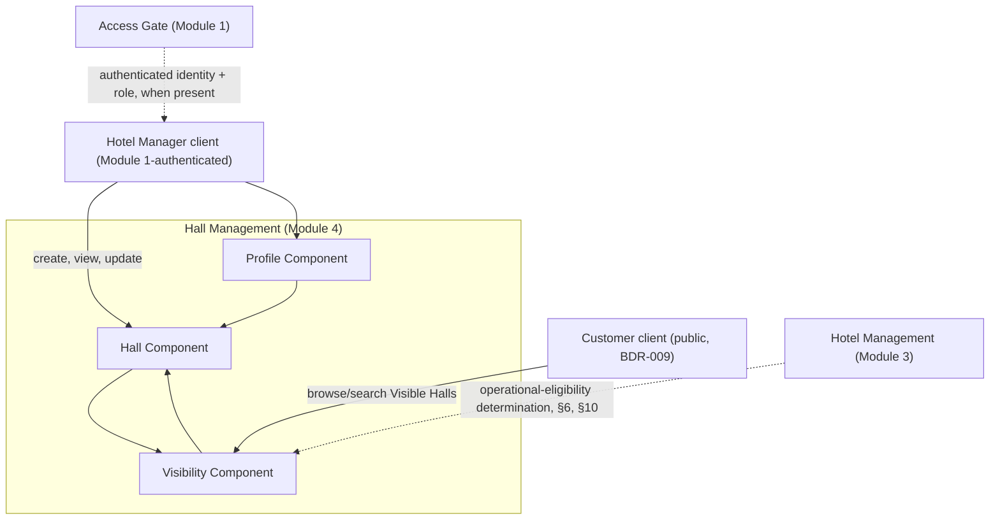
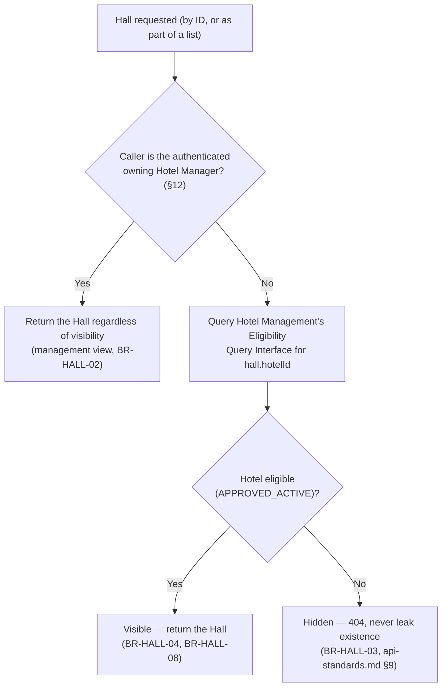
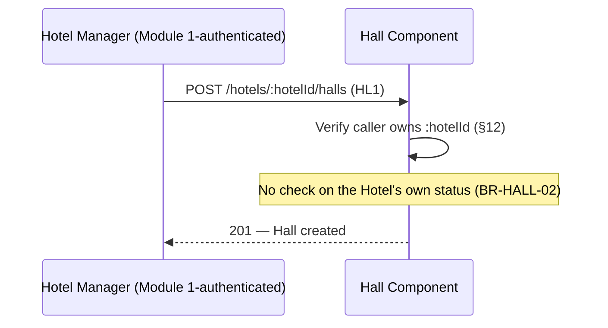
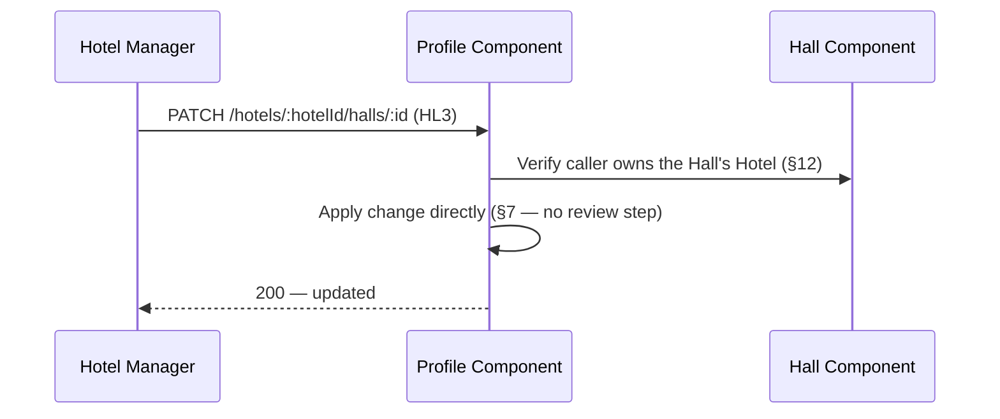
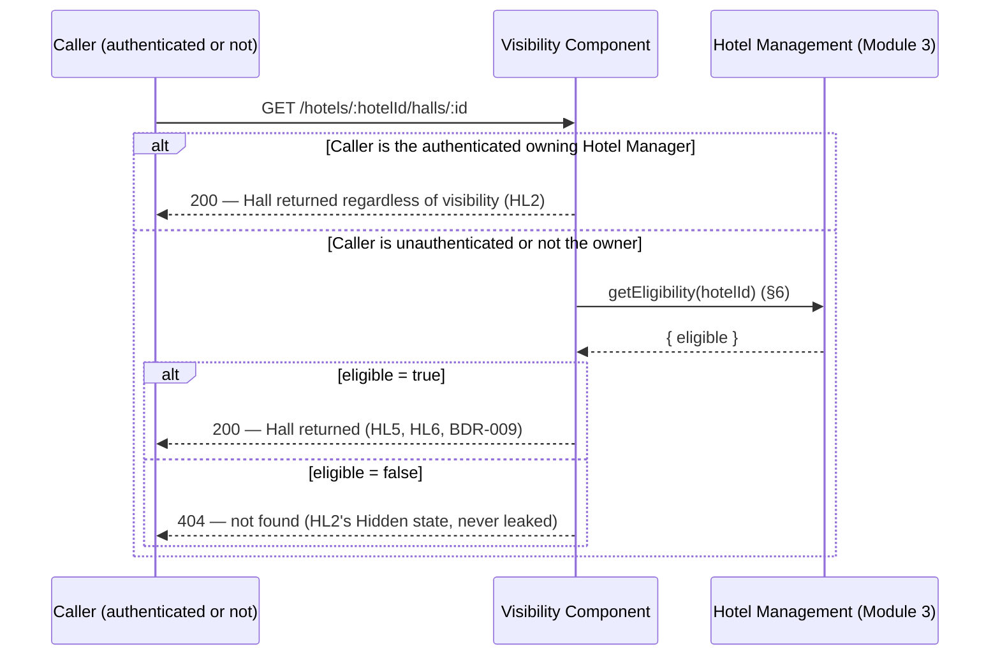
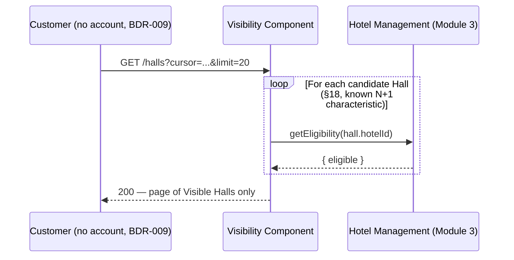

# Hall Management — Technical Design
## Hotel Hall Booking Management System

> **Relationship to other documents:** this document answers *how* Hall Management is built,
> never *what* it does or *why* — every business rule and journey referenced below is defined
> once, in `business-specification.md` (`Approved`, v1.1), and cited here by ID (`BR-HALL-##`,
> `HL#`) rather than restated. Where this document and the Business Specification appear to
> disagree, the Business Specification governs (`documentation-standards.md` §2) and this
> document has a defect to correct. Where this document and an approved architecture or
> standards document appear to disagree, the more detailed/canonical document governs
> (`system-architecture-overview.md`'s own relationship rule) — except where §18 identifies a
> genuine, unresolved conflict *between* two already-approved documents, which is flagged
> rather than silently arbitrated.

---

## 1. Technical Overview

This Technical Design translates the `Approved` Hall Management Business Specification (v1.1)
into a concrete technical architecture: components, domain model, data design, the Hall
visibility model, API contract, and module interactions — conforming to
`architecture-principles.md`, `system-architecture-overview.md`, `data-architecture.md`
(v1.2, corrected 2026-08-25), and the Standards Layer (`api-standards.md`,
`database-standards.md`, `coding-standards.md`, `naming-conventions.md`).

It does not restate business rules, journeys, or acceptance criteria — every technical
decision below traces to one (§19, Traceability Matrix). It contains no Prisma schema, SQL,
Express controller implementation, or client (Flutter/React) code — those belong to
Implementation Planning and Development (`documentation-architecture.md` §12), once this
document reaches `Approved`.

Hall Management is the technical realization of a Hall as the Platform's **bookable
inventory** (`data-architecture.md` §3–§4, Hall Domain): its creation, profile, and the
mechanics of its Customer-facing visibility. It is the second module in
`Development-Roadmap.md` Wave 2 ("Core Inventory"), depending on Authentication & Account
Management (Module 1, `Approved` and implemented) and Hotel Management (Module 3, `Approved`
and implemented), and unblocked by any other module. Its architecture is deliberately much
thinner than Hotel Management's own — Hall Management has no equivalent of Hotel
Management's five lifecycle-shaping decisions (`BDR-010`–`BDR-014`); where the Business
Specification leaves a mechanism genuinely undefined (§11 of that document), this design is
parameterized to accommodate any future resolution, never inventing one.

---

## 2. Architecture Context

### 2.1 Module Position

Per `system-architecture-overview.md` §6, this module is **"Hall — Bookable hall
inventory,"** the backend module folder `halls/` (`folder-structure.md` §4,
`naming-conventions.md` §4). It is one of the fourteen approved feature-based modules
(`architecture-principles.md` §3) and introduces no component outside that approved list.

### 2.2 Responsibilities

Directly realizing Business Specification §5 (Business Capabilities):

- **Hall Creation** — establishing a Hall as bookable inventory belonging to a Hotel.
- **Profile Management** — maintaining a Hall's information, including its Amenities.
- **Lifecycle Management** — a Hall's own state, entirely computed from the owning Hotel's
  eligibility (§6) — no independent Hall-side lifecycle exists.
- **Inventory Representation** — a Hall's attributes as the Platform's sellable inventory.
- **Amenity Definition** — this module owns the eventual definitive Amenity list; not yet
  approved (§9, §18).
- **Visibility Mechanics** — the mechanism `BR-HOTEL-04` explicitly assigns to this module.

### 2.3 Dependencies

| Dependency | Relationship |
|---|---|
| PostgreSQL + Prisma (`technology-stack.md`) | This module's persistence layer, per `database-standards.md`. |
| Authentication & Account Management (Module 1, `Approved`, implemented) | Provides the authenticated Hotel Manager identity and role claim (via the Access Gate) this module operates under; this module never re-implements identity, credentials, or session logic (§10). |
| Hotel Management (Module 3, `Approved`, implemented) | Provides the operational-eligibility determination this module consumes, unmodified, through its existing Eligibility Query Interface (`backend/src/modules/hotels/eligibility.service.js`, already implemented and already designed to serve this exact consumer — Hotel Management Technical Design §3, §10) — `BR-HOTEL-04`, `BR-HOTEL-05`. This module never owns, re-derives, or overrides Hotel data (§6, §10). |
| Booking Management (Module 5, `Not Started`) | Future consumer of this module's Hall data; not a blocking dependency — this module is upstream (§17). |
| Calendar & Scheduling Management (Module 6, `Not Started`) | Boundary not resolved (Business Specification §3, §11 Item 9); this design does not assume ownership of live, booking-driven availability scheduling (§9, §17). |

### 2.4 Architectural Boundaries

Per Business Specification §3, restated technically:

- This module **owns** the Hall entity and its profile data (§4–§5); visibility is a
  computed property of that data plus an upstream signal, never a second copy of it (§6).
- This module **does not own** Hotel Manager identity/credentials/authentication (Module 1),
  Hotel identity/onboarding/approval/operational-eligibility (Module 3), reservations or
  booking transactions (Module 5), the live booking-driven calendar (Module 6, boundary
  unresolved), Event Type taxonomy (Module 8), or payment/pricing policy (Module 7) — §10
  defines each interaction precisely.
- **No cross-document conflict remains for this module to resolve.** `data-architecture.md`
  §9 was corrected (v1.2, 2026-08-25) to attribute Hall inventory data to a new Hall Domain
  row, resolving the staleness Hotel Management's Technical Design §18 (Item 5) flagged; the
  matching stale row in Module 1's Technical Design §3.2 was corrected in the same pass
  (v1.9). This design proceeds against a consistent architecture set.

---

## 3. Module Architecture

Internal components of the `halls/` module (`folder-structure.md` §4), each with a single
responsibility (`architecture-principles.md` §4). No implementation code — conceptual
responsibility only. Three components, not six — Hall Management has no application-review,
suspension, or restriction workflow of its own (§7–§9 explain what replaces those concerns
here).

| Component | Responsibility |
|---|---|
| **Hall Component** | Creates and retrieves the Hall entity (§4) — the aggregate root every other operation in this module operates on. |
| **Profile Component** | Manages Hall profile data, including Amenities (`BR-HALL-06`, §8–§9) — no ordinary/critical routing exists here, unlike Hotel Management's Profile Component, because no approved decision establishes one for Halls (`BR-HALL-07`). |
| **Visibility Component** | A narrow, read-only component that computes whether a given Hall is Hidden or Visible (§6) by consuming Hotel Management's Eligibility Query Interface — never a second, independently-maintained visibility flag. |



---

## 4. Domain Model

Logical entities only, per `data-architecture.md` §4's convention — no Prisma models, no
columns.

| Entity | Business Purpose | Owning Component |
|---|---|---|
| **Hall** | The persistent inventory entity — one record per Hall, existing from creation onward, belonging to exactly one Hotel. Holds profile data (content deliberately unspecified, §18 Item 2) including any Amenities (§9). Has no persisted visibility state (§6). | Hall Component |

**Entities investigated but not modeled separately**, with rationale:

- **Hall Profile** — still not modeled as a separate entity, now that `BDR-016` (Required Hall
  Information, resolving former Pending Business Decision #2) is `Approved`. `BDR-016` settles
  the required/optional/custom-field *content* of a Hall's profile at the business level; it
  does not require a dedicated schema-level entity to enforce it — the required/optional
  standard field names (Hall Name, Capacity; Description, Location/Area) are validated at the
  request-shape layer (§8, `hall.validation.js`), the same way `api-standards.md` §14 already
  separates request-shape validation from persistence shape. Profile data remains a single
  attribute set on **Hall** (the existing `profileData` column, §5) — now with a defined
  minimum key set rather than an unconstrained one, mirroring Hotel Profile's own `BDR-015`
  resolution exactly. **Hall Photos is the one exception**, for the identical reason Hotel
  Logo/Photos were: a storage-path reference (and unbounded multiplicity) doesn't fit the
  flat-attribute-set shape — but unlike Hotel (`ADR-0006`), **no storage mechanism is approved
  for Hall media yet**, so Hall Photos remains an approved *business* field (`BDR-016`) with no
  corresponding technical design or entity here; a future Hall Media Component, mirroring
  Hotel Management's Media Component (that module's Technical Design §8a), is the anticipated
  shape once that dependency resolves — not designed or invented here.
- **Amenity (master data)** — `data-architecture.md` §6 anticipates Amenities as Master
  Data, and `database-standards.md` §6 even names the eventual junction table
  (`hall_amenities`) as its own illustrative example. Neither is modeled as a real entity or
  table *yet* — the definitive Amenity list is undefined (Business Specification `BR-HALL-06`,
  §11). Amenities are represented as ordinary content inside Hall's `profileData` for now
  (§9); promoting them to the anticipated master-data shape once the list is approved is an
  additive migration, not a redesign.
- **Hall Visibility Record** — not modeled. Visibility is a computed value (§6), never
  persisted, so there is nothing to model as an entity — the same discipline Hotel
  Management's Technical Design applies to Restriction and Suspension Records (state values
  plus Audit Records, not bespoke tracking entities).

### 4.1 Relationships

- A **Hall** belongs to exactly one **Hotel** (`BR-HALL-01`); a **Hotel** has zero or more
  **Halls** (`data-architecture.md` §5). Consistent with `BDR-008` — one Hotel, one physical
  location, so a Hall's single Hotel reference is also its single location reference; no
  Branch layer exists to complicate this (`architecture-principles.md` §6).
- A **Hall**'s visibility is derived from, never stored redundantly with, its owning
  **Hotel**'s operational-eligibility status (§6) — this module holds no copy of any Hotel
  field.

---

## 5. Data Architecture (Logical)

Business-purpose persistence design only, per `data-architecture.md`'s convention — no
Prisma schema, no SQL (`database-standards.md` governs the physical shape, not written here).

- **Ownership** — Hall is owned exclusively by this module (`architecture-principles.md`
  §5); no other module reads or writes the Hall table directly — only through this module's
  defined interfaces, once Booking Management (§17) or any future consumer needs one.
- **Constraints** (business-level, not `CHECK`-constraint detail) —
  - A Hall always has exactly one owning Hotel (`hotelId` never null, `BR-HALL-01`).
  - **Updated — `BDR-016` (Approved):** required-field completeness is now defined at the
    business level (Hall Name, Capacity required; Description, Location/Area, Hall Photos
    optional) but is still enforced at the **request-validation** layer
    (`hall.validation.js`), never a schema-level `CHECK` constraint — `profileData` remains a
    single unstructured JSON column (§4); no migration was required. `hotelId` referencing an
    existing, owned Hotel remains the only genuinely schema-adjacent constraint
    (`coding-standards.md` §11).
- **Audit requirements** — Hall creation and Hall update are recorded as Audit Records
  (§13), per `api-standards.md` §19 and `Project-Constitution.md` §8 (Auditability) — the
  same cross-cutting, log-based pattern Hotel Management already uses (§18 Item 3 notes the
  same inherited ownership gap for the Audit Record entity itself).
- **Soft delete** — `deleted_at` is reserved for a genuinely disposable/erroneous Hall
  record, per `database-standards.md` §9's rule that soft delete is distinct from any
  operational-status concept. Unlike Hotel, a Hall has no persisted status at all (§6), so
  there is no risk of conflating deletion with a status transition here — the distinction
  `database-standards.md` §9 illustrates using Hotel as its own example applies even more
  directly to Hall's simpler design. Whether, and under what conditions, a Hotel Manager may
  soft-delete a Hall is Pending Business Decision #6 (Hall Deletion) — this design provides
  the mechanism (soft delete, the platform-wide default) without deciding when it may be
  used.
- **Classification** (`data-architecture.md` §13) — Hall profile data, once Visible, is
  explicitly named **Public** ("Hall names ... published Amenities — data intended for
  anyone to see"). While Hidden, that same data is not exposed to Customers at all —
  visibility (§6) is what actually gates exposure; classification only describes the data's
  nature once exposed, never a substitute for the visibility check itself (§12).

---

## 6. Visibility Model

The Business Specification's Hall lifecycle (§6 of that document) has exactly two states,
Hidden and Visible, and is explicit that whether every prepared Hall becomes Visible
automatically, or some further condition applies, is **not settled by any approved
decision**. This is architecturally different from Hotel's lifecycle (Hotel Management
Technical Design §6), which is a genuine **state machine** — an explicit, actor-triggered
transition mutates a persisted `status` column. Hall Management has no equivalent
actor-triggered visibility action (no approved rule grants one, `BR-HALL-05` and Business
Specification §9's own Exception Scenario for this), so there is nothing to transition.
Visibility is instead a **computed value**, evaluated at read time, never persisted:

```
isVisible(hall) := hotelEligibility(hall.hotelId).eligible
```

Where `hotelEligibility(...)` is Hotel Management's existing Eligibility Query Interface
(`getEligibility(hotelId)`, `backend/src/modules/hotels/eligibility.service.js`), already
implemented and already returning `eligible: true` only while the Hotel is
`APPROVED_ACTIVE` — exactly `BR-HOTEL-04`/`BR-HOTEL-05`'s rule, read, never re-implemented.



**`HL4` ("Hotel becomes Approved/Active") needs no dedicated mechanism in this module.**
That event happens entirely inside Hotel Management's own domain and is already fully
designed there (Hotel Management Technical Design §14.2, journeys `HM5`/`HM10`). This
module never observes, subscribes to, or reacts to it — because visibility is computed, not
synchronized (above), `HL4`'s only effect on Hall Management is that the very next call to
`hotelEligibility(...)` for that Hotel's Halls returns `eligible: true`. There is no trigger,
event, or callback to design, and nothing to keep in sync.

**Why "automatic" is the necessary default, not an invented decision:** absent any approved
mechanism for an independent per-Hall visibility toggle (Pending Decision #3), the only
behavior this design can implement without inventing one is exactly what the formula above
computes — a Hall is Visible whenever, and only for as long as, its Hotel is eligible. This
mirrors the exact technique Hotel Management's own Technical Design uses for its
undefined ordinary/critical field classification (§8 of that document): the *mechanism* is
fully specified and buildable today; the *default* it falls back to in the absence of a
decision is explicitly documented as such, not silently treated as final. If Pending
Decision #3 later approves an independent Hall-level visibility control, `isVisible` gains
an additional `AND hall.independentlyVisible` term — an additive change to this component,
not a redesign of it.

**No transition table, no `stateDiagram-v2`, no persisted status column** appear in this
document for Hall, unlike Hotel Management's §6.1/§6.2 — there is nothing to transition, and
inventing a status column that must be kept in sync with Hotel's own status (via some
unapproved synchronization trigger) would be a strictly worse design than computing the
answer live from the single source of truth Hotel Management already maintains
(`architecture-principles.md` §5, Single Source of Truth via `data-architecture.md` §2).

---

## 7. Hall Creation & Update Workflow

Technical orchestration only; business policy is defined in the Business Specification and
never re-decided here.

1. **Creation** (`HL1`, `HL2`) — the Hall Component creates a Hall record referencing the
   caller's own Hotel (`hotelId`, enforced by authorization, §12). No precondition on the
   owning Hotel's own status is checked (`BR-HALL-02`) — a Hall may be created whether the
   Hotel is `REGISTERED` or `APPROVED_ACTIVE` or anything between, per `BR-HOTEL-04`. **Added
   per `BDR-016`:** the request must supply a non-empty Hall Name and a valid positive-integer
   Capacity (§8) — validated at the request-shape layer (`400`, §16) before the Hall Component
   ever runs; no other field is required.
2. **Update** (`HL3`) — the Profile Component applies the requested changes to the Hall's
   `profileData` directly. **No classification step exists** (unlike Hotel Management's
   ordinary/critical routing, §8 of that document) — `BR-HALL-07` establishes that no
   approved decision defines Hall *update rules* at all (a distinct question from required
   *content*, which `BDR-016` now settles), so there is no approved basis for inventing a
   review gate; every well-formed, authorized update simply applies. This is the necessary
   default absence of a decision, not a foreclosure of Pending Decisions #7/#3 eventually
   introducing one — adding a review gate later is an additive change to this component, the
   same parameterization technique as §6. **Added per `BDR-016`:** if the request includes a
   `name` or `capacity` key, its *content* is validated the same way creation validates it
   (non-empty name, valid positive-integer capacity) — a Hall Name or Capacity can never be
   cleared to empty/invalid via edit; every other key is merged unchanged (§8).
3. **Visibility is never touched by this workflow.** Creating or updating a Hall never reads
   or writes anything about the owning Hotel's eligibility — visibility is computed
   separately, only when a Hall is *read* (§6), keeping this workflow's only dependency the
   caller's own authorization (§12).

---

## 8. Profile Management

- **Profile creation** — occurs at Hall creation (§7); required fields (Hall Name, Capacity,
  `BDR-016`) must be supplied at creation time — there is no separate "complete profile" step
  the way Hotel Management has (`PROFILE_COMPLETE`, that module's §6) — a Hall has no such
  state, since visibility depends only on the owning Hotel's eligibility (§6), never on the
  Hall's own profile completeness. Optional fields (Description, Location/Area, Hall Photos)
  and custom fields may still be supplied incrementally via later updates. Whether a Hall's
  information must meet any *additional* completeness bar before it can be Visible remains
  Pending Decision #2's residual scope — `BDR-016` settles only the *content* of a complete
  profile, not any visibility-gating role for it (§6 is unchanged: visibility depends solely
  on Hotel eligibility).
- **Profile updates** — applied directly (§7); no ordinary/critical split exists for Halls.
  Updating Hall Name or Capacity re-validates their content (§7); every other field is merged
  unchanged, no re-validation of fields not present in the request.
- **Required content** — **resolved by `BDR-016` (Approved, 2026-08-26).** Required: Hall
  Name, Capacity. Optional standard: Description, Location/Area, Hall Photos. Optional
  extensibility: Hotel Manager-defined custom key/value fields, which may never satisfy or
  replace a required field (enforced by validating the specific `name`/`capacity` keys, never
  by counting "any field present" — the same mechanism `BDR-015` established for Hotel). The
  `profileData` attribute set (§4) remains unstructured JSON — `BDR-016` defines content, not
  schema; no migration was required.
- **Validation** — request-shape validation (`hall.validation.js`) now includes, per
  `BDR-016`: Hall Name must be a non-empty string; Capacity must be a valid positive integer
  (accepted as a JSON number or a numeric string, normalized server-side) — both `400
  VALIDATION_ERROR` with field-level `details` (`api-standards.md` §8) if missing/invalid at
  creation, or supplied-but-invalid at update. Description, Location/Area, Hall Photos, and
  any custom field remain unconstrained in content, per `coding-standards.md` §11 /
  `api-standards.md` §14. **Hall Photos has no upload mechanism yet** — no Supabase (or other
  provider) contract has been designed or approved for Hall media, unlike Hotel's `ADR-0006`;
  the field exists in the approved business model (`BDR-016`) but nothing in this Technical
  Design or its implementation makes it functional. Manager Mobile's "Add Photos" control is a
  clearly-marked non-functional placeholder until that dependency resolves (§11, §17).

---

## 9. Amenity Representation

Business Specification `BR-HALL-06` establishes that this module is the intended owner of
the *definitive* Amenity list, while leaving the list itself undefined (§11 of that
document). **`BDR-016` (Approved, resolving former Pending Decision #2) did not resolve this
separately** — the approved Hall profile model (Hall Name, Capacity, Description,
Location/Area, Hall Photos, custom fields) does not name Amenities as a standard field.
Amenities remain expressible only through the generic custom-field mechanism (§4, §8) until a
future, dedicated decision defines the actual list.

- **Today:** Amenities are ordinary content inside a Hall's `profileData` (§4, §8) — no
  dedicated `Amenity` entity, no `hall_amenities` junction table. Building either now would
  mean inventing specific Amenity values (or even just an Amenity *shape*) no approved
  decision has supplied — exactly what `data-architecture.md` §18 ("AI must never invent a
  new entity without approval") and `architecture-principles.md` §3 (modules introduce no
  structure the business model doesn't require) both prohibit.
- **The anticipated future shape is already named, not invented here:**
  `data-architecture.md` §6 lists "Amenities" as Master Data, and `database-standards.md` §6
  gives `hall_amenities` as its own worked example of a junction table ("a Hall has many
  Amenities, an Amenity is used by many Halls"). Once the definitive list is approved, an
  `Amenity` master-data entity plus a `hall_amenities` junction table (`database-standards.md`
  §4, §6, §10) is the shape this design expects to migrate toward — an additive schema
  change, not a redesign of the Hall Component or the Visibility Component.
- **Public classification carries over unchanged** — `data-architecture.md` §13 already
  names "published Amenities" as Public data, the same classification a Hall's name carries
  (§5) — once a Hall is Visible, its Amenities (wherever represented) are exposed the same
  way its other profile content is.

---

## 10. Module Interactions

- **Authentication & Account Management (Module 1, `Approved`, implemented)** — this module
  trusts the Access Gate's authenticated identity and role claim exactly as every other
  module does (`architecture-principles.md` §7); it never re-implements authentication,
  credentials, or session logic. Unlike Hotel Management, this module's Customer-facing read
  endpoints (§11, §12) are intentionally reachable *without* an identity at all, per
  `BDR-009` — the Access Gate is consulted when a token is present, never required for those
  specific endpoints.
- **Hotel Management (Module 3, `Approved`, implemented)** — the module's one real upstream
  data dependency (§2.3, §6). This module calls Hotel Management's existing Eligibility
  Query Interface as an in-process function call within the single Express backend
  (`architecture-principles.md` §5, `system-architecture-overview.md` §5 — not a second HTTP
  round-trip, the identical pattern Hotel Management's own Technical Design §7 established
  for Module 13's calls into *it*). This module never reaches into Hotel Management's table
  directly, and never re-derives or caches a Hotel's eligibility independently (§6).
- **Booking Management (Module 5, `Not Started`)** — not yet a consumer of anything this
  module exposes; when it is built, several currently-undefined questions about Hall
  behavior once Bookings exist (change restriction, deletion with booking history — Pending
  Decision #5) will need resolving, tracked, not invented, here.
- **Calendar & Scheduling Management (Module 6, `Not Started`)** — the Hall/Calendar
  availability boundary is unresolved (Business Specification §3, §11 Item 9). This design
  models no availability-schedule entity or field beyond whatever a Hotel Manager chooses to
  put in `profileData` (§8) — it does not anticipate, and does not preclude, whichever way
  that boundary is eventually drawn.
- **Audit** — cross-cutting, same gap Hotel Management's Technical Design already flags
  (§18 Item 3, inherited from Module 1's own Technical Design §17 Item 4): no approved
  module owns the Audit Record entity. This module produces Audit Records for
  security-significant, state-changing actions (§13) without claiming ownership, consistent
  with both modules' precedent.
- **Notification** — the Business Specification does not require notifying anyone of a Hall
  event; no such requirement is invented here.

---

## 11. API Design

Every endpoint follows `api-standards.md` in full: `/api/v1/...` versioning (§3), the
success/error envelopes (§7–§8), the status codes in §9, and `naming-conventions.md` §9's
field casing. Nesting under `/hotels/:hotelId/halls` follows `api-standards.md` §4's own
worked example verbatim ("`/api/v1/hotels/:id/halls` is valid because a Hall belongs to a
Hotel") — not a new pattern invented here. Request/response field lists are now settled by
`BDR-016` (Approved) — see each endpoint below.

**Design choice, stated explicitly per `api-standards.md` §12's requirement that
public-ness be an explicit Technical Design decision:** the two `GET` endpoints below are
**public** — reachable without authentication, per `BDR-009` — but behave differently
depending on whether a valid Hotel-Manager token for the *owning* Hotel is presented. This is
the only way for a single resource URL to serve both "a Hotel Manager preparing a Hidden
Hall" and "a Customer browsing a Visible one" without duplicating the resource under two
different paths for no reason `api-standards.md` §2 (Resource-oriented endpoints) would
endorse.

#### `POST /api/v1/hotels/:hotelId/halls`
- **Purpose** — create a new Hall belonging to the given Hotel — `HL1`, `HL2`.
- **Actor** — Hotel Manager.
- **Authentication** — Required.
- **Authorization** — Own-Hotel only (`api-standards.md` §13); `:hotelId` not owned by the
  caller returns `404`, never `403` (tenant-isolation rule).
- **Request concept** — **`BDR-016` (Approved):** `profileData.name` (required, non-empty
  string) and `profileData.capacity` (required, valid positive integer) at minimum;
  `description`, `location`, and any custom key/value fields are optional. Hall Photos has no
  request field yet — no upload mechanism exists (§8).
- **Response concept** — `201 Created`; the created Hall's identifier and `hotelId`.
- **Validation** — `400` for malformed request shape, or for a missing/empty Hall Name or a
  missing/invalid Capacity (§16); `404` if `:hotelId` doesn't exist or isn't owned by the
  caller. **No precondition on the owning Hotel's own status** (`BR-HALL-02`).

#### `GET /api/v1/hotels/:hotelId/halls/:id`
- **Purpose** — retrieve a single Hall — supports `HL3`–`HL6`.
- **Actor** — Hotel Manager (own Hotel) or Customer (public, no account, `BDR-009`).
- **Authentication** — **Public.** If a valid token for the owning Hotel Manager is
  presented, the Hall is returned regardless of visibility (§6). Otherwise (no token, or a
  token for a different Hotel), the Hall is returned only if Visible.
- **Response concept** — Hall profile fields; visibility is not returned as a field on the
  resource (§6) — its effect is entirely in whether the request succeeds at all.
- **Validation** — `404` if the Hall doesn't exist, or exists but is Hidden and the caller
  isn't its owning Hotel Manager — the identical "never leak existence" reasoning
  `api-standards.md` §9 already applies to cross-tenant access, generalized here to
  visibility (§6).

#### `PATCH /api/v1/hotels/:hotelId/halls/:id`
- **Purpose** — update Hall information — `HL3`.
- **Actor** — Hotel Manager (own Hotel only).
- **Authentication** — Required.
- **Authorization** — Own-Hotel only (`404` cross-tenant, as above).
- **Request concept** — one or more profile fields to change. If `name` or `capacity` is
  included, its content is validated the same way creation validates it (`BDR-016`, §7, §8);
  every other field (including `description`, `location`, and custom keys) is merged
  unvalidated beyond shape.
- **Response concept** — `200 OK`; the change applies immediately (§7 — no review step
  exists for Halls, unlike Hotel Management's ordinary/critical split).
- **Validation** — `400` for malformed fields, or an included `name`/`capacity` that fails
  content validation (§16); `404` for a Hall not owned by the caller.

#### `GET /api/v1/hotels/:hotelId/halls`
- **Purpose** — list a Hotel's Halls — supports the Hotel Manager's own management view, and
  a Customer browsing one specific, already-known Hotel (`BDR-009`).
- **Actor** — Hotel Manager (own Hotel) or Customer (public).
- **Authentication** — **Public**, same conditional behavior as the single-Hall `GET` above:
  the owning Hotel Manager sees every Hall regardless of visibility; anyone else sees only
  Visible Halls.
- **Request concept** — paginated per `api-standards.md` §10 (offset pagination — a bounded,
  page-numbered list, the same mode Hotel Management's own `GET /hotels` uses).
- **Response concept** — `200 OK`; a page of Hall summaries.
- **Validation** — `404` if `:hotelId` doesn't exist (a nonexistent Hotel has no Halls to
  list, and per the tenant-isolation rule this is indistinguishable from "exists but not
  yours" at the API boundary).

#### `GET /api/v1/halls`
- **Purpose** — platform-wide browse/search across every currently Visible Hall — the
  concrete technical realization of `BR-HALL-08`'s "browse and search" capability.
  **Added during this design**, the same way Hotel Management's own `GET /hotels` query
  interface was "added during technical review" (that document's §11) to give an already-approved
  capability somewhere to actually happen — without this endpoint, Customer browsing across
  Hotels has no way to be exercised.
- **Actor** — Customer (public, no account, `BDR-009`).
- **Authentication** — Public, unconditionally — this endpoint never returns a Hidden Hall
  to anyone, including an authenticated Hotel Manager, since it isn't scoped to any one
  Hotel; a Hotel Manager uses the nested `GET /hotels/:hotelId/halls` above for their own
  management view instead.
- **Request concept** — optional `?hotelId=` filter (`naming-conventions.md` §9); **cursor
  pagination** (`cursor` + `limit`), per `api-standards.md` §10 and `coding-standards.md`
  §6's own rule that cursor pagination is required for "any list that can grow large or is
  user-scrolled" — unlike the bounded, per-Hotel `GET /hotels/:hotelId/halls` list above,
  this endpoint has no natural bound (every Visible Hall on the Platform) and is exactly the
  kind of Customer-facing, likely infinite-scrolled list that rule describes. **Corrected
  during Implementation Planning** (v1.2) — the initial draft left the mode unspecified for
  this endpoint specifically; §18 records this as a self-found defect, the same transparency
  discipline Module 1's own implementation applied to its own discovered API defect.
- **Response concept** — `200 OK`; a page of Visible Hall summaries, including pricing and
  availability wherever a Hall's own `profileData` carries them (`BDR-009`).
- **Validation** — `400` for a malformed `hotelId` filter value.
- **Known performance characteristic, not solved here (§18):** filtering to Visible-only
  means, per Hall, a call to Hotel Management's Eligibility Query Interface (§6) — at real
  scale this is an N+1 pattern. `architecture-principles.md` §12 (Performance Principles,
  "optimize only when necessary... against a measured requirement") is why this document
  does not propose extending Hotel Management's `Approved`/`Implemented` interface with a
  batch-lookup mode to solve a load this module has no measured evidence of yet — flagged
  honestly as a risk (§18), not silently over-engineered around.

---

## 12. Security Design

- **Authentication dependency on Module 1** — this module never issues, validates, or stores
  any token or credential; every request that carries one passes through Module 1's Access
  Gate first (`architecture-principles.md` §7). No duplication of Module 1's implementation.
- **Two endpoints are deliberately public** (§11) — `GET /hotels/:hotelId/halls/:id` and
  `GET /hotels/:hotelId/halls` accept an absent or non-owning token and still respond, scoped
  to Visible Halls only in that case; `GET /halls` is public unconditionally. Every other
  endpoint (`POST`, `PATCH`) requires authentication, the secure default
  (`api-standards.md` §12).
- **Authorization** — Hotel Manager write actions are scoped to their own Hotel only,
  enforced per `api-standards.md` §13 (cross-tenant access returns `404`, never `403`, so
  tenant existence is never leaked). The same reasoning extends, for read access, to Hall
  *visibility*: an unauthorized or absent caller receives `404` for a Hidden Hall, never a
  status code that would confirm the Hall exists but is hidden (§6, §11).
- **No Platform-Administrator-only action exists in this module** — unlike Hotel
  Management, Hall Management has no operation gated behind Module 13's authorization,
  because no approved rule establishes Platform Administrator involvement in individual Hall
  management (Business Specification §4).
- **Hall data protection** — profile data classified per `data-architecture.md` §13 (§5);
  Public once Visible, not exposed at all while Hidden — visibility, not classification
  alone, is what actually gates a Customer's access (§6).
- **Auditability** — every state-changing action is logged (§13), per `api-standards.md` §19.
- **No independent visibility mutation exists** — only the Visibility Component's computed
  read (§6) determines Hidden/Visible; no component, including the Hall and Profile
  Components, writes a visibility flag, because none is persisted.

**`security-architecture.md` and `security-coding-standards.md` are both currently `Not
Started`** (§18) — this section is grounded instead in `architecture-principles.md` §6–§7,
`api-standards.md` §12–§13/§19, and `database-standards.md` §16, the same gap Hotel
Management's Technical Design already flags and works around.

---

## 13. Audit & Traceability

Hall actions requiring an Audit Record, each derived directly from an approved rule —
nothing invented beyond the Business Specification's own scope:

| Action | Rule / Journey |
|---|---|
| Hall created | `HL1`, `BR-HALL-02` |
| Hall information updated | `HL3`, `BR-HALL-07` |

Each record captures actor, action, timestamp, and the affected Hall, using the same
structured-log mechanism (not a persisted Audit Record table) Hotel Management already uses
(`backend/src/modules/hotels/audit.js`) — subject to the same unresolved ownership gap (§18,
inherited from Hotel Management's Technical Design §18 Item 3 and Module 1's Technical
Design §17 Item 4). Unlike Hotel Management's audit table (§13 of that document), there is no
approval/rejection/suspension/restriction action to log here, because none exists in this
module (§3, §7–§9).

---

## 14. Sequence Diagrams

Only flows supported by approved business rules.

### 14.1 Hall Creation, Before or After Hotel Approval (`HL1`, `HL2`)



### 14.2 Hall Information Update (`HL3`)



### 14.3 Hall Read — Owning Hotel Manager vs. Public Customer (`HL2`, `HL5`, `HL6`)



### 14.4 Platform-Wide Customer Browsing (`HL6`)



---

## 15. Data / State Diagrams

### 15.1 Hall Visibility

See §6's flowchart — there is no separate `stateDiagram-v2` for Hall, unlike Hotel
Management's §15.1/§6.1, because Hall visibility is computed, not transitioned (§6).

### 15.2 Hall Entity Lifecycle (Existence Only)

```mermaid
stateDiagram-v2
    [*] --> EXISTS: Hall Manager creates a Hall (HL1)
    EXISTS --> EXISTS: Profile updated (HL3) — no state change
    EXISTS --> DELETED: Soft delete (mechanism only; permission undefined, Pending Decision #6)
    DELETED --> [*]
```



A Hall's only real persisted lifecycle is existence versus soft-deleted — everything else a
Business Specification reader might expect as "Hall lifecycle" (Hidden/Visible) is the
computed model in §6, not a state stored on the entity itself.

---

## 16. Error & Failure Handling

All categories use `api-standards.md` §8's error envelope and §9's status codes — no new
status code is introduced.

| Category | Status Code | Handling |
|---|---|---|
| Invalid Hall data (malformed request) | `400 Bad Request` | Request-shape validation, before business logic runs (`api-standards.md` §14). |
| **Added v1.5** — Missing/empty Hall Name, or missing/invalid Capacity (`BDR-016`) | `400 Bad Request` | Same category as the row above, specialized: `api-standards.md` §9 classifies "missing required field" as request validation, not a business rule — field-level `details` (§8, §11) name which field failed. |
| `:hotelId` doesn't exist, or isn't owned by the caller, on a write | `404 Not Found` | Never `403` — consistent with `api-standards.md` §9's tenant-isolation rule (§12). |
| Hall doesn't exist, or exists but is Hidden and caller isn't the owning Hotel Manager | `404 Not Found` | Same "never leak existence" reasoning, extended from tenant isolation to visibility (§6, §12). |
| Hotel Manager attempts to change a Hall's visibility directly | `404 Not Found` (no such endpoint exists) | No API surface is designed for this action at all (§11) — consistent with Business Specification §9's Exception Scenario that no approved action exists. |

---

## 17. Dependencies

- **Internal** — Authentication & Account Management (Module 1, satisfied); Hotel Management
  (Module 3, satisfied — this module is the *consumer* of its Eligibility Query Interface,
  already built and already designed for this exact consumer); Booking Management (Module 5,
  `Not Started` — not a blocking dependency, this module is upstream); Calendar & Scheduling
  Management (Module 6, `Not Started` — boundary unresolved, §2.3, §10).
- **External services** — none required by this module's approved scope *yet*. Hall Photos is
  now an approved business field (`BDR-016`), which makes a media-storage dependency real
  rather than hypothetical — but which provider realizes it is **not settled by this
  document**: Supabase is the current platform-wide default (`architecture-principles.md`
  §10, `technology-stack.md`, `ADR-0006`), approved so far only for Hotel Logo/Photos, not
  extended to Hall Photos by any approved decision. No upload integration is designed in this
  document until that extension is approved — the same posture Hotel Management's own
  Technical Design held before `ADR-0006` resolved it for that module (§8, §11).
- **Infrastructure** — PostgreSQL + Prisma, Express (shared, no module-specific addition).
- **Pending BDR dependencies** — see §18 for the full classification of whether each of the
  eleven Pending Business Decisions blocks architecture, blocks only specific future
  Development-phase work, or blocks neither.

---

## 18. Technical Risks & Assumptions

Per this project's own rule that a Technical Design must never silently encode an unrecorded
answer (`business-decision-register.md` §1) and must never bypass an architectural principle
rather than flag it (`architecture-principles.md` §14), the following were identified while
authoring this document.

1. **`security-architecture.md` and `security-coding-standards.md` are both `Not Started`.**
   The same gap Hotel Management's and Module 1's Technical Designs already flag — inherited
   here, not newly introduced. §12 is grounded in everything already `Approved` that touches
   security.
2. **`domain-model-and-bounded-contexts.md` does not exist.** Referenced as "once authored"
   by both `data-architecture.md` and `system-architecture-overview.md`. This document's §4
   and §5 are grounded directly in `data-architecture.md` §3–§5 instead — the same
   accommodation Hotel Management's and Module 1's Technical Designs already make.
3. **Audit Record has no assigned owning domain** — the same gap Hotel Management's
   Technical Design flags in its own §18 (Item 3, inherited from Module 1's §17 Item 4). This
   module participates in audit logging (§13) without claiming ownership, for the same
   reason.
4. **The Hall/Calendar availability boundary is genuinely open**, per Business Specification
   §3/§11 Item 9. This design deliberately models no availability-schedule entity or field —
   whatever a future resolution decides, this document does not need to be redesigned to
   accommodate it, only extended.
5. **The `GET /halls` platform-wide browse endpoint has an N+1 performance characteristic**
   (§11, §14.4) — one Eligibility Query Interface call per candidate Hall. Not solved here,
   per `architecture-principles.md` §12 (optimize only against a measured requirement); if
   Hall volume later demonstrates a real cost, the fix is an additive extension to Hotel
   Management's own interface (a batch/list-eligible-Hotels mode) — a decision for that
   module's own change process, not unilaterally assumed as a prerequisite by this document.
6. **Amenities are not yet a master-data entity** (§9) — a deliberate deferral, not an
   oversight: `data-architecture.md` §6 and `database-standards.md` §6 both already name the
   eventual shape (`Amenity`, `hall_amenities`), but building it now would mean inventing the
   actual Amenity list no approved decision supplies.
7. **Self-found defect, corrected — `GET /api/v1/halls`'s pagination mode was left
   unspecified in v1.1** (§11). `coding-standards.md` §6 requires cursor pagination for "any
   list that can grow large or is user-scrolled"; this endpoint — a platform-wide,
   Customer-facing browse/search with no natural bound — is exactly that case, unlike the
   bounded per-Hotel `GET /hotels/:hotelId/halls` list, which correctly uses offset
   pagination. **Corrected in v1.2**, discovered during Implementation Planning rather than
   left to surface during Development — the same transparency this project's own precedent
   (Module 1's `PATCH /password-resets/:id` correction) establishes for a defect found after
   a document's initial approval.

**Pending Business Decisions — classified against this document's architecture:**

| # | Pending Decision | Blocks this Technical Design's architecture? | Blocks specific future work? |
|---|---|---|---|
| 1 | Hall Creation Limit | No — unbounded creation supported by default; a future cap is an additive validation rule in the Hall Component (§3). | No |
| 2 | ~~Required Hall Information~~ | **RESOLVED 2026-08-26** — `BDR-016` approved. No architecture change required: profile remains a single `profileData` attribute set on Hall (§4), now with a defined required/optional/custom key structure enforced at the request-validation layer (§8) rather than a schema/migration change. | Resolved — no longer blocks Development-phase work. |
| 3 | Hall Visibility Control & Deactivation Authority | No — the computed-visibility default (§6) is exactly the necessary absence of this decision, additively extensible if it resolves. | No, until the resolution actually adds a control — then it's additive, not blocking. |
| 4 | Hall Retirement | No — no retirement state exists to redesign (§15.2 models only existence/soft-delete). | No |
| 5 | Duplicate Hall Names | No — no uniqueness constraint is assumed either way (§5, §8). | No |
| 6 | Hall Deletion | No — soft delete is the platform-wide default mechanism (§5); *who* may trigger it is what's undefined. | **Yes** — the delete endpoint itself (not designed here, since no approved permission exists to design it against, §11) waits on this. |
| 7 | Hall Capacity Changes | No — a Capacity *value* is now a required field (`BDR-016`, §8), stored in the same unstructured `profileData` as every other field; this decision concerns only whether/how that value may be *changed* after creation, which remains genuinely open — `BDR-016` did not resolve it (§8, §11). | No |
| 8 | Hall Pricing | No — same reasoning as #7; `business-decision-register.md` §4's empty "Pricing Policies" category is unaffected by this document's architecture. | No |
| 9 | Hall Availability Scheduling / Hall–Calendar Boundary | No — this document assumes nothing about where the line falls (§10, §17, Item 4 above). | **Yes** — any availability-scheduling feature waits on this resolving, in either direction. |
| 10 | Effect of Future Bookings on Hall Changes | No — Booking Management doesn't exist yet, so there is nothing for this document to be blocked by. | **Yes** — once Booking Management exists, this governs whether Hall updates/deletes need new restrictions. |
| 11 | Hall Information Validity | No — no restriction-and-review mechanism is modeled, the same deliberate omission as Hotel Management's own equivalent gap before `BDR-013` existed. | No |

**Conclusion:** of the eleven Pending Business Decisions originally identified, ten remain
open; none block this Technical Design's own architecture — it is deliberately parameterized
to accommodate any resolution, the same technique Hotel Management's and Module 1's Technical
Designs both use. Three of the ten (#6, #9, #10) block specific future Development-phase
tasks and should be resolved before those particular tasks are scheduled, not before this
document proceeds. Item #2 has been resolved (`BDR-016`, 2026-08-26) without requiring any
architecture change — see row above. No architecture-level conflict remains unresolved for
this module — the one that existed (`data-architecture.md` §9's stale Hall ownership) was
corrected, along with its echo in Module 1's Technical Design, immediately before this
document was authored (§2.4).

---

## 19. Traceability Matrix

| Business Rule / Journey | Technical Component / Design Element | API / Flow / Data Element |
|---|---|---|
| `BR-HALL-01` (one Hotel per Hall) | §4, §4.1 | `hotelId` on Hall (§5) |
| `BR-HALL-02` (creation regardless of Hotel status) | Hall Component (§3), §7 | `POST /hotels/:hotelId/halls` (§11), §14.1 |
| `BR-HALL-03` (Hidden while Hotel not eligible) | Visibility Component (§3), §6 | §6 flowchart, §14.3 |
| `BR-HALL-04` (Visible once Hotel eligible) | Visibility Component (§3), §6 | §6 flowchart, §14.3 |
| `BR-HALL-05` (Hotel Management is sole eligibility source) | §2.3, §6, §10 | `getEligibility()` call (§6) |
| `BR-HALL-06` (Amenity list ownership) | §9 | `profileData` (§4, §8) |
| `BR-HALL-07` (required content resolved; other details tracked, not invented) | §7, §8, §18 | `BDR-016` (§4, §8, §18); Pending Decisions table (§18) for everything else |
| `BR-HALL-08` (Customer browsing without an account) | Visibility Component (§3) | `GET /halls`, `GET /hotels/:hotelId/halls[/:id]` (§11), §14.3–§14.4 |
| `BR-HALL-09` (no Booking/Calendar ownership here) | §2.4, §10 | — (boundary statement, no dedicated flow) |
| `BR-HALL-10` (own-Hotel-only management) | §12 | `404` cross-tenant handling (§11, §16) |
| `HL1`, `HL2`, `HL3`, `HL5`, `HL6` | §14 (Sequence Diagrams) | Each journey maps to a named sequence diagram |
| `HL4` (Hotel becomes Approved/Active) | §6 (explicit note) | No mechanism here — entirely Hotel Management's own event (that module's `HM5`/`HM10`); this module only computes against its outcome |
| Pending Business Decisions #1–#11 | §18 | Classified individually, none invented; #2 resolved via `BDR-016` |
| `BDR-008` | §4.1 | Single-Hotel-per-Hall grounding |
| `BDR-009` | §11, §12 | Public `GET` endpoints |
| `BDR-016` | §4, §7, §8, §11, §18 | Required/optional/custom Hall profile field structure |

Every row traces to an approved source; no technical element in this document lacks one.

---

## Version History

| Version | Date | Author | Change |
|---|---|---|---|
| 1.5 | 2026-08-26 | Ahmed | Reflects `BDR-016` (Required Hall Information), `Approved` 2026-08-26, resolving former Pending Business Decision #2 (§18). §4 (Domain Model), §5, §7, §8, §11, and §16 updated to state the actual required (Hall Name, Capacity) and optional (Description, Location/Area, Hall Photos) field structure — no architecture change: profile remains the existing `profileData` attribute set on Hall, validated at the request-shape layer, not a new entity or schema/migration. Hall Photos has no upload mechanism yet (no Hall equivalent of `ADR-0006`) — flagged explicitly, not invented. §9 clarifies `BR-HALL-06`'s separate Amenity-list question is untouched. §18's Pending Decision table/conclusion and §19's Traceability Matrix updated accordingly. Ahmed directed and reviewed this change directly; no separate Mohamed/Abukar review round occurred (the same transparently-flagged deviation this document's own v1.3 already used). |
| 1.4 | 2026-08-26 | Ahmed | §17: default storage-provider name updated Cloudinary → Supabase, per `ADR-0006` (Hotel Management's own media-storage decision). Purely a factual-consistency correction — this module still has no approved Hall-photo upload requirement (Pending Decision #2 unresolved) and nothing here was newly assumed. |
| 1.3 | 2026-08-25 | Ahmed | Traceability note only — no design content changed. §11's own-Hotel-scoped endpoints (`POST`/`GET`/`PATCH /hotels/:hotelId/halls[/:id]`, `GET /hotels/:hotelId/halls`) are now implemented exactly as specified here (Implementation Plan v1.2, WBS-05), consuming Hotel Management's Hotel Ownership Query Interface (that module's Technical Design v1.5) for the own-Hotel authorization §12 already called for — this design anticipated needing such a check without naming the mechanism; no defect was found, and nothing in §3–§19 required correction. |
| 1.2 | 2026-08-25 | Ahmed | Self-found defect corrected while authoring the Implementation Plan: `GET /api/v1/halls`'s pagination mode was left unspecified in §11, violating `coding-standards.md` §6's requirement that any large/user-scrolled list use cursor pagination — this platform-wide, unbounded, Customer-facing browse endpoint is exactly that case. Corrected to cursor pagination (§11, §14.4); §18 records this as a new Item 7. Status remains `Approved` — a compliance correction to an already-reviewed contract, not a new design decision requiring a fresh review round; flagged for Mohamed/Abukar's attention at the next convenient review rather than blocking Implementation Planning on a one-line fix. |
| 1.1 | 2026-08-25 | Ahmed | Status changed `Draft` → `Approved`: independent review by Mohamed is complete, per `documentation-architecture.md` §4's no-self-review rule, with no changes requested. This document is now the authoritative technical source of truth for Hall Management — Implementation Planning may begin. |
| 1.0 | 2026-08-25 | Ahmed | Initial draft Technical Design for Hall Management, authored against the `Approved` Business Specification (v1.1) once the `data-architecture.md` §9 Hall-ownership conflict was resolved (v1.2) and its echo in Module 1's Technical Design corrected (v1.9). Hall visibility modeled as a computed value derived from Hotel Management's existing Eligibility Query Interface, not a persisted, transitioned state — a deliberate departure from Hotel Management's state-machine pattern, justified in §6. Not yet reviewed — see status. |
