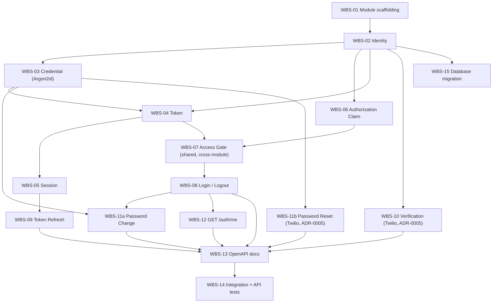

# Authentication & Account Management — Implementation Plan
## Hotel Hall Booking Management System

> **Naming note:** the correct, approved filename for this document is
> `implementation-plan.md`, per `naming-conventions.md` §12 and `documentation-architecture.md`
> §2 — not `implementation-planning.md`. This document was authored at the existing,
> already-scaffolded path (`docs/06-implementation-planning/modules/01-authentication-and-account-management/implementation-plan.md`)
> to keep the file tree consistent with every other module's placeholder and with
> `folder-structure.md` §8.
>
> **Relationship to other documents:** this document answers *what gets built, in what
> order, and how it's verified* — never *what* the feature does (`business-specification.md`)
> or *how it's architected* (`technical-design.md`). Every task below implements a specific
> component or endpoint already defined in the Technical Design; none introduces new
> structure. Where this document and the Technical Design appear to disagree, the Technical
> Design governs and this document has a defect to correct.

---

## 1. Purpose

This Implementation Plan breaks the `Approved` Authentication & Account Management Technical
Design into a sequenced, dependency-ordered set of development tasks, so that a developer
assigned this module by Round Robin (`Team-Management.md` §4) has a concrete roadmap from
approved design to working, tested software — without re-deriving business rules or
re-designing the architecture already settled in the two documents above.

It defines **what** is built and **in what order**, and **how completion is verified**
(§8, §10). It contains no business requirements (those are `business-specification.md`'s),
no architectural decisions (those are `technical-design.md`'s), and no source code, Express
controllers, Prisma schema, SQL, Flutter code, or React code — those belong to Development
(`Development-Lifecycle.md` Phase 8), once this document reaches `Approved`.

---

## 2. Implementation Strategy

- **Development strategy** — one feature-based backend module,
  `backend/src/modules/authentication/` (`folder-structure.md` §4), built incrementally
  component-by-component per the Technical Design's Component Architecture (§4 there), not
  as one monolithic change. Each component is implemented, unit-tested, and reviewable
  independently, per `coding-standards.md` §3 (Feature-Based Development) and §14
  (testability).
- **Build order** — no task in this plan is blocked any longer. Both blockers the Technical
  Design's self-review identified (§17 there) are resolved as of 2026-08-03: the SMS
  delivery provider via `ADR-0005` (Twilio, `Approved`), and the password hashing algorithm
  via a direct decision (Argon2id, Technical Design §11). Build order now follows dependency
  order alone (§4 below), not blocker avoidance.
- **Incremental implementation** — the Work Breakdown Structure (§3) is the actual increment
  list; each task is small enough to be one focused Merge Request
  (`git-workflow-and-branching.md` §5, §14 — "small, focused commits... one feature per
  branch").
- **Milestones**
  1. **M1 — Identity foundation**: Identity, Credential, and Token Components; Login and
     Logout endpoints (WBS-01–04, WBS-08).
  2. **M2 — Session lifecycle and platform-wide gate**: Session Component, Access Gate
     middleware, Token Refresh endpoint (WBS-05, WBS-07, WBS-09) — this milestone is what
     unblocks every other module's protected endpoints, per
     `architecture-principles.md` §7.
  3. **M3 — Verification and password recovery**: Verification Component and Password Reset
     (WBS-10, WBS-11b) — no longer contingent; both the delivery-provider dependency
     (`ADR-0005`, Twilio) and the hashing-algorithm dependency (WBS-03, Argon2id) are
     resolved.
  4. **M4 — Contract completion and validation readiness**: `GET /auth/me`, OpenAPI
     documentation, full test suite, handoff to Validation (WBS-12–15).
- **Definition of completion** — per `testing-standards.md` §14 (Feature Acceptance
  Criteria): implementation complete, code review passed, unit and integration tests
  passing, manual validation complete, and the Validation Report `Approved`. This module has
  no separate "Definition of Ready/Done" checklist to consult beyond that —
  `docs/00-governance/definition-of-ready-and-done.md` is currently `Not Started` (§6, §11
  below); this plan uses `testing-standards.md` §14 as the operative completion standard in
  its absence.

---

## 3. Work Breakdown Structure (WBS)

Complexity is qualitative (Low / Medium / High / High — security-critical), not a time
estimate — this project does not fix effort estimates in Implementation Plans; scheduling is
a `Team-Management.md` §7 concern once this plan is `Approved`.

| ID | Task | Purpose | Description | Dependencies | Deliverables | Complexity |
|---|---|---|---|---|---|---|
| WBS-01 | Module scaffolding | Establish the module's home | Create `backend/src/modules/authentication/`'s file shape per `folder-structure.md` §4 (routes/controller/service/repository/validation files as needed) — structure only, no logic. | None (Implementation Plan `Approved`) | Module skeleton | Low |
| WBS-02 | Identity Component | Represent a login identity | Implement User Account creation/retrieval (Technical Design §4, §5) — the record every other domain references. | WBS-01 | Identity service + repository | Medium |
| WBS-03 | Credential Component | Store and verify passwords | Implement password hashing (Argon2id, decided 2026-08-03 — Technical Design §11), verification, and change (`BR-AUTH-08`). | WBS-02 | Credential service | Medium |
| WBS-04 | Token Component | Issue/validate/revoke tokens | JWT access + refresh token issuance, validation, and revocation, treating the refresh token as a distinct security boundary (`architecture-principles.md` §7). | WBS-02, WBS-03 | Token service | High (security-critical) |
| WBS-05 | Session Component | Track session validity | Session lifecycle (create/validate/terminate) tied to the current refresh token (Technical Design §9). | WBS-04 | Session service | Medium |
| WBS-06 | Authorization (Claim) Component | Produce the role claim | Resolve a User Account's Role(s) into the claim the Token Component embeds (`BR-AUTH-14`) — production only, no policy evaluation. | WBS-02 | Claim-resolution service | Low |
| WBS-07 | Access Gate middleware | Platform-wide authentication gate | Shared middleware every protected endpoint, in every module, passes through (Technical Design §4, §8). Highest blast radius in this module. | WBS-04, WBS-06 | Shared authentication middleware | High (security-critical, cross-module impact) |
| WBS-08 | Login / Logout endpoints | Implement `C4`, `H7`, `A1`, `C5`, `A2` | `POST /api/v1/auth/login`, `POST /api/v1/auth/logout` (Technical Design §7.1–7.2, §10). | WBS-02–07 | 2 endpoints, OpenAPI stubs | Medium |
| WBS-09 | Token Refresh endpoint | Implement §7.3 | `POST /api/v1/auth/refresh` (Technical Design §7.3, §10). | WBS-04, WBS-05 | 1 endpoint, OpenAPI stub | Medium |
| WBS-10 | Verification Component + endpoints | Implement `C3`, `BR-AUTH-02` | **Done.** `POST /api/v1/auth/verifications`, `POST /api/v1/auth/verifications/confirm` (Technical Design §7.5, §10), via `SmsProvider` (`MockSmsProvider`/`TwilioSmsProvider`). | WBS-02 | 2 endpoints, OpenAPI docs, 6 tests | Medium |
| WBS-11a | Password Change endpoint | Implement `C7`, `A3`, `BR-AUTH-08` | **Done.** `PATCH /api/v1/auth/password` (Technical Design §10). | WBS-03, WBS-08 | 1 endpoint, OpenAPI docs, 4 tests | Low |
| WBS-11b | Password Reset endpoints | Implement `C6`, `BR-AUTH-09` | **Done.** `POST /api/v1/auth/password-resets`, `PATCH /api/v1/auth/password-resets` (Technical Design §7.4, §10 — corrected in Technical Design v1.5 from `PATCH .../{:id}`, a defect surfaced during implementation, not a plan change). | WBS-03 | 2 endpoints, OpenAPI docs, 5 tests | Medium |
| WBS-12 | Account summary endpoint | Implement `C8` | `GET /api/v1/auth/me` (Technical Design §10). | WBS-08 | 1 endpoint, OpenAPI stub | Low |
| WBS-13 | OpenAPI documentation | Satisfy `api-standards.md` §16 | Complete OpenAPI entries (summary, description, parameters, request/response, security) for every endpoint implemented so far. | WBS-08–12 (as each completes) | OpenAPI/Swagger definitions | Low–Medium |
| WBS-14 | Integration + API test suite | Verify cross-layer and contract behavior | Integration tests against a real test database and real JWT verification (`testing-standards.md` §6); API tests against the Technical Design §10 contract. | WBS-08–13 (as each completes) | Integration + API test suite | Medium |
| WBS-15 | Database migration | Persist the logical data design | A Prisma migration implementing the logical entities in Technical Design §5 (User Account, Role, Session, Refresh Token, Verification Request, Password Reset Request), per `database-standards.md` — the schema itself is written during Development, not in this plan. | WBS-02–06 (entities identified) | One or more Prisma migrations | Medium |

Unit tests (`testing-standards.md` §5) are written alongside each component task (WBS-02–12),
per that standard's "test early" principle — not listed as a separate trailing task.

---

## 4. Development Sequence

**Every milestone (M1–M4) is unblocked** as of 2026-08-03. `ADR-0005` (Twilio, `Approved`)
cleared the SMS delivery dependency, and the password hashing algorithm is decided
(Argon2id, Technical Design §11) — WBS-03 and everything depending on it (WBS-04, WBS-08,
WBS-11a, WBS-11b) can now proceed on ordinary dependency order alone, with no external
approval to wait on.

---

## 5. Deliverables

- **Backend module** — `backend/src/modules/authentication/` (`folder-structure.md` §4).
- **Access Gate middleware** — shared, cross-module (`folder-structure.md` §5), consumed by
  every other module's endpoints.
- **REST API** — 10 endpoints per Technical Design §10, all unblocked at the architecture
  level (`ADR-0005` resolved the last contingency, §6, §7).
- **Database migration(s)** — Prisma schema realizing Technical Design §5's logical entities
  (`database-standards.md`).
- **Unit tests** — one suite per component (WBS-02–12), per `testing-standards.md` §5.
- **Integration tests** — cross-layer and cross-module interface verification, per
  `testing-standards.md` §6.
- **API tests** — contract verification against Technical Design §10 and `api-standards.md`.
- **OpenAPI (Swagger) documentation** — complete for every implemented endpoint
  (`api-standards.md` §16).
- **Validation Report input** — the completed module, ready for
  `docs/07-validation-and-qa/modules/01-authentication-and-account-management/validation-report.md`
  (§8, §9).

---

## 6. Dependencies

**Internal**

- Customer Management (Module 2) and Hotel Management (Module 3) — not required for this
  module's own component-level completion, but required for **end-to-end integration
  testing** of the full registration journey (`C2`, `H1`) once those modules exist
  (`testing-standards.md` §6, cross-module interaction).
- Every other module — depends on this module's Access Gate (WBS-07) and Token Component
  (WBS-04) to protect their own endpoints; this is a one-directional dependency (they depend
  on this module, not the reverse), consistent with Technical Design §2.2.

**External**

- **Twilio (SMS)** — approved via `ADR-0005` (2026-08-03) for identity-verification and
  password-reset delivery, behind the `SmsProvider` abstraction (`shared/providers/`).
  **Resolved**: `TwilioSmsProvider` and `MockSmsProvider` are both implemented; the app
  selects between them at startup based on whether `TWILIO_*` credentials are present, and
  runs correctly either way (never a hard dependency, per `Architecture-Principles.md`
  §10–§11). WBS-10/WBS-11b were built and tested entirely against `MockSmsProvider`; real
  Twilio credentials are needed only for actual SMS delivery in a live environment, not for
  development or CI.

**Infrastructure**

- PostgreSQL + Prisma, already bootstrapped at the workspace level (`Project-Overview.md`
  §21, ADR-0004) — module-specific schema is new (WBS-15), the underlying database
  connection is not.
- Environment variables `JWT_SECRET` and `JWT_REFRESH_SECRET` (`naming-conventions.md` §10)
  must be provisioned in the development environment before WBS-04 can be verified end to
  end.
- Docker development configuration already exists (ADR-0004) — no new infrastructure
  decision required for this module specifically.

**Pending Business Decision Records** (per `business-specification.md` §10, none of which
block this plan's structure, but several block specific tasks' exact parameter values):

| Pending Decision | Blocks |
|---|---|
| #1 Password Strength Policy | WBS-03 (validation rule), WBS-11a |
| #2 Mobile Number Verification Method | WBS-10 (code format/window only — delivery provider resolved via `ADR-0005`) |
| #3 Session Validity Duration | WBS-04, WBS-05 (exact expiry values) |
| #4 Failed Login Attempt Handling | WBS-08 (whether/how lockout is implemented) |
| #5 Customer Self-Deactivation | Not blocking for M1–M4 — affects a future task outside this plan's current scope if approved |
| #6 Hotel Re-Application After Rejection | Not blocking for this module — affects Hotel Management/Administration |
| #7 Platform Administrator Credential Recovery | WBS-11b's scope (whether it applies to Platform Administrator accounts) |
| *(New, surfaced in Technical Design §9)* Concurrent Session Policy | WBS-05 |

None of these prevent starting the corresponding task — each component is designed (Technical
Design §5, §9) to be parameterized — but exact values must be resolved before that task's
Merge Request can be considered complete against `testing-standards.md` §8 (Business Rule
Validation).

---

## 7. Risks & Mitigation

| Risk | Impact | Likelihood | Mitigation |
|---|---|---|---|
| ~~Password hashing algorithm unspecified~~ **Resolved 2026-08-03** | Was High — WBS-03 and WBS-04/08/11a/11b all depend on it | N/A — closed | Ahmed decided Argon2id, recorded in Technical Design §11 with rationale (bcrypt considered and rejected). No further mitigation needed; retained here for audit history rather than deleted. |
| ~~No approved SMS delivery integration~~ **Resolved 2026-08-03** | Was High — would have blocked WBS-10/WBS-11b entirely | N/A — closed | `ADR-0005` approved Twilio as the default SMS provider. No further mitigation needed; retained here for audit history rather than deleted. |
| Access Gate middleware (WBS-07) defect | Critical — every other module's protected endpoints depend on it; a defect here has platform-wide blast radius | Low, if tested per plan | Integration-test with real JWT verification (`testing-standards.md` §6, explicitly called out there for authentication); require Ahmed's review regardless of Round-Robin assignment outcome, given this task's blast radius (a recommendation to `Team-Management.md`'s assignment process, not an override of it). |
| Pending Business Decisions (§6) remain unresolved once development starts | Medium — tasks may need rework if implemented against an assumed value | Medium | Components are deliberately parameterized (Technical Design §5, §9) specifically to reduce rework cost; resolve pending decisions through the Business Specification's own governance path before the affected task's Merge Request, not after. |
| `docs/07-validation-and-qa/test-strategy.md`, `review-checklists.md`, and `definition-of-ready-and-done.md` are all `Not Started` | Medium — this module would reach implementation completion with no formally approved Validation process document to close against | Certain (already true today) | Use `testing-standards.md` §13–§14 as the interim, already-`Approved` standard for what a Validation Report must contain (§9, §10 below); recommend these three documents be authored before M4 completes, not merely noted as a gap. |

---

## 8. Testing Plan

Per `testing-standards.md`, applied to this module specifically:

- **Unit Testing** (§5) — each component (WBS-02–12) tested in isolation with mocked
  dependencies; Credential and Token Components receive particular attention given their
  security sensitivity (`coding-standards.md` §12).
- **Integration Testing** (§6) — real Prisma queries against a test database (WBS-15's
  schema); protected endpoints tested with real JWT verification, not a mocked auth layer,
  per §6's explicit call-out that authentication is exactly the kind of cross-cutting
  concern a unit test would miss.
- **API Testing** — every endpoint in Technical Design §10 verified against its documented
  contract: request shape, response envelope (`api-standards.md` §7–§8), and every status
  code Technical Design §12 assigns it.
- **Security Testing** — full penetration/vulnerability testing is a `testing-standards.md`
  §4 "future" tier, not required at this stage; the baseline that *does* apply now is
  `coding-standards.md` §12 and §16's security checklist, applied during code review of
  every Merge Request in this plan — particularly WBS-03, WBS-04, and WBS-07.
- **Manual Validation** — walking through the Business Specification's journeys (`C1`–`C9`,
  `H1`–`H8`, `A1`–`A4`) end to end, per `testing-standards.md` §7; `stakeholders-and-personas.md`
  is `Not Started`, so this is performed directly against the Business Specification's
  journeys rather than persona-specific scripts.
- **Business Rule Validation** (§8 there) — every `BR-AUTH-##` traced to a validation result,
  per the Technical Design's own Traceability Matrix (§15 there) — a rule with no
  corresponding test result is not considered verified.

**Handoff to Validation** — results feed
`docs/07-validation-and-qa/modules/01-authentication-and-account-management/validation-report.md`,
which is currently `Not Started`. `test-strategy.md` and `review-checklists.md` (both `Not
Started`) would normally govern this handoff's specifics; in their absence, this plan treats
`testing-standards.md` §13 (Validation Report Standards) as the operative content
requirement.

---

## 9. Documentation Updates

Documents that must be updated once implementation of this module is underway or complete:

- **`validation-report.md`** (currently `Not Started`) — authored by the assigned
  implementation reviewer once M4 completes, per `testing-standards.md` §13.
- **API documentation** — maintained continuously as each endpoint is implemented (WBS-13),
  not written retroactively at the end.
- **`business-specification.md` / `technical-design.md` version history** — updated if
  implementation reveals a gap either document didn't anticipate; per
  `testing-standards.md` §8, the specification is corrected and re-approved before the
  revealed behavior is accepted as correct, never silently implemented around.
- **This document's own Version History** — updated if the WBS or sequence changes materially
  during development (`documentation-standards.md` §8).
- **`Team-Management.md` §7 (Feature Assignment Register)** — updated as the module moves
  through `Ready for Development` → `Implementation` → `Implementation Review` →
  `Validation & QA` → `Feature Accepted`.
- **`business-decision-register.md`** — updated if any Pending Business Decision (§6) is
  formally proposed and resolved during this work.
- **`decision-log.md` / `ADR-0005`** — `ADR-0005` (`Approved` 2026-08-03,
  `docs/02-architecture/adr/0005-sms-delivery-provider.md`) resolved the delivery-provider
  decision (§6, §7); `decision-log.md`, `system-architecture-overview.md` §8, and
  `technology-stack.md` have already been updated to match, per
  `Decision-Making-Principles.md` §7.

---

## 10. Completion Checklist

Per `testing-standards.md` §14 (Feature Acceptance Criteria), applied to this module:

- [x] Business Specification requirements implemented (every `BR-AUTH-##`, `C#`, `H#`, `A#`
      behaviorally implemented; exact parameter values for items still tracked in
      Business Specification §10 use the provisional defaults documented in `config/env.js`,
      not yet-finalized business policy).
- [x] Technical Design implemented — all 15 WBS tasks complete (WBS-01–15).
- [x] Coding standards followed (`coding-standards.md`) — lint clean throughout.
- [x] Security standards followed — `security-coding-standards.md` itself is still
      `Not Started`; `coding-standards.md` §12's baseline is followed (Argon2id hashing,
      hashed tokens/codes at rest, no credential material in any response, verified by
      dedicated tests).
- [x] API standards followed (`api-standards.md`) — envelopes, status codes, versioning; full
      OpenAPI documentation at `/docs`.
- [x] Database standards followed (`database-standards.md`).
- [x] Unit tests passing — 51/51 (§8).
- [x] Integration tests passing — real Postgres, real JWT verification, real `MockSmsProvider`
      (§8).
- [x] API tests passing — every endpoint's contract exercised (§8).
- [x] Documentation updated (§9) — Technical Design corrected to v1.5 (§10's
      `password-resets` confirm endpoint), this plan, and `Team-Management.md`.
- [ ] Ready for Validation — **not yet**: `validation-report.md`, `test-strategy.md`,
      `review-checklists.md`, and `definition-of-ready-and-done.md` are all still
      `Not Started` (§8, §9). This is the one remaining gap before the feature can formally
      close out, and it is process documentation, not remaining code.

---

## 11. Final Validation — Self-Review

1. **Alignment with the Business Specification** — every WBS task cites the `BR-AUTH-##`,
   `C#`, `H#`, or `A#` it implements (§3); nothing in this plan introduces behavior the
   Business Specification doesn't require.
2. **Alignment with the Technical Design** — every WBS task maps to exactly one component or
   endpoint already defined there (§3, §5); no new component, endpoint, or data entity is
   introduced.
3. **Implementation sequencing** — §4's dependency graph contains no cycle and no task
   depending on an incomplete prerequisite; no task-family is blocked any longer (§2, §4).
4. **Blockers at any point during this work:** both resolved before they stopped anything.
   - ~~Password hashing algorithm unselected~~ **Resolved 2026-08-03** — Argon2id (Technical
     Design §11).
   - ~~No approved SMS delivery integration~~ **Resolved 2026-08-03** — `ADR-0005` (Twilio),
     implemented behind the `SmsProvider` abstraction with `MockSmsProvider` as the
     no-credentials-needed default (§6).
5. **Implementation status (2026-08-04):** all 15 WBS tasks are complete. 51 automated tests
   passing (unit + integration), lint clean. One defect was found and corrected during
   implementation, not silently worked around: Technical Design §10's original
   `PATCH /password-resets/:id` was incompatible with that same endpoint's own
   anti-enumeration requirement — corrected to `PATCH /password-resets` (Technical Design
   v1.5).
6. **What remains:** `test-strategy.md`, `review-checklists.md`, and
   `definition-of-ready-and-done.md` are all still `Not Started` — process documentation the
   Validation & QA phase depends on, not implementation work. `validation-report.md` itself
   is not yet authored.

**Conclusion (updated 2026-08-04):** This Implementation Plan is internally consistent, fully
traceable to the `Approved` Technical Design and Business Specification, and does not
redesign either. **Implementation is complete** — every milestone (M1–M4) and all 15 WBS
tasks are done, tested, and documented. The Implementation Planning document itself has been
ready for the Development phase since its own approval; that phase is now finished. What
remains before this feature reaches `Feature Accepted` (`Team-Management.md` §6) is the
Implementation Review (Mohamed, per the Feature Assignment Register) and the Validation & QA
phase — the latter currently ungoverned by its own dedicated documents (`test-strategy.md`,
`review-checklists.md`, `definition-of-ready-and-done.md`, all `Not Started`), which should
be authored before that phase begins in earnest.

---

## Version History

| Version | Date | Author | Change |
|---|---|---|---|
| 1.5 | 2026-08-04 | Ahmed | Milestone M3 implemented (WBS-10, WBS-11a, WBS-11b) via the `SmsProvider` abstraction (`MockSmsProvider`/`TwilioSmsProvider`) — all 15 WBS tasks now complete, 51 tests passing. §3, §6, §10, §11 updated accordingly. Ready for Implementation Review; Validation & QA still waits on `test-strategy.md`, `review-checklists.md`, `definition-of-ready-and-done.md` (all `Not Started`). |
| 1.4 | 2026-08-03 | Ahmed | Password hashing algorithm decided (Argon2id, Technical Design §11) — the last remaining blocker. WBS-03 and its dependents (§3), the Development Sequence (§4), Risks (§7), and Final Validation (§11) all updated. No blockers remain; every milestone is ready for Development. |
| 1.3 | 2026-08-03 | Ahmed | Status changed `Draft` → `Approved`: independent review by Mohamed or Abukar is complete, per `documentation-architecture.md` §4's no-self-review rule. All three governing documents for Module 1 (Business Specification, Technical Design, Implementation Plan) are now `Approved` — the feature moves to `Ready for Development` (`Team-Management.md` §7) and Round Robin assignment applies. The password-hashing algorithm remains an open task-level blocker for WBS-03 and its dependents (§7) — approval of this plan does not resolve it. |
| 1.2 | 2026-08-03 | Ahmed | `ADR-0005` reached `Approved` (Twilio). §2, §3 (WBS-10, WBS-11b), §4, §5, §6, §7, §9, §10, and §11 updated: the SMS delivery-provider blocker is resolved, unblocking WBS-10 and Milestone M3. The password-hashing algorithm (WBS-03 and its dependents) remains the sole open blocker. |
| 1.1 | 2026-08-03 | Ahmed | §6, §9, §11 now cite `ADR-0005` (`Proposed`, `docs/02-architecture/adr/0005-sms-delivery-provider.md`) by ID instead of referring generically to "a new ADR" — the delivery-provider ADR has been drafted. Minor, clarifying cross-reference only; the blocker itself and this plan's sequencing are unchanged pending Ahmed's approval of ADR-0005. |
| 1.0 | 2026-08-03 | Ahmed | Initial draft Implementation Plan for Authentication & Account Management, authored against the `Approved` Business Specification (v1.2) and Technical Design (v1.1). Self-review carried forward both blockers identified in the Technical Design's own §17 and added one new procedural risk (§7). Not yet reviewed — see status. |
