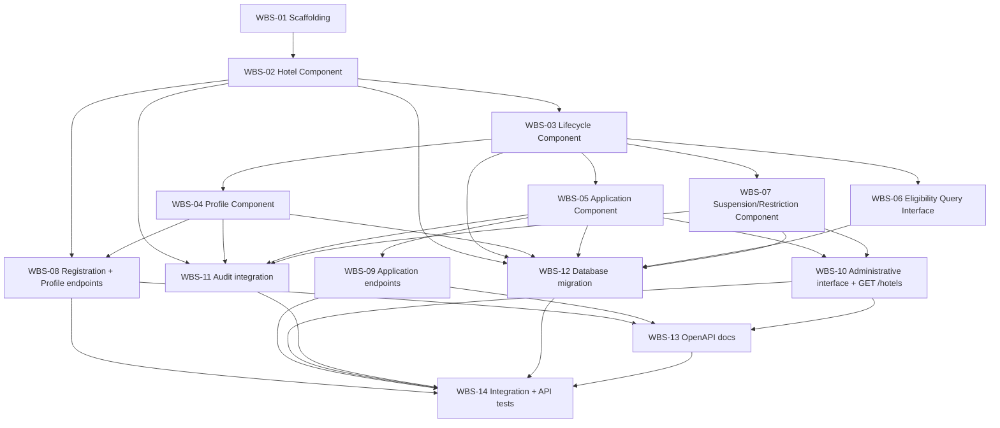

# Hotel Management — Implementation Plan
## Hotel Hall Booking Management System

> **Naming note:** the correct, approved filename for this document is
> `implementation-plan.md`, per `naming-conventions.md` §12 and `documentation-architecture.md`
> §2 — not `implementation-planning.md`, authored at the existing, already-scaffolded path.
>
> **Relationship to other documents:** this document answers *what gets built, in what
> order, and how it's verified* — never *what* the feature does
> (`business-specification.md`, `Approved` v1.1) or *how it's architected*
> (`technical-design.md`, `Approved` v1.3). Every task below implements a specific component,
> entity, or endpoint already defined in the Technical Design; none introduces new structure.
> Where this document and the Technical Design appear to disagree, the Technical Design
> governs and this document has a defect to correct.

---

## 1. Purpose

This Implementation Plan breaks the `Approved` Hotel Management Technical Design into a
sequenced, dependency-ordered set of development tasks, so that a developer assigned this
module by Round Robin (`Team-Management.md` §4) has a concrete roadmap from approved design
to working, tested software — without re-deriving business rules or re-designing the
architecture already settled in the Business Specification and Technical Design.

It defines **what** is built and **in what order**, and **how completion is verified**
(§8, §14). It contains no business requirements, no architectural decisions, and no source
code, Express controllers, Prisma schema, SQL, Flutter code, or React code — those belong to
Development (`Development-Lifecycle.md` Phase 8), once this document reaches `Approved`.

---

## 2. Implementation Strategy

- **Development approach** — one feature-based backend module,
  `backend/src/modules/hotels/` (`folder-structure.md` §4, `naming-conventions.md` §4), built
  incrementally component-by-component per the Technical Design's Module Architecture (§3
  there), the same pattern Module 1 already used successfully.
- **Build order** — the foundational entity and its state machine first (a Hotel cannot be
  meaningfully manipulated before its lifecycle rules exist), then the components that
  request transitions through it, then the API surface, then cross-cutting concerns (audit,
  persistence, tests, docs) — §4 defines this precisely as a dependency graph, not just prose.
- **Incremental implementation** — the Work Breakdown Structure (§3) is the actual increment
  list; each task is sized to be one focused Merge Request
  (`git-workflow-and-branching.md` §5, §14).
- **No component is blocked by an external dependency.** Hall Management (Module 4) and
  Administration & Platform Management (Module 13) are both `Not Started`, but this module is
  the **interface provider** in both relationships (Technical Design §2.3), not the consumer —
  neither absence blocks a single WBS task in §3. Three Pending Business Decisions (#4, #5,
  #7) block specific task *completion*, not task *start* — see §11.

---

## 3. Work Breakdown Structure (WBS)

Complexity is qualitative (Low / Medium / High), not a time estimate — scheduling is a
`Team-Management.md` §7 concern once this plan is `Approved`.

| ID | Task | Purpose | Description | Dependencies | Deliverable | Validation Approach | Complexity |
|---|---|---|---|---|---|---|---|
| WBS-01 | Module scaffolding | Establish the module's home | Create `backend/src/modules/hotels/`'s file shape per `folder-structure.md` §4 — structure only, no logic. | None (this plan `Approved`) | Module skeleton | Code review only (no logic to test) | Low |
| WBS-02 | Hotel Component | Represent the Hotel entity | Hotel creation/retrieval (Technical Design §3–§4) — the aggregate root every other component operates on. | WBS-01 | Hotel service + repository | Unit tests (`testing-standards.md` §5) | Medium |
| WBS-03 | Lifecycle (State) Component | Enforce valid Hotel state transitions | The single arbiter of every status transition in Technical Design §6 — no other component mutates status directly. | WBS-02 | State-transition service | Unit tests covering every transition row in Technical Design §6.2, including rejected invalid transitions | High (state-model correctness is the module's core guarantee) |
| WBS-04 | Profile Component | Profile completion + ordinary/critical change routing | `BR-HOTEL-02`, `BR-HOTEL-11`, `BR-HOTEL-12` (Technical Design §8) — the ordinary/critical classification mechanism is built as an injectable ruleset (Technical Design §8), not a hardcoded list. **Partially blocked** — see §11 (#5, #7). | WBS-03 | Profile service | Unit tests against the routing mechanism using a placeholder ruleset; full business-rule validation waits on Pending Decisions #5/#7 | Medium |
| WBS-05 | Application Component | Application lifecycle | Submission, edit-after-rejection, resubmission, withdrawal (`BR-HOTEL-03`, `BR-HOTEL-06`–`BR-HOTEL-08`, Technical Design §7) — each resubmission creates a new Hotel Application record (Technical Design §4). | WBS-03 | Application service | Unit tests for HM3, HM7–HM9 | Medium |
| WBS-06 | Eligibility Query Interface | Read-only interface for Module 1 and Module 4 | Narrow, read-only operational-eligibility query (Technical Design §3, §10) — the seam Module 1's Access Gate and Hall Management will consume. | WBS-03 | Query interface | Unit tests; contract stability is what WBS-11 (Module 1 TD correction) already depends on | Low |
| WBS-07 | Suspension / Restriction Component | Suspension, deactivation, restriction | `BR-HOTEL-09`, `BR-HOTEL-10` (Technical Design §9). Suspension/deactivation are **not blocked**. **Restriction's detection and resolution logic is blocked** — see §11 (#4). | WBS-03 | Suspension/Restriction service | Unit tests for suspension/deactivation (HM11) now; restriction tests deferred until #4 resolves | Medium |
| WBS-08 | Hotel registration + profile endpoints | Implement `HM1`, `HM2`, `HM12`, `HM13` | `POST /api/v1/hotels`, `GET /api/v1/hotels/:id`, `PATCH /api/v1/hotels/:id` (Technical Design §11) — includes the own-Hotel authorization check (`api-standards.md` §13, 404 not 403 cross-tenant). | WBS-02, WBS-04 | 3 endpoints, OpenAPI stubs | API tests against Technical Design §11's contract | Medium |
| WBS-09 | Application endpoints | Implement `HM3`, `HM7`–`HM9` | `POST /api/v1/hotels/:id/applications`, `POST /api/v1/hotels/:id/applications/:applicationId/withdrawal` (Technical Design §11) — same own-Hotel authorization pattern as WBS-08. | WBS-05 | 2 endpoints, OpenAPI stubs | API tests | Medium |
| WBS-10 | Administrative interface + query endpoint | Implement `BR-HOTEL-14`, HM5, HM6, HM11 | The in-process service interface Administration & Platform Management (Module 13) will call to record approve/reject/suspend/deactivate/critical-change decisions (Technical Design §7, §9), plus `GET /api/v1/hotels` (Technical Design §11) for Module 13's approval queue to discover pending work. No REST endpoint for the decision actions themselves — those belong to Module 13's own API surface (`BR-HOTEL-14`). | WBS-05, WBS-07 | Internal service interface + 1 endpoint | Unit tests against the interface; API test for `GET /hotels`; full end-to-end verification waits on Module 13 existing | Medium |
| WBS-11 | Audit integration | Record every action in Technical Design §13 | Audit Record emission (actor, action, timestamp) for all 15 auditable actions Technical Design §13 lists — Hotel registration through critical-change decisions. | WBS-02, WBS-04, WBS-05, WBS-07 | Audit hooks across all state-changing operations | Unit tests confirming an Audit Record is produced for each of the 15 actions | Medium |
| WBS-12 | Database migration | Persist the logical data design | A Prisma migration realizing Technical Design §4–§5's entities (Hotel, Hotel Application, Critical Information Change Request), per `database-standards.md` — schema itself written during Development, not here. **Hotel's final field list is blocked** — see §11 (#7); the entity's structural shape (status enum, audit columns, foreign key to Module 1's User Account) is not. | WBS-02–07 (entities identified) | One or more Prisma migrations | Migration review per `database-standards.md` §14 | Medium |
| WBS-13 | OpenAPI documentation | Satisfy `api-standards.md` §16 | Complete OpenAPI entries for every endpoint implemented (WBS-08–10). | WBS-08–10 | OpenAPI/Swagger definitions | Documentation completeness check (`api-standards.md` §20) | Low |
| WBS-14 | Integration + API test suite | Verify cross-layer and contract behavior | Integration tests against a real test database and the real Module 1 Access Gate (`testing-standards.md` §6 — authentication is never mocked); API tests against Technical Design §11's full contract. | WBS-08–13 | Integration + API test suite | `testing-standards.md` §6 | Medium |

Unit tests (`testing-standards.md` §5) are written alongside each component task (WBS-02–07,
WBS-10–11), per that standard's "test early" principle — not a separate trailing task.

**Coverage note, per this plan's required WBS scope:** Hotel domain/module foundation
(WBS-01–02), data/persistence layer (WBS-12), Hotel lifecycle (WBS-03), application workflow
(WBS-05, WBS-09), profile management (WBS-04, WBS-08), rejection/resubmission (WBS-05,
folded in — not a separate task, since it's the same Application Component per Technical
Design §7), withdrawal (WBS-05, WBS-09, same reasoning), approval/activation (WBS-10),
suspension/restriction (WBS-07), critical profile-change review (WBS-04, WBS-10), API layer
(WBS-08–10), authorization integration (folded into WBS-08–09 — own-Hotel scoping — and
WBS-10 — Module 13's own role check, not built here, per `BR-HOTEL-14`; this module consumes
Module 1's existing Access Gate rather than building new authorization, Technical Design
§12), audit integration (WBS-11), tests (WBS-14, plus unit tests alongside each component),
documentation (WBS-13). **Notification integration is not included** — Technical Design §10
confirms nothing approved requires it; inventing a task for it would be unnecessary work.

---

## 4. Development Sequence

No cycle exists. Every task's prerequisites are already available: Authentication & Account
Management (Module 1) is `Approved` and implemented; nothing in §3 waits on Hall Management
or Administration & Platform Management, since this module is the interface *provider* for
both (§2, Technical Design §2.3).

---

## 5. Database Implementation

Implementation tasks for Technical Design §4–§5's logical data model — no Prisma schema or
SQL written here (WBS-12 writes it, during Development).

- **Hotel entity** — UUID primary key (`database-standards.md` §4); a `status` enum with the
  nine values Technical Design §6.1 defines (`REGISTERED` through
  `RESTRICTED_UNDER_REVIEW`), never null; standard audit columns (`created_at`, `updated_at`,
  universal per `database-standards.md` §8); a foreign key relationship to one or more Hotel
  Manager User Accounts (Module 1, one-to-many per Technical Design §4.1) — this module never
  stores Module 1's identity/credential data, only the reference. Profile fields are
  **deliberately not finalized** pending §11 (#7).
- **Hotel Application entity** — UUID primary key; foreign key to Hotel; submission and
  decision timestamps; a decision field; a foreign key reference to the deciding Platform
  Administrator User Account (Module 1, referenced, never owned). Append-only per record —
  a resubmission creates a new row (Technical Design §4), never overwrites a decided one.
- **Critical Information Change Request entity** — UUID primary key; foreign key to Hotel;
  the proposed change; submission and decision timestamps; a decision field; independent of
  Hotel status throughout its own lifecycle (Technical Design §6, §15.3).
- **Constraints** (business-level, realized as physical constraints during Development) — at
  most one *open* Hotel Application per Hotel; at most one *open* Critical Information Change
  Request per Hotel (Technical Design §4.1, §5). The specific mechanism (partial unique
  index vs. application-level enforcement) is a Development-time decision within
  `database-standards.md` §13's constraint guidance, not fixed here.
- **Soft delete** — `deleted_at` is reserved for a genuinely disposable/erroneous Hotel
  record; Suspended, Deactivated, and every other lifecycle status are represented by
  `status`, never by `deleted_at` (`database-standards.md` §9, Technical Design §5 — the
  standard's own illustrative example is a Hotel).
- **Indexing** — `hotel_id` foreign keys on Hotel Application and Critical Information Change
  Request (`database-standards.md` §12); a `status` index on Hotel, since `GET /hotels`
  (WBS-10) filters by it.

---

## 6. API Implementation

Implementation tasks for Technical Design §11's contract — no controllers written here.

| Endpoint | WBS Task | Notes |
|---|---|---|
| `POST /api/v1/hotels` | WBS-08 | `201 Created`; own-account registration, no additional role check beyond authentication. |
| `GET /api/v1/hotels/:id` | WBS-08 | Own-Hotel or Platform Administrator; `404` cross-tenant, never `403` (`api-standards.md` §13). |
| `PATCH /api/v1/hotels/:id` | WBS-08 | Ordinary changes apply immediately; critical changes create a Critical Information Change Request (§8, Technical Design §8). |
| `POST /api/v1/hotels/:id/applications` | WBS-09 | Submission or resubmission, per `api-standards.md` §5's non-idempotent sub-resource pattern. |
| `POST /api/v1/hotels/:id/applications/:applicationId/withdrawal` | WBS-09 | `409` if the Application is no longer open. |
| `GET /api/v1/hotels` | WBS-10 | Platform-Administrator-only; paginated (`api-standards.md` §10); filterable by `status`. |

Every implementation task follows `api-standards.md` in full: `/api/v1/` versioning (§3), the
success/error envelopes (§7–§8), the status codes in §9, and `naming-conventions.md` §9 field
casing. No endpoint beyond these six is implemented — in particular, no
approve/reject/suspend/deactivate REST endpoint is built under this module, since that
action belongs to Administration & Platform Management's own future API surface
(`BR-HOTEL-14`, Technical Design §11).

---

## 7. Security Implementation

- **Authentication** — this module builds no new authentication logic. Every endpoint
  (WBS-08–10) sits behind Module 1's existing, already-implemented Access Gate
  (`architecture-principles.md` §7) — consumed, not duplicated.
- **Authorization** — two implementation tasks, both already folded into §3's WBS rather than
  listed separately, to avoid inventing work: (1) own-Hotel resource scoping (WBS-08–09),
  returning `404` rather than `403` for cross-tenant attempts (`api-standards.md` §13); (2)
  Platform-Administrator-only actions (WBS-10) are authorized by Module 13's own layer before
  it calls into this module's interface — this module does not re-implement that role check
  (`BR-HOTEL-14`, Technical Design §12).
- **State-transition protection** — only the Lifecycle Component (WBS-03) may mutate Hotel
  status; enforced structurally, not by convention (Technical Design §6, §12).
- **Data classification** — Hotel profile data is provisionally Public–Internal
  (`data-architecture.md` §13); no Restricted-classification data is handled by this module
  (Technical Design §12).
- **`security-architecture.md` and `security-coding-standards.md` are both still `Not
  Started`** (Technical Design §18 Item 2, inherited from Module 1's own Technical Design
  §17 Item 1) — implementation follows `architecture-principles.md` §6–§7 and
  `api-standards.md` §12–§13/§19 in their absence, the same baseline Module 1 already
  implemented against successfully.

---

## 8. Testing Strategy

Per `testing-standards.md`, applied to this module specifically, mapped to the approved
business rules and Technical Design.

- **Unit tests** (§5) — each component (WBS-02–07, WBS-10–11) tested in isolation. WBS-03
  (Lifecycle Component) receives particular attention: every transition row in Technical
  Design §6.2 must have both a positive test (valid transition succeeds) and a negative test
  (invalid transition is rejected with `409`, per Technical Design §16).
- **Integration tests** (§6) — real Prisma queries against a test database (WBS-12's schema);
  every endpoint tested behind the real Module 1 Access Gate, never a mocked auth layer, the
  same standard Module 1's own module already meets.
- **API tests** — every endpoint in §6 verified against Technical Design §11's documented
  contract: request shape, response envelope, and every status code Technical Design §16
  assigns it.
- **State-transition tests** — a dedicated test class covering the full Hotel lifecycle
  (Technical Design §6.1) and the Hotel Application / Critical Information Change Request
  sub-lifecycles (§15.2, §15.3) — every `stateDiagram-v2` edge exercised at least once.
- **Authorization tests** — own-Hotel scoping (cross-tenant returns `404`, not `403`);
  confirmation that no endpoint in this module accepts a Platform-Administrator-only action
  without that role (exercised via the interface WBS-10 exposes, since the actual role check
  is Module 13's, not directly testable here until Module 13 exists — covered by a stub
  caller in the interim).
- **Security tests** — baseline `coding-standards.md` §12/§16 checklist applied during code
  review of every Merge Request in this plan, particularly WBS-03 (state-transition
  integrity) and WBS-10 (the administrative interface boundary).
- **Regression tests** — every Merge Request in this plan runs the full existing Module 1
  test suite (51 tests) in CI, confirming no cross-module regression, given this module reads
  Module 1's Access Gate output.
- **Business Rule Validation** (`testing-standards.md` §8) — every `BR-HOTEL-01`–`14` traced
  to a test result, per Technical Design §19's Traceability Matrix — a rule with no
  corresponding test result is not considered verified.

**Handoff to Validation** — results feed
`docs/07-validation-and-qa/modules/03-hotel-management/validation-report.md`, currently
`Not Started`. As with Module 1's plan, `test-strategy.md` and `review-checklists.md` (both
`Not Started`) would normally govern this handoff's specifics; in their absence, this plan
treats `testing-standards.md` §13 as the operative content requirement.

---

## 9. Documentation Tasks

- **`validation-report.md`** (currently `Not Started`) — authored by the assigned
  implementation reviewer once all WBS tasks complete, per `testing-standards.md` §13.
- **API documentation** — maintained continuously as each endpoint is implemented (WBS-13),
  not written retroactively.
- **`business-specification.md` / `technical-design.md` version history** — updated if
  implementation reveals a gap either document didn't anticipate, per the same discipline
  Module 1's implementation already demonstrated (its `PATCH /password-resets/:id` defect,
  corrected transparently rather than silently worked around).
- **This document's own Version History** — updated if the WBS or sequence changes materially
  during development.
- **`Team-Management.md` §7 (Feature Assignment Register)** — updated as the module moves
  through `Ready for Development` → `Implementation` → `Implementation Review` →
  `Validation & QA` → `Feature Accepted`.
- **`business-decision-register.md`** — updated if any of the seven Pending Business
  Decisions (§11) is formally proposed and resolved during this work.
- **`data-architecture.md` / Module 1 Technical Design** — both already corrected 2026-08-10
  (Hotel approval status ownership reconciliation) ahead of this plan; no further update
  anticipated from this module's own implementation unless a new gap surfaces.

---

## 10. Dependencies

**Internal**

- **Authentication & Account Management (Module 1)** — `Approved`, implemented. This
  module's Access Gate and identity/role claim are consumed directly (§7); no blocking
  dependency remains.
- **Hall Management (Module 4)** — `Not Started`. Not a blocking dependency for this plan:
  Hall Management is the *consumer* of this module's Eligibility Query Interface (WBS-06),
  not the reverse. Cross-module integration testing of the full HM4/HM5-triggered
  hall-visibility flow waits until Hall Management exists, but that is a Hall Management
  concern, not a blocker here.
- **Administration & Platform Management (Module 13)** — `Not Started`. Same relationship as
  above: this module is the interface *provider* (WBS-10) Module 13 will consume. Full
  end-to-end verification of the approve/reject/suspend/deactivate flow waits until Module
  13 exists; WBS-10 itself can be built and unit-tested against a stub caller in the
  meantime.

**External** — none required by this module's approved scope (Technical Design §17). No
storage, SMS, or payment-provider dependency exists for Hotel Management's current scope.

**Infrastructure** — PostgreSQL + Prisma, already bootstrapped at the workspace level; Express
backend already running (Module 1). No new infrastructure decision required.

**Audit** — cross-cutting, same ownership gap Module 1's Technical Design already flags (its
own §17 Item 4, inherited into this module's Technical Design §18 Item 4): no approved module
owns the Audit Record entity. WBS-11 produces Audit Records without claiming ownership,
consistent with Module 1's own implementation.

**Notification** — not a dependency. Technical Design §10 confirms nothing approved requires
notifying a Hotel Manager of a decision or state change.

---

## 11. Pending Business Decisions

Per the Technical Design's own §18 classification, re-framed here against **implementation**
impact specifically. None are answered here — every row states only whether implementation
can proceed without the answer, consistent with `business-specification.md` §11 and
`Project-Constitution.md` §4.

| # | Pending Decision | Does implementation depend on it? | Blocks a specific task? | Can implementation proceed safely without it? |
|---|---|---|---|---|
| 1 | Rejection/Resubmission Cycle Limit | No | No | Yes — WBS-05 supports unlimited cycles by default; a cap is an additive validation rule later. |
| 2 | Post-Withdrawal Reapplication | No | No | Yes — WBS-05/WBS-03 leave `WITHDRAWN` without an outgoing transition; adding one later is additive. |
| 3 | Suspension vs. Deactivation Distinction | No | No | Yes — WBS-07 implements both as status values with identical current effect. |
| 4 | Restriction Scope & Applicable Business Process | **Yes, partially** | **Yes — WBS-07's restriction detection/resolution sub-scope** | Partially — suspension/deactivation (the rest of WBS-07) can proceed and be fully tested now; restriction's detection mechanism and resolution path cannot be completed until this resolves. **Do not schedule WBS-07's restriction sub-scope for completion before this decision lands.** |
| 5 | Ordinary vs. Critical Field Classification | **Yes, partially** | **Yes — WBS-04's field-classification content** | Partially — the routing *mechanism* (WBS-04) can be built and tested against a placeholder ruleset now; the real field list cannot be supplied, and WBS-04 cannot be considered *complete*, until this resolves. |
| 6 | Hotel Operational Status During Critical-Change Review | No | No | Yes — WBS-04's Critical Information Change Request is independent of Hotel status by design (Technical Design §6, §15.3). |
| 7 | Required Business-Profile Content | **Yes** | **Yes — WBS-12's Hotel schema/migration, and WBS-02's field-level implementation** | Partially — WBS-02's structural shape (status, audit columns, identity reference) can be built now; WBS-12's migration cannot be finalized, and WBS-02 cannot be considered *complete*, until this resolves. |

**Summary:** four of seven Pending Business Decisions (#1, #2, #3, #6) do not block any task.
Three (#4, #5, #7) each block the *completion* of a specific, already-identified task
sub-scope — never the *start* of this plan's work, and never silently resolved by proceeding
around them (§3's per-task notes make each blocked sub-scope explicit).

---

## 12. Risks & Mitigation

| Risk | Impact | Likelihood | Mitigation |
|---|---|---|---|
| Lifecycle Component (WBS-03) defect | High — every other component depends on correct state-transition enforcement; a defect here has module-wide blast radius | Low, if tested per plan | Exhaustive positive/negative transition testing (§8) against Technical Design §6.2's full transition table before any dependent task (WBS-04–10) is considered safe to build against. |
| Pending Business Decisions #4, #5, #7 remain unresolved once their dependent tasks are scheduled | Medium — WBS-04, WBS-07, WBS-12 may need rework if implemented against an assumed value | Medium | Components are deliberately parameterized (Technical Design §8, §9) specifically to reduce rework cost; resolve pending decisions through the Business Specification's own governance path before the blocked sub-scope's Merge Request, not after. |
| The `data-architecture.md` / Module 1 Technical Design ownership correction (2026-08-10) is not yet reflected in a formal Mohamed/Abukar review round | Low–Medium — a future architecture review could re-open the question | Low | The correction is recorded with full rationale and version history in both documents (Technical Design §18 Item 1); flag for inclusion in the next scheduled architecture review rather than treated as silently settled. |
| Administration & Platform Management (Module 13) does not yet exist | Low for this plan (WBS-10 is independently testable via a stub caller) — Medium for true end-to-end Hotel-approval-queue verification | Certain (already true today) | WBS-10's interface is built and unit-tested now; full integration testing of the real approve/reject/suspend flow is explicitly deferred to when Module 13's own Implementation Plan exists, not blocked on it. |
| `docs/07-validation-and-qa/test-strategy.md`, `review-checklists.md`, and `definition-of-ready-and-done.md` are all `Not Started` | Medium — this module would reach implementation completion with no formally approved Validation process document to close against | Certain (already true today, same gap Module 1's plan carries) | Use `testing-standards.md` §13–§14 as the interim, already-`Approved` standard for what a Validation Report must contain. |

---

## 13. Implementation Milestones

| Milestone | Goal | Tasks | Dependencies | Expected Result | Validation Required |
|---|---|---|---|---|---|
| **M1 — Hotel & Lifecycle Foundation** | A Hotel entity exists with a fully enforced, tested state machine — the guarantee every later milestone builds on. | WBS-01, WBS-02, WBS-03 | None | Hotel Component and Lifecycle Component complete; nothing yet reachable via API. | Every Technical Design §6.2 transition row has a passing positive and negative unit test. |
| **M2 — Business Logic Components** | All non-API business logic complete: profile handling, application workflow, eligibility queries, suspension/restriction. | WBS-04, WBS-05, WBS-06, WBS-07 | M1 | Four components complete (two, WBS-04/WBS-07, partially blocked per §11 on Pending Decisions #4/#5). | Unit tests passing for every unblocked behavior; blocked sub-scopes explicitly marked incomplete, not silently passed. |
| **M3 — API Surface & Module 13 Interface** | The full REST contract is live; the interface Module 13 will eventually consume is ready. | WBS-08, WBS-09, WBS-10 | M2 | 6 endpoints implemented per Technical Design §11. | API tests passing against the full contract; own-Hotel authorization verified (404 cross-tenant). |
| **M4 — Audit, Persistence & Contract Completion** | Fully audited, persisted, documented, and tested — ready to hand off to Validation. | WBS-11, WBS-12, WBS-13, WBS-14 | M3 | Database migration applied; all 15 audited actions (Technical Design §13) verified; OpenAPI complete; full integration/API suite passing. | `testing-standards.md` §14 Feature Acceptance Criteria met, except the three items §11 keeps open pending Business Decisions #4/#5/#7. |

---

## 14. Definition of Implementation Complete

Per `testing-standards.md` §14 (Feature Acceptance Criteria), applied to this module, the
same standard Module 1's Implementation Plan used:

- [ ] Business Specification requirements implemented — every `BR-HOTEL-01`–`14` and `HM1`–
      `HM15` behaviorally implemented, **except** the sub-scopes explicitly blocked by
      Pending Business Decisions #4, #5, #7 (§11), which remain incomplete by design until
      those decisions resolve.
- [ ] Technical Design implemented — all 14 WBS tasks complete (WBS-01–14).
- [ ] Coding standards followed (`coding-standards.md`) — lint clean throughout.
- [ ] Security standards followed — per §7's baseline, in the continued absence of
      `security-architecture.md`/`security-coding-standards.md`.
- [ ] API standards followed (`api-standards.md`) — envelopes, status codes, versioning; full
      OpenAPI documentation at `/docs`.
- [ ] Database standards followed (`database-standards.md`).
- [ ] Unit tests passing — every component (WBS-02–07, WBS-10–11).
- [ ] Integration tests passing — real Postgres, real Module 1 Access Gate (§8).
- [ ] API tests passing — every endpoint's contract exercised (§8).
- [ ] Documentation updated (§9).
- [ ] Ready for Validation — contingent on `validation-report.md`, `test-strategy.md`,
      `review-checklists.md`, and `definition-of-ready-and-done.md`, all currently
      `Not Started` — the same process-documentation gap Module 1's plan carries forward,
      not specific to this module.

**This module cannot reach full "Implementation Complete" while Pending Business Decisions
#4, #5, and #7 remain unresolved** — their blocked sub-scopes (§3, §11) are a deliberate,
partial completion state, not an oversight. Every other task and milestone can complete
independently of them.

---

## Version History

| Version | Date | Author | Change |
|---|---|---|---|
| 1.2 | 2026-09-10 | Ahmed | **Post-completion amendment, `BDR-020`.** `GET /api/v1/hotels/public` gains a `search` query parameter (Technical Design v2.1) — matched server-side, case-insensitively, by partial substring, against Hotel Name and address, reusing the endpoint's existing cursor pagination and `APPROVED_ACTIVE`-only eligibility filter. Fixes a real reported gap: a Hotel beyond the endpoint's first page was unreachable by Customer search though correctly visible under Near You. No WBS task reopened — additive behavior on an already-`Done` endpoint. Customer Mobile's Discover screen search bar updated to call it instead of filtering a locally-loaded page. |
| 1.1 | 2026-08-10 | Ahmed | Status changed `Draft` → `Approved`. All three governing documents for Hotel Management (Business Specification v1.1, Technical Design v1.3, this Implementation Plan) are now `Approved` — the feature moves to `Ready for Development` (`Team-Management.md` §7) and Round Robin assignment applies. Pending Business Decisions #4, #5, and #7 (§11) remain open task-level blockers for their specific sub-scopes — approval of this plan does not resolve them. |
| 1.0 | 2026-08-10 | Ahmed | Initial draft Implementation Plan for Hotel Management, authored against the `Approved` Business Specification (v1.1) and Technical Design (v1.3). 14 WBS tasks across 4 milestones; three Pending Business Decisions (#4, #5, #7) identified as partial blockers on specific task sub-scopes, none blocking plan start. Not yet reviewed — see status. |
