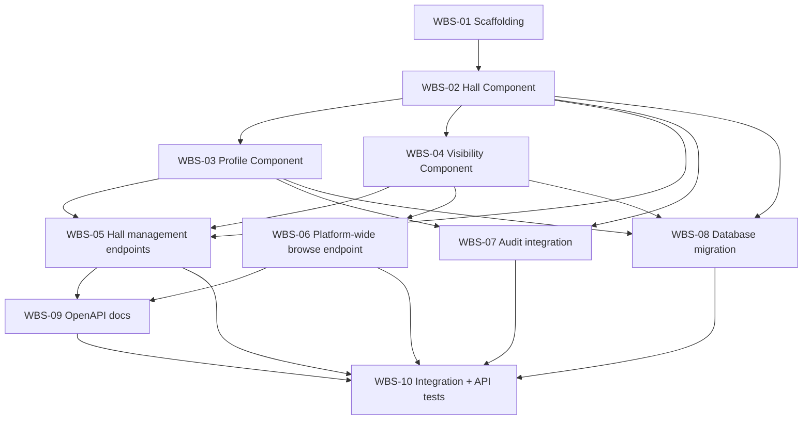

# Hall Management — Implementation Plan
## Hotel Hall Booking Management System

> **Relationship to other documents:** this document answers *what gets built, in what
> order, and how it's verified* — never *what* the feature does
> (`business-specification.md`, `Approved` v1.1) or *how it's architected*
> (`technical-design.md`, `Approved` v1.2). Every task below implements a specific component,
> entity, or endpoint already defined in the Technical Design; none introduces new structure.
> Where this document and the Technical Design appear to disagree, the Technical Design
> governs and this document has a defect to correct.

---

## 1. Purpose

This Implementation Plan breaks the `Approved` Hall Management Technical Design into a
sequenced, dependency-ordered set of development tasks, so that a developer assigned this
module by Round Robin (`Team-Management.md` §4) has a concrete roadmap from approved design
to working, tested software — without re-deriving business rules or re-designing the
architecture already settled in the Business Specification and Technical Design.

It defines **what** is built and **in what order**, and **how completion is verified**
(§8, §14). It contains no business requirements, no architectural decisions, and no source
code, Express controllers, Prisma schema, SQL, Flutter code, or React code — those belong to
Development (`Development-Lifecycle.md` Phase 8), once this document reaches `Approved`.

---

## 2. Implementation Strategy

- **Development approach** — one feature-based backend module,
  `backend/src/modules/halls/` (`folder-structure.md` §4, `naming-conventions.md` §4), built
  incrementally component-by-component per the Technical Design's Module Architecture (§3
  there) — the same pattern Module 1 and Hotel Management already used successfully.
- **Build order** — the foundational Hall entity first, then the Profile Component that
  operates on it, then the Visibility Component (the module's one real cross-module
  dependency, on Hotel Management's existing Eligibility Query Interface), then the API
  surface, then cross-cutting concerns (audit, persistence, tests, docs) — §4 defines this
  precisely as a dependency graph, not just prose.
- **No Lifecycle (State) Component task exists** — unlike Hotel Management's WBS-03, this
  module has no persisted state machine to build (Technical Design §6): visibility is
  computed, not transitioned. This is a smaller WBS than Hotel Management's own (10 tasks,
  not 14), reflecting that architectural simplification directly, not incomplete planning.
- **Incremental implementation** — the Work Breakdown Structure (§3) is the actual increment
  list; each task is sized to be one focused Merge Request
  (`git-workflow-and-branching.md` §5, §14).
- **No component is blocked by an external dependency.** Booking Management (Module 5) and
  Calendar & Scheduling Management (Module 6) are both `Not Started`, but neither is a
  dependency of this module (Technical Design §2.3, §17) — this module is upstream of both.
  Hotel Management (Module 3), this module's one real dependency, is `Approved` and
  implemented, with the exact interface this module needs (`eligibility.service.js`) already
  built and already designed for this consumer. One Pending Business Decision (#2) blocks
  specific task *completion*, not task *start* — see §11.

---

## 3. Work Breakdown Structure (WBS)

Complexity is qualitative (Low / Medium / High), not a time estimate — scheduling is a
`Team-Management.md` §7 concern once this plan is `Approved`.

| ID | Task | Purpose | Description | Dependencies | Deliverable | Validation Approach | Complexity |
|---|---|---|---|---|---|---|---|
| WBS-01 | Module scaffolding | Establish the module's home | Create `backend/src/modules/halls/`'s file shape per `folder-structure.md` §4 — structure only, no logic. | None (this plan `Approved`) | Module skeleton | Code review only (no logic to test) | Low |
| WBS-02 | Hall Component | Represent the Hall entity | Hall creation/retrieval (Technical Design §3–§4) — the aggregate root every other component operates on; `hotelId` ownership check baked in from the start (`BR-HALL-01`, `BR-HALL-10`). | WBS-01 | Hall service + repository | Unit tests (`testing-standards.md` §5) | Medium |
| WBS-03 | Profile Component | Hall information updates | `BR-HALL-02`, `BR-HALL-07` (Technical Design §7–§8) — updates apply directly; no classification/review routing exists, unlike Hotel Management's Profile Component, because no approved decision establishes one for Halls. **Partially blocked** — see §11 (#2). | WBS-02 | Profile service | Unit tests against update behavior; full field-level validation waits on Pending Decision #2 | Low |
| WBS-04 | Visibility Component | Compute Hall visibility | Read-only computation of Hidden/Visible (`BR-HALL-03`–`BR-HALL-05`, Technical Design §6) by calling Hotel Management's existing, already-implemented Eligibility Query Interface (`eligibility.service.js`) as an in-process call — never a second HTTP round-trip, never a re-derived or cached copy of Hotel eligibility. | WBS-02 | Visibility service | Unit tests against every caller/eligibility combination (§8); no state-transition tests needed, since there is no state machine (Technical Design §6) | Medium (the module's one genuine cross-module integration point) |
| WBS-05 | Hall management endpoints | Implement `HL1`–`HL3`, `HL5`, `HL6` (per-Hotel scope) | `POST /api/v1/hotels/:hotelId/halls`, `GET /api/v1/hotels/:hotelId/halls/:id`, `PATCH /api/v1/hotels/:hotelId/halls/:id`, `GET /api/v1/hotels/:hotelId/halls` (Technical Design §11) — the two `GET` endpoints are public with conditional behavior (owning Hotel Manager sees all; anyone else sees only Visible), per `BDR-009`; the `POST`/`PATCH` endpoints require own-Hotel authorization (`api-standards.md` §13, `404` not `403` cross-tenant). **Done 2026-08-25** — authorized via Hotel Management's Hotel Ownership Query Interface (Technical Design v1.5), which unblocked this task; 19 new integration tests, `backend/src/modules/halls/hall.controller.js`/`hall.routes.js`/`hall.service.js`. | WBS-02, WBS-03, WBS-04 | 4 endpoints, OpenAPI stubs | API tests against Technical Design §11's contract | Medium |
| WBS-06 | Platform-wide browse endpoint | Implement `HL6` (platform-wide) | `GET /api/v1/halls` (Technical Design §11, §18 Item 5/7) — public, unconditionally; **cursor pagination** (`coding-standards.md` §6), corrected in Technical Design v1.2 from an initially-unspecified mode. Known N+1 characteristic against the Visibility Component (Technical Design §18 Item 5) — accepted, not solved, per `architecture-principles.md` §12. | WBS-04 | 1 endpoint, OpenAPI stub | API tests against Technical Design §11's contract | Medium |
| WBS-07 | Audit integration | Record every action in Technical Design §13 | Audit Record emission (actor, action, timestamp) for both auditable actions Technical Design §13 lists — Hall created, Hall information updated — using the same structured-log mechanism Hotel Management already implements (`backend/src/modules/hotels/audit.js`), not a new persisted table. | WBS-02, WBS-03 | Audit hooks on Hall creation and update | Unit tests confirming an Audit Record is produced for both actions | Low |
| WBS-08 | Database migration | Persist the logical data design | A Prisma migration realizing Technical Design §4–§5's Hall entity — `id` (UUID), `hotelId` (FK to `hotels`, not null, `BR-HALL-01`), `profileData` (nullable JSON, mirroring the Hotel entity's own unspecified-content pattern), standard audit columns, `deletedAt` (soft delete). **No `status` column** — Hall visibility is computed, never persisted (Technical Design §6); this is a deliberate absence, not an oversight. `idx_halls_hotel_id` index, per `naming-conventions.md` §8's own worked example for this exact table. **Hall's final field list is blocked** — see §11 (#2); the entity's structural shape is not. | WBS-02, WBS-03, WBS-04 (entities identified) | One or more Prisma migrations | Migration review per `database-standards.md` §14 | Medium |
| WBS-09 | OpenAPI documentation | Satisfy `api-standards.md` §16 | Complete OpenAPI entries for every endpoint implemented (WBS-05, WBS-06) — including each endpoint's public-vs-conditional authentication behavior, explicitly documented per `api-standards.md` §16's security-requirements field. **Done 2026-08-25** — all 5 endpoints documented in `backend/src/openapi/openapi.json`; conditional-public `GET` endpoints use the `security: [{bearerAuth: []}, {}]` pattern (optional auth); verified served correctly via `/openapi.json` and `/docs`. | WBS-05, WBS-06 | OpenAPI/Swagger definitions | Documentation completeness check (`api-standards.md` §20) | Low |
| WBS-10 | Integration + API test suite | Verify cross-layer and contract behavior | Integration tests against a real test database, the real Module 1 Access Gate, **and the real Hotel Management Eligibility Query Interface** (`testing-standards.md` §6 — cross-module interaction is never mocked, the identical standard applied to Module 1's own Access Gate); API tests against Technical Design §11's full contract, including both pagination modes (offset for WBS-05's per-Hotel list, cursor for WBS-06). **Done 2026-08-25** — also exercises the real Hotel Ownership Query Interface (never mocked), both pagination modes, and own-Hotel/visibility-based 404 behavior. Full Hall Management suite: 29 tests (`halls.integration.test.js` 27 + `visibility.service.test.js` 2) plus 4 in Hotel Management's own suite for the Hotel Ownership Query Interface this module consumes; full backend suite 172/172 passing. | WBS-05–09 | Integration + API test suite | `testing-standards.md` §6 | Medium |

Unit tests (`testing-standards.md` §5) are written alongside each component task
(WBS-02–04, WBS-07), per that standard's "test early" principle — not a separate trailing
task.

**Coverage note, per this plan's required WBS scope:** Hall domain/module foundation
(WBS-01–02), data/persistence layer (WBS-08), profile management (WBS-03, WBS-05), visibility
computation (WBS-04), the platform-wide browse capability realizing `BR-HALL-08`
(WBS-06), API layer (WBS-05–06), authorization integration (folded into WBS-05 — own-Hotel
scoping and the public/conditional `GET` behavior — rather than listed separately, to avoid
inventing work), audit integration (WBS-07), tests (WBS-10, plus unit tests alongside each
component), documentation (WBS-09). **No task exists for Amenity master data**, Hall
deletion, retirement, or availability scheduling — Technical Design §9 and §18 explain why
each is deliberately deferred rather than a planning oversight. **Notification integration
is not included** — Technical Design §10 confirms nothing approved requires it.

---

## 4. Development Sequence

No cycle exists. Every task's prerequisites are already available: Authentication & Account
Management (Module 1) and Hotel Management (Module 3) are both `Approved` and implemented;
nothing in §3 waits on Booking Management or Calendar & Scheduling Management, since this
module is upstream of both (§2, Technical Design §2.3).

---

## 5. Database Implementation

Implementation tasks for Technical Design §4–§5's logical data model — no Prisma schema or
SQL written here (WBS-08 writes it, during Development).

- **Hall entity** — UUID primary key (`database-standards.md` §4); `hotelId` foreign key to
  `hotels`, never null (`BR-HALL-01`); standard audit columns (`created_at`, `updated_at`,
  universal per `database-standards.md` §8). Profile fields are **deliberately not
  finalized** pending §11 (#2), held as a flexible `profileData` field mirroring the Hotel
  entity's identical, already-implemented pattern.
- **No `status` field.** Unlike Hotel, Hall Application, or Critical Information Change
  Request, the Hall entity carries no persisted lifecycle/visibility column at all — Technical
  Design §6 computes visibility live from Hotel Management's own status, specifically to
  avoid an unapproved synchronization mechanism. A migration reviewer should expect this
  absence, not flag it as missing.
- **Constraints** (business-level, realized as physical constraints during Development) —
  `hotelId` is `NOT NULL` and foreign-key-constrained to `hotels` (`database-standards.md`
  §5, `RESTRICT` — the platform-wide default — preventing a Hotel from being deleted out from
  under Halls that still reference it, consistent with how `database-standards.md` §5 already
  uses "a Hotel with existing Halls cannot be deleted outright" as its own worked example).
  No other structural constraint is defined, since required-field completeness is undecided
  (§11).
- **Soft delete** — `deleted_at` reserved for a genuinely disposable/erroneous Hall record;
  since Hall has no status field to conflate it with (unlike Hotel, `database-standards.md`
  §9's own illustrative example), there is no risk of the confusion that rule warns against.
  *Who* may trigger a soft delete is Pending Decision #6 — the mechanism is built; no
  `DELETE` endpoint is (Technical Design §11, §18).
- **Indexing** — `idx_halls_hotel_id` on the `hotelId` foreign key (`database-standards.md`
  §12) — this exact index name and column is `naming-conventions.md` §8's own worked example
  for a foreign-key index, given for this exact table.

---

## 6. API Implementation

Implementation tasks for Technical Design §11's contract — no controllers written here.

| Endpoint | WBS Task | Notes |
|---|---|---|
| `POST /api/v1/hotels/:hotelId/halls` | WBS-05 | `201 Created`; own-Hotel authorization required; no precondition on the owning Hotel's own status (`BR-HALL-02`). |
| `GET /api/v1/hotels/:hotelId/halls/:id` | WBS-05 | Public with conditional behavior — owning Hotel Manager sees regardless of visibility; anyone else only if Visible; `404` otherwise (never `403`, never leaks existence). |
| `PATCH /api/v1/hotels/:hotelId/halls/:id` | WBS-05 | Own-Hotel authorization required; every well-formed change applies immediately — no review step exists. |
| `GET /api/v1/hotels/:hotelId/halls` | WBS-05 | Same conditional public behavior as the single-Hall `GET`; offset pagination (bounded, per-Hotel list, `api-standards.md` §10). |
| `GET /api/v1/halls` | WBS-06 | Public, unconditionally; **cursor pagination** (`coding-standards.md` §6, Technical Design v1.2 correction); optional `?hotelId=` filter. |

Every implementation task follows `api-standards.md` in full: `/api/v1/` versioning (§3), the
success/error envelopes (§7–§8), the status codes in §9, and `naming-conventions.md` §9 field
casing. No endpoint beyond these five is implemented — in particular, no `DELETE` endpoint is
built under this module yet, since no approved decision grants the permission it would
enforce (`BR-HALL-07`, Pending Decision #6, Technical Design §11).

---

## 7. Security Implementation

- **Authentication** — this module builds no new authentication logic. Every endpoint that
  requires it (`POST`, `PATCH`, WBS-05) sits behind Module 1's existing, already-implemented
  Access Gate (`architecture-principles.md` §7) — consumed, not duplicated. Two `GET`
  endpoints (WBS-05, WBS-06) are implemented to accept an absent token, per `BDR-009` and
  Technical Design §12 — an explicit design decision, not an oversight in applying the
  secure-by-default rule.
- **Authorization** — two implementation tasks, both folded into §3's WBS rather than listed
  separately: (1) own-Hotel resource scoping (WBS-05), returning `404` rather than `403` for
  cross-tenant attempts (`api-standards.md` §13); (2) visibility-based access on the two
  public `GET` endpoints (WBS-05, WBS-06) — a Hidden Hall returns `404` to anyone but its
  owning Hotel Manager, the same "never leak existence" reasoning applied to visibility
  instead of tenancy (Technical Design §6, §12).
- **No Platform-Administrator-only action is implemented** — unlike Hotel Management's
  WBS-10, this module has no task analogous to it, because no approved rule grants Module 13
  any role in individual Hall management (Business Specification §4).
- **Data classification** — Hall profile data is Public once Visible (`data-architecture.md`
  §13); not exposed at all while Hidden — enforced by WBS-04's visibility check, never by
  classification alone (Technical Design §12).
- **`security-architecture.md` and `security-coding-standards.md` are both still `Not
  Started`** (Technical Design §18 Item 1, inherited from Hotel Management's and Module 1's
  own Technical Designs) — implementation follows `architecture-principles.md` §6–§7 and
  `api-standards.md` §12–§13/§19 in their absence, the same baseline Hotel Management already
  implemented against successfully.

---

## 8. Testing Strategy

Per `testing-standards.md`, applied to this module specifically, mapped to the approved
business rules and Technical Design.

- **Unit tests** (§5) — each component (WBS-02–04, WBS-07) tested in isolation. WBS-04
  (Visibility Component) receives particular attention: every combination of caller type
  (owning Hotel Manager / non-owning Hotel Manager / unauthenticated) and Hotel eligibility
  (eligible / not eligible) must have a passing test — six combinations, all from Technical
  Design §6's flowchart, none of which involve a state transition since none exists.
- **Integration tests** (§6) — real Prisma queries against a test database (WBS-08's
  schema); every endpoint tested behind the real Module 1 Access Gate; **WBS-04's call into
  Hotel Management's Eligibility Query Interface is exercised against a real Hotel record
  moved through real status transitions in the test database (e.g. actually reaching
  `APPROVED_ACTIVE`), never a mocked or stubbed response** — the same standard
  `testing-standards.md` §6 already requires for any cross-module interface, and the same
  discipline Hotel Management's own plan established for the interfaces it exposes.
- **API tests** — every endpoint in §6 verified against Technical Design §11's documented
  contract: request shape, response envelope, every status code Technical Design §16
  assigns it, and **both** pagination modes exercised (offset for the per-Hotel list, cursor
  for the platform-wide browse).
- **Visibility computation tests** — a dedicated test class covering Technical Design §6's
  full decision flowchart, functionally replacing the state-transition test suite Hotel
  Management's plan requires for its own Lifecycle Component — there being no transitions
  here to test, only a pure function's outcomes.
- **Authorization tests** — own-Hotel scoping (cross-tenant returns `404`, not `403`);
  visibility scoping (a Hidden Hall returns `404` to every caller except its owning Hotel
  Manager).
- **Security tests** — baseline `coding-standards.md` §12/§16 checklist applied during code
  review of every Merge Request in this plan, particularly WBS-04 (the visibility boundary)
  and WBS-05/WBS-06 (the public-endpoint authorization logic).
- **Regression tests** — every Merge Request in this plan runs the full existing Module 1 and
  Hotel Management test suites in CI, confirming no cross-module regression, given this
  module reads both modules' outputs (identity/role claim, and Hotel eligibility).
- **Business Rule Validation** (`testing-standards.md` §8) — every `BR-HALL-01`–`10` traced
  to a test result, per Technical Design §19's Traceability Matrix — a rule with no
  corresponding test result is not considered verified.

**Handoff to Validation** — results feed
`docs/07-validation-and-qa/modules/04-hall-management/validation-report.md`, currently
`Not Started`. As with Hotel Management's plan, `test-strategy.md` and `review-checklists.md`
(both `Not Started`) would normally govern this handoff's specifics; in their absence, this
plan treats `testing-standards.md` §13 as the operative content requirement.

---

## 9. Documentation Tasks

- **`validation-report.md`** (currently `Not Started`) — authored by the assigned
  implementation reviewer once all WBS tasks complete, per `testing-standards.md` §13.
- **API documentation** — maintained continuously as each endpoint is implemented (WBS-09),
  not written retroactively.
- **`business-specification.md` / `technical-design.md` version history** — updated if
  implementation reveals a gap either document didn't anticipate, per the same discipline
  already demonstrated twice on this module: Technical Design v1.2's own self-found
  pagination-mode correction, and Module 1's `PATCH /password-resets/:id` defect before it.
- **This document's own Version History** — updated if the WBS or sequence changes materially
  during development.
- **`Team-Management.md` §7 (Feature Assignment Register)** — updated as the module moves
  through `Ready for Development` → `Implementation` → `Implementation Review` →
  `Validation & QA` → `Feature Accepted`.
- **`business-decision-register.md`** — updated if any of the eleven Pending Business
  Decisions (§11) is formally proposed and resolved during this work.
- **`data-architecture.md` / Module 1 Technical Design** — both already corrected 2026-08-25
  (Hall inventory data ownership reconciliation) ahead of this plan; no further update
  anticipated from this module's own implementation unless a new gap surfaces.

---

## 10. Dependencies

**Internal**

- **Authentication & Account Management (Module 1)** — `Approved`, implemented. This
  module's Access Gate and identity/role claim are consumed directly (§7); no blocking
  dependency remains.
- **Hotel Management (Module 3)** — `Approved`, implemented. This module's one real
  dependency: the Eligibility Query Interface (`eligibility.service.js`) WBS-04 consumes
  already exists, already returns exactly the shape Technical Design §6 relies on, and was
  already designed with this module as one of its two intended consumers. No blocking
  dependency remains.
- **Booking Management (Module 5)** — `Not Started`. Not a blocking dependency: this module
  is upstream of it (Technical Design §2.3, §10). Several currently-undefined questions
  about Hall behavior once Bookings exist (Pending Decision #10) wait on Booking Management
  existing, not the reverse.
- **Calendar & Scheduling Management (Module 6)** — `Not Started`. Same relationship: the
  Hall/Calendar availability boundary (Pending Decision #9) is unresolved, but nothing in
  this plan's WBS assumes an answer either way (Technical Design §18 Item 4).

**External** — none required by this module's approved scope (Technical Design §17). No
storage, SMS, or payment-provider dependency exists for Hall Management's current scope.

**Infrastructure** — PostgreSQL + Prisma, already bootstrapped at the workspace level; Express
backend already running (Module 1, Hotel Management). No new infrastructure decision
required.

**Audit** — cross-cutting, same ownership gap Hotel Management's and Module 1's Technical
Designs already flag: no approved module owns the Audit Record entity. WBS-07 produces Audit
Records without claiming ownership, consistent with both modules' existing implementations.

**Notification** — not a dependency. Technical Design §10 confirms nothing approved requires
notifying anyone of a Hall event.

---

## 11. Pending Business Decisions

Per the Technical Design's own §18 classification, re-framed here against **implementation**
impact specifically. None are answered here — every row states only whether implementation
can proceed without the answer, consistent with `business-specification.md` §11 and
`Project-Constitution.md` §4.

| # | Pending Decision | Does implementation depend on it? | Blocks a specific task? | Can implementation proceed safely without it? |
|---|---|---|---|---|
| 1 | Hall Creation Limit | No | No | Yes — WBS-02 supports unbounded creation by default; a future cap is an additive validation rule. |
| 2 | Required Hall Information | **Yes, partially** | **Yes — WBS-03's validation content and WBS-08's migration field list** | Partially — the structural shape (`hotelId`, flexible `profileData`) can be built and tested now against a shape-only contract; the real required-field list and its validation rules cannot be finalized, and WBS-03/WBS-08 cannot be considered *complete*, until this resolves. |
| 3 | Hall Visibility Control & Deactivation Authority | No | No | Yes — WBS-04 implements the computed default; an independent toggle later is additive, not a rework. |
| 4 | Hall Retirement | No | No | Yes — no task in this WBS assumes a retirement mechanism exists. |
| 5 | Duplicate Hall Names | No | No | Yes — no uniqueness constraint is assumed either way (WBS-02, WBS-08). |
| 6 | Hall Deletion | No | No | Yes — the soft-delete *mechanism* (WBS-08) is built regardless; no `DELETE` endpoint exists in this WBS to be blocked, by design (§6). |
| 7 | Hall Capacity Changes | No | No | Yes — capacity, if represented at all, lives in the same unstructured `profileData` as every other undecided field. |
| 8 | Hall Pricing | No | No | Yes — same reasoning as #7. |
| 9 | Hall Availability Scheduling / Hall–Calendar Boundary | No | No | Yes — no task in this WBS models an availability-schedule entity or field either way. |
| 10 | Effect of Future Bookings on Hall Changes | No | No | Yes — Booking Management doesn't exist yet, so there is nothing for this plan's WBS to be blocked by. |
| 11 | Hall Information Validity | No | No | Yes — no restriction-and-review mechanism is modeled or scheduled. |

**Summary:** only one of eleven Pending Business Decisions (#2) partially blocks this plan —
and only the *completion* of two specific, already-identified task sub-scopes (WBS-03,
WBS-08), never the *start* of this plan's work. This is a materially smaller blocking
footprint than Hotel Management's own plan (three of seven decisions partially blocking),
directly reflecting how much less of Hall Management's detail is settled yet — not a
planning gap.

---

## 12. Risks & Mitigation

| Risk | Impact | Likelihood | Mitigation |
|---|---|---|---|
| Visibility Component (WBS-04) defect | High — every read path (WBS-05, WBS-06) depends on correct Hidden/Visible determination; a defect here has module-wide blast radius, the same concentration of risk Hotel Management's Lifecycle Component carries | Low, if tested per plan | Exhaustive testing of all six caller/eligibility combinations (§8) against a real Hotel Management Eligibility Query Interface call, before WBS-05/06 are considered safe to build against. |
| Pending Business Decision #2 remains unresolved once WBS-03/WBS-08 are scheduled | Medium — both tasks may need rework if implemented against an assumed field list | Medium | `profileData` is deliberately unstructured (Technical Design §4, §8) specifically to reduce rework cost; resolve the pending decision through the Business Specification's own governance path before those tasks' Merge Request, not after. |
| `GET /api/v1/halls` (WBS-06) N+1 performance characteristic at real scale | Medium — response time degrades as Hall volume grows | Low at current/near-term volume | Flagged transparently (Technical Design §18 Item 5), not solved speculatively, per `architecture-principles.md` §12; revisit once real Hall volume gives a measured requirement to optimize against. |
| A future, incompatible change to Hotel Management's Eligibility Query Interface | Medium if it happened — this module's entire visibility model depends on its current shape | Low — the interface is `Approved`, implemented, and deliberately narrow | WBS-10's integration tests call the real interface, not a mock, so an incompatible change surfaces as a failing test in this module's own suite, not silently. |
| `docs/07-validation-and-qa/test-strategy.md`, `review-checklists.md`, and `definition-of-ready-and-done.md` are all `Not Started` | Medium — this module would reach implementation completion with no formally approved Validation process document to close against | Certain (already true today, same gap Hotel Management's and Module 1's plans carry) | Use `testing-standards.md` §13–§14 as the interim, already-`Approved` standard for what a Validation Report must contain. |

---

## 13. Implementation Milestones

| Milestone | Goal | Tasks | Dependencies | Expected Result | Validation Required |
|---|---|---|---|---|---|
| **M1 — Hall Foundation** | A Hall entity exists with working profile management — the record every later milestone builds on. | WBS-01, WBS-02, WBS-03 | None | Hall Component and Profile Component complete; nothing yet reachable via API. | Unit tests passing for Hall creation, retrieval, and profile updates. |
| **M2 — Visibility & Cross-Module Integration** | The module's one real cross-module mechanic — computed visibility against Hotel Management's real interface — proven correct in isolation. | WBS-04 | M1 | Visibility Component complete, exercised against a real Hotel Management call. | All six caller/eligibility combinations (§8) pass, including at least one integration test against a real `APPROVED_ACTIVE` Hotel. |
| **M3 — API Surface** | The full REST contract is live. | WBS-05, WBS-06 | M2 | 5 endpoints implemented per Technical Design §11, both pagination modes correct. | **Complete 2026-08-25.** API tests passing against the full contract; own-Hotel and visibility-based `404` behavior verified. |
| **M4 — Audit, Persistence & Contract Completion** | Fully audited, persisted, documented, and tested — ready to hand off to Validation. | WBS-07, WBS-08, WBS-09, WBS-10 | M3 | Database migration applied; both audited actions (Technical Design §13) verified; OpenAPI complete; full integration/API suite passing. | **Complete 2026-08-25**, except the Pending Business Decision #2 sub-scope, which remains open by design (§11, §14) — `testing-standards.md` §14 Feature Acceptance Criteria otherwise met. |

---

## 14. Definition of Implementation Complete

Per `testing-standards.md` §14 (Feature Acceptance Criteria), applied to this module, the
same standard Hotel Management's and Module 1's Implementation Plans used:

- [x] Business Specification requirements implemented — every `BR-HALL-01`–`10` and
      `HL1`–`HL6` behaviorally implemented, **except** the sub-scope explicitly blocked by
      Pending Business Decision #2 (§11), which remains incomplete by design until that
      decision resolves.
- [x] Technical Design implemented — all 10 WBS tasks complete (WBS-01–10), 2026-08-25.
- [x] Coding standards followed (`coding-standards.md`) — lint clean throughout, including
      the cursor-pagination correction (Technical Design v1.2).
- [x] Security standards followed — per §7's baseline, in the continued absence of
      `security-architecture.md`/`security-coding-standards.md`.
- [x] API standards followed (`api-standards.md`) — envelopes, status codes, versioning; full
      OpenAPI documentation at `/docs`.
- [x] Database standards followed (`database-standards.md`).
- [x] Unit tests passing — every component (WBS-02–04, WBS-07).
- [x] Integration tests passing — real Postgres, real Module 1 Access Gate, real Hotel
      Management Eligibility Query Interface **and Hotel Ownership Query Interface** (§8).
- [x] API tests passing — every endpoint's contract exercised, both pagination modes (§8).
- [x] Documentation updated (§9) — this plan, and OpenAPI (WBS-09).
- [ ] Ready for Validation — contingent on `validation-report.md`, `test-strategy.md`,
      `review-checklists.md`, and `definition-of-ready-and-done.md`, all currently
      `Not Started` — the same process-documentation gap Hotel Management's and Module 1's
      plans carry forward, not specific to this module. Implementation itself is otherwise
      complete (per the items above); entering Validation & QA formally is a separate act,
      not performed by this update.

**This module cannot reach full "Implementation Complete" while Pending Business Decision #2
remains unresolved** — its blocked sub-scope (§3, §11) is a deliberate, partial completion
state, not an oversight. Every other task and milestone has completed independently of it,
as of 2026-08-25: all 10 WBS tasks, all 4 milestones (M1–M4). The module is not formally
marked "Implementation Complete" or moved to Validation & QA by this document alone — those
are separate acts (`Development-Lifecycle.md`), not performed here.

---

## Version History

| Version | Date | Author | Change |
|---|---|---|---|
| 1.2 | 2026-08-25 | Ahmed | WBS-05, WBS-09, WBS-10 marked Done, completing M3 and M4 (§13) — WBS-05's own-Hotel-scoped endpoints, unblocked by Hotel Management's Hotel Ownership Query Interface (Technical Design v1.5); WBS-09's OpenAPI documentation for all 5 endpoints; WBS-10's full integration/API test suite (29 Hall Management tests, 172/172 full backend suite). §3, §6, §13, §14 updated. All 10 WBS tasks and 4 milestones are now complete except the Pending Business Decision #2 sub-scope, which remains open by design (§11) — not moved to Validation & QA by this entry. |
| 1.1 | 2026-08-25 | Ahmed | Status changed `Draft` → `Approved`: independently reviewed, "Approved with minor recommendations" (cross-document reconciliation note, test-count correction, migration-sequencing clarification — each non-blocking, explicitly accepted without requiring a separate revision cycle) and one non-blocking optional suggestion. This document is now the authoritative implementation-planning source of truth for Hall Management. |
| 1.0 | 2026-08-25 | Ahmed | Initial draft Implementation Plan for Hall Management, authored against the `Approved` Business Specification (v1.1) and Technical Design (v1.2, including its own self-found cursor-pagination correction). 10 WBS tasks across 4 milestones — smaller than Hotel Management's 14, directly reflecting the simpler, computed-visibility architecture (no Lifecycle/State Component, no Suspension/Restriction Component). One Pending Business Decision (#2) identified as a partial blocker on two task sub-scopes (WBS-03, WBS-08), none blocking plan start. Not yet reviewed — see status. |
